# Architecture Design Specification (ADS)
## Enterprise Railway AI Inspection System — Wayside Portal

| Field | Value |
|---|---|
| **Document Title** | Architecture Design Specification — Railway AI Inspection Portal |
| **Document ID** | ADS-RAIP-001 |
| **Version** | 1.1 (Baseline + Chief-Architect Review Supplement) |
| **Status** | DRAFT — Chief-Architect Review Complete; For Stakeholder Approval at Decision Gate |
| **Classification** | Confidential — Engineering |
| **Date** | 2026-07-14 (Part II supplement); 2026-07-13 (Part I baseline) |
| **Author (Role)** | Principal Solution Architect / AI Systems Architect |
| **Reviewer (Role)** | Chief Architect — Final Design Review (Part II, §G–§S) |
| **Intended Audience** | ML Engineering, Backend Engineering, Frontend Engineering, DevOps/SRE, QA, System Integration, Program Management, Customer/Railway Operations |
| **Review Cadence** | Every major decision gate (see Ch. 18 & closing sections) |

---

## How To Read This Document

This is an **architecture review**, not a marketing document and not a user manual. Every significant decision is presented in a consistent frame:

> **Decision** — what is chosen.
> **Rationale** — why.
> **Alternatives** — what else was considered.
> **Pros / Cons** — trade-offs.
> **Failure modes** — how it breaks.
> **Scalability implication** — what happens as load grows.

Throughout, wherever the *stated problem constraints* appear to be optimistic, wrong, or internally inconsistent, they are flagged with a **⚠ CHALLENGE** callout. These are not editorial — they are load-bearing. Several of them (most importantly the **32 GB RAM budget**, the **single-GPU-for-nine-models** implication, and the **area-scan-camera coverage math at 120 km/h**) materially change the design and must be resolved at the decision gates in the closing sections before implementation begins.

Diagrams are provided in **Mermaid** (renders in GitHub, GitLab, VS Code, Obsidian, and most Markdown-to-PDF pipelines) and in ASCII where a fixed layout communicates better.

---

## Table of Contents

1. Executive Summary
2. System Requirements
3. Camera Layout
4. Complete Data Flow
5. Software Architecture
6. Thread Architecture
7. Buffer Management
8. Event-Driven Architecture
9. Database Design
10. Storage Design
11. AI Pipeline
12. Dashboard Architecture
13. Performance Analysis
14. Failure Analysis
15. Monitoring
16. Deployment Architecture
17. Testing Strategy
18. Future Roadmap
- Appendix A — Architectural Risks
- Appendix B — Open Questions (must be answered before implementation)
- Appendix C — Assumptions
- Appendix D — Recommended Implementation Roadmap
- Appendix E — Prioritized Technical Decisions Requiring Stakeholder Approval
- Appendix F — Glossary

**PART II — Chief Architect's Final Review & Detailed Design Supplement (v1.1)**
- Appendix G — Chief Architect's Review: Verdict, Weaknesses & Hidden Assumptions
- Appendix H — Camera Synchronization Architecture (PTP, triggers, timestamp validation, clock drift)
- Appendix I — Thread & Worker Architecture (complete responsibility matrix)
- Appendix J — Producer–Consumer Queue Architecture (sizes, overflow, retry, dead-letter)
- Appendix K — Event Lifecycle State Machine (capture → archive)
- Appendix L — Architecture Decision Records (formal ADRs)
- Appendix M — RAM Sizing for Ring Buffers (parameterized)
- Appendix N — Storage Growth Estimation (daily / monthly / yearly)
- Appendix O — GPU Scheduling Strategy (batching, prioritization, VRAM, crash semantics)
- Appendix P — Failure-Recovery Workflows (incl. database outage)
- Appendix Q — Critical-Workflow Sequence Diagrams
- Appendix R — Performance Targets & SLOs (consolidated register)
- Appendix S — Extended Risk Register & Open Architectural Questions

---

# Chapter 1 — Executive Summary

## 1.1 Business Problem

Rolling-stock inspection on high-density railway networks is today largely **manual, static, and reactive**. Trains are pulled into inspection sheds, technicians walk the length of the train with torches and gauges, and defects such as wheel shelling, brake-block wear, loose or missing undercarriage components, and hanging parts are found by eye. This model has four structural weaknesses:

1. **Throughput ceiling.** A human inspection of a full rake takes tens of minutes to hours. Networks that must turn around hundreds of rakes per day cannot inspect every train on every pass, so inspection becomes sampled and probabilistic rather than universal.
2. **Detection variance.** Human detection rates for small or partially occluded defects vary with fatigue, lighting, shift, and experience. There is no consistent, auditable record of *what was inspected and to what standard*.
3. **No digital trail.** Manual inspection produces paper or ad-hoc records. There is no queryable history that allows a component to be tracked across inspections, no trend analysis, no predictive maintenance signal.
4. **Safety exposure.** The defects being sought — brake-assembly failures, wheel-tread defects (shelling, flats), dropped undercarriage parts — are precisely the ones that cause derailments and in-service failures. A missed defect is a safety incident, not a cosmetic one.

The system specified here replaces the sampled, manual model with an **automated wayside inspection portal**: a fixed installation the train passes through *at line speed* (70–120 km/h), instrumented with 12 synchronized industrial cameras, that captures the entire underframe, wheels, sides, and undercarriage of every passing train and produces a **complete, defect-annotated inspection report within 5–7 minutes of the train clearing the portal**.

## 1.2 Goals

| # | Goal | Success measure |
|---|---|---|
| G1 | Inspect **100% of passing trains** at line speed without stopping them | Zero requirement for the train to slow or stop; capture coverage ≥ 99% of underframe/wheel surface area |
| G2 | Produce a **complete report within 5–7 minutes** of portal clearance | 95th-percentile report-ready latency ≤ 7 min; median ≤ 5 min |
| G3 | Detect the specified defect classes with **auditable, consistent** accuracy | Per-class precision/recall meeting acceptance thresholds (Ch. 17); every decision traceable to source frames |
| G4 | Provide a **queryable digital history** of every inspection, coach, and component | Any coach/bogie identifiable and its inspection history retrievable in < 2 s |
| G5 | Operate **unattended and continuously** in an industrial trackside environment | ≥ 99.5% portal availability; automatic recovery from transient faults |
| G6 | Be **extensible** — new defect models and new cameras added without re-architecting | New model deployable via plugin interface with no core code change |

## 1.3 Objectives (concrete, measurable)

- **O1** — Capture 12 camera streams, hardware-synchronized, during the train-presence window, with **zero silent frame loss** (loss must be detected and logged even when unavoidable).
- **O2** — Segment the continuous capture into **per-coach events** using gap detection, assigning each event a stable, globally unique **Event ID** that is the *primary key* for all downstream data.
- **O3** — Enrich each event with **OCR-derived coach/bogie identity** as *metadata*, asynchronously, such that OCR **never blocks** capture or preprocessing and OCR failure never blocks report generation.
- **O4** — Run **nine AI models** over assigned frames on GPU with deterministic scheduling and produce aggregated, per-component, per-defect results.
- **O5** — Persist results to **PostgreSQL** and images/artifacts to a structured object/file store with a defined retention and archive policy.
- **O6** — Surface results through a **web dashboard** with search, filter, visualization, and drill-down to source imagery.
- **O7** — Provide **observability** (logs, metrics, alerts, health) sufficient for unattended trackside operation.

## 1.4 Scope

### In scope
- The **wayside portal** capture, processing, storage, and reporting pipeline for a **single track**.
- The 12-camera capture subsystem, synchronization, and triggering strategy.
- Event-driven processing pipeline from frame capture to dashboard.
- Nine AI models and the inference-serving substrate around them (the model *weights/training* are an ML-team deliverable; this document specifies the **interfaces, serving, scheduling, and lifecycle**, not the model internals).
- On-premise / industrial-edge deployment; a defined path to Kubernetes and optional cloud integration.

### Explicitly out of scope (this baseline)
- **Model training pipelines, dataset labeling, and MLOps retraining loops** — referenced as integration points (Ch. 11, Ch. 18) but specified separately.
- **Multi-track / multi-portal fleet orchestration** — architecturally provisioned for (Ch. 18) but not detailed for v1.
- **Physical civil works, camera housings, lighting rigs, power, and network cabling** — these are a systems-integration/OEM deliverable with hard dependencies called out in Ch. 3 and Appendix B. The **lighting design in particular is a make-or-break dependency** and is flagged as an open question, not assumed solved.
- **Actuation** — the system *reports*; it does not physically stop or divert trains.

### ⚠ CHALLENGE — scope of the "single-node, 32 GB RAM" implication
The stated environment (32 GB RAM, "GPU available" — singular) implies a **single-node deployment**. As shown quantitatively in Ch. 7 and Ch. 13, a naïve interpretation of "12 industrial cameras streaming into RAM ring buffers" is **physically impossible on 32 GB**, and nine models resident on a single GPU is **VRAM-bound**. The architecture is therefore designed around a **capture-to-NVMe + deferred batch inference** model rather than "everything in RAM," and the 32 GB figure is treated as an **input to be validated, not a fixed law**. This is decision **D-01** in Appendix E.

## 1.5 Stakeholders

| Stakeholder | Interest / concern | What they need from this document |
|---|---|---|
| **Railway Operations / Customer** | Detect defects reliably; don't disrupt operations | Ch. 1, 2, 13, 17 — what it does, how fast, how accurate |
| **Safety / Regulatory Authority** | Auditability, traceability, no missed safety defects | Ch. 8 (event traceability), Ch. 9/10 (records), Ch. 14 (failure), Ch. 17 (acceptance) |
| **Program / Project Management** | Delivery risk, sequencing, dependencies | Appendices A–E (risks, roadmap, decisions) |
| **ML Engineers** | Model interfaces, GPU budget, batching, expansion | Ch. 11, 13 |
| **Backend Engineers** | Pipeline, events, queues, DB, storage APIs | Ch. 4, 5, 6, 7, 8, 9, 10, 12 |
| **Frontend Engineers** | Dashboard API contract, data model, UX flows | Ch. 12, 9 |
| **DevOps / SRE** | Deployment, scaling, monitoring, recovery | Ch. 15, 16, 14 |
| **QA Engineers** | Testability, acceptance criteria, stress limits | Ch. 17, 13, 14 |
| **System Integrators** | Camera/PTP/trigger hardware, lighting, power, network | Ch. 3, 16, Appendix B |

## 1.6 One-Paragraph Architecture Statement

The system is an **event-driven, staged pipeline** with a hard architectural seam between a **real-time capture tier** (bounded-latency, loss-sensitive, runs while the train is physically present — ~15–30 s) and a **deferred processing tier** (throughput-oriented, runs over the following minutes to meet the 5–7 min SLA). Capture streams all 12 cameras through **per-camera lock-free ring buffers that spill to NVMe**, timestamps every frame from a **PTP-disciplined clock**, and hands frames to preprocessing. A dedicated **Gap Detection** stream watches Camera 12 to find inter-coach gaps; each gap boundary **creates an Event** (a coach/bogie unit) with a **globally unique Event ID**, which is the *only* primary identifier used downstream. **OCR runs asynchronously** and merely *enriches* the event's metadata with the human-readable coach number — it is never on the capture critical path and never a key. Frames are assigned to events by timestamp, batched, and run through the **nine-model inference pipeline** on GPU under an explicit scheduler; results are **aggregated per event**, written to **PostgreSQL + object storage**, and served to a **web dashboard**. Every stage is independently observable, independently scalable, and degrades gracefully.

---

# Chapter 2 — System Requirements

## 2.1 Requirements Method & Traceability

Requirements are identified as **FR-x** (functional) and **NFR-x** (non-functional). Each carries a **priority** (M = Must, S = Should, C = Could — MoSCoW) and a **verification method** (T = Test, D = Demonstration, A = Analysis, I = Inspection). Every requirement is traceable to a chapter that realizes it and to an acceptance test in Ch. 17. A requirement with no verification method is not a requirement — it is a wish, and is rejected at review.

## 2.2 Functional Requirements

### Capture & Synchronization
| ID | Requirement | Pri | Verify | Realized in |
|---|---|---|---|---|
| FR-01 | The system shall capture synchronized image streams from all 12 cameras while a train is present in the portal. | M | T | Ch. 3, 4, 6 |
| FR-02 | The system shall assign each captured frame a monotonic capture timestamp derived from a single disciplined time source (PTP). | M | T | Ch. 3, 6 |
| FR-03 | The system shall detect train presence (arm) and departure (disarm) and gate capture to the presence window plus configurable lead/lag margins. | M | T | Ch. 4, 8 |
| FR-04 | The system shall trigger the line-scan camera (Cam 7) from a wheel encoder/tachometer so that line acquisition is **spatially** (not temporally) sampled, independent of train speed. | M | T | Ch. 3 |
| FR-05 | The system shall detect and record frame loss / dropped frames per camera; silent loss is prohibited. | M | T,A | Ch. 6, 7, 14, 15 |

### Event Segmentation & Identity
| ID | Requirement | Pri | Verify | Realized in |
|---|---|---|---|---|
| FR-06 | The system shall segment the capture into per-coach/bogie **Events** using gap detection from Camera 12. | M | T | Ch. 8 |
| FR-07 | Each Event shall be assigned a **globally unique Event ID** at creation; this ID is the primary key for all downstream artifacts. | M | T | Ch. 8, 9 |
| FR-08 | The system shall assign captured frames to Events by timestamp/position, including frames from all 12 cameras. | M | T | Ch. 8 |
| FR-09 | The system shall perform OCR on Camera 12 imagery to extract coach/bogie numbers and attach them to Events **as metadata**. | M | T | Ch. 8, 11 |
| FR-10 | OCR shall **never block** capture or preprocessing; a late or failed OCR result shall not prevent an Event from completing or a report from generating. | M | T | Ch. 8 |
| FR-11 | The system shall reconcile late-arriving OCR results into already-created Events (late-OCR enrichment). | M | T | Ch. 8 |
| FR-12 | When OCR fails or is ambiguous, the Event shall remain valid, flagged `identity_unresolved`, and be operator-resolvable later. | M | T | Ch. 8, 12 |

### Inference & Results
| ID | Requirement | Pri | Verify | Realized in |
|---|---|---|---|---|
| FR-13 | The system shall run the 9 specified models over the appropriate frames/regions per Event. | M | T | Ch. 11 |
| FR-14 | The system shall aggregate per-frame detections into per-component, per-Event, and per-train results, with deduplication across overlapping frames. | M | T | Ch. 8, 11 |
| FR-15 | The system shall run an anomaly-detection model to flag out-of-distribution / unknown conditions not covered by supervised classes. | S | T | Ch. 11 |
| FR-16 | Every result shall reference the exact source frame(s) and coordinates that produced it (traceability). | M | I | Ch. 8, 9, 10 |

### Storage & Reporting
| ID | Requirement | Pri | Verify | Realized in |
|---|---|---|---|---|
| FR-17 | The system shall persist Events, results, and metadata to PostgreSQL. | M | T | Ch. 9 |
| FR-18 | The system shall persist source and annotated images to a structured file/object store with a deterministic naming convention. | M | T | Ch. 10 |
| FR-19 | The system shall produce a complete, human- and machine-readable inspection report per train. | M | T | Ch. 10, 12 |
| FR-20 | The system shall enforce a configurable retention & archive policy for images and records. | M | T | Ch. 10 |

### Dashboard
| ID | Requirement | Pri | Verify | Realized in |
|---|---|---|---|---|
| FR-21 | The system shall provide a web dashboard listing inspected trains, drill-down to coaches, components, and defects, with source imagery. | M | D | Ch. 12 |
| FR-22 | The dashboard shall support search and filtering by train, date/time, coach number, defect type, and severity. | M | T | Ch. 12, 9 |
| FR-23 | The dashboard shall support operator review workflows: confirm/reject a detection, resolve unresolved identity, add notes. | S | T | Ch. 12 |
| FR-24 | The system shall expose a versioned REST/JSON API backing the dashboard and available for integration. | M | T | Ch. 12 |

## 2.3 Non-Functional Requirements

### 2.3.1 Performance
| ID | Requirement | Target | Verify |
|---|---|---|---|
| NFR-P1 | End-to-end report latency (train clears portal → report ready) | p50 ≤ 5 min, p95 ≤ 7 min | T,A |
| NFR-P2 | Capture must sustain the aggregate camera data rate for the full presence window with zero silent loss | See Ch. 13 sizing | T,A |
| NFR-P3 | Inference throughput must clear one train's frames within the latency budget minus capture+IO+aggregation | Budgeted in Ch. 13 | A,T |
| NFR-P4 | Dashboard query response (list/search) | p95 < 2 s | T |

### 2.3.2 Availability
| ID | Requirement | Target |
|---|---|---|
| NFR-A1 | Portal operational availability (able to capture+process a passing train) | ≥ 99.5% monthly |
| NFR-A2 | No single transient software fault (one worker crash) shall drop a train inspection | 0 lost trains per single-worker crash |
| NFR-A3 | Planned maintenance windows shall be schedulable outside peak train windows | Config-driven |

### 2.3.3 Reliability
| ID | Requirement | Target |
|---|---|---|
| NFR-R1 | Capture completeness (frames captured / frames expected) within presence window | ≥ 99.9%, and any shortfall logged |
| NFR-R2 | Event segmentation correctness (coaches correctly bounded) | ≥ 99% coaches correctly segmented; miss/over-segmentation logged |
| NFR-R3 | No data corruption: images and DB records consistent (atomic commit of an Event) | 100% (transactional) |
| NFR-R4 | Idempotent processing — replaying a captured train produces identical Events/results | Deterministic given fixed models |

### 2.3.4 Latency (decomposed budget — the whole point of the seam)
See Ch. 13 for the full arithmetic. The 5–7 minute SLA is decomposed into a **latency budget** with headroom; the capture tier is bounded by physics (train presence), and the processing tier is where engineering effort buys margin.

### 2.3.5 Scalability
| ID | Requirement |
|---|---|
| NFR-S1 | Adding a defect model shall not require changes to the pipeline core (plugin interface). |
| NFR-S2 | Adding cameras shall be a configuration + capacity change, not a redesign. |
| NFR-S3 | The processing tier shall scale horizontally (more GPU workers / more nodes) to support higher train frequency or a second track. |
| NFR-S4 | Storage shall scale to the retention policy without architectural change (object store + lifecycle). |

### 2.3.6 Maintainability
| ID | Requirement |
|---|---|
| NFR-M1 | Clean/layered architecture with dependency inversion; core domain has no framework dependencies. |
| NFR-M2 | Every component independently deployable and independently testable. |
| NFR-M3 | Configuration is externalized and versioned; no hardcoded site-specific values. |
| NFR-M4 | Model versions, code versions, and config versions are recorded on every Event for reproducibility. |

### 2.3.7 Fault Tolerance
| ID | Requirement |
|---|---|
| NFR-F1 | Any single camera failure shall not stop the inspection; the affected regions are flagged `data_unavailable`, and other cameras proceed. |
| NFR-F2 | GPU failure shall fail the processing tier over to a degraded/CPU or queued mode with alerting, not silent data loss. |
| NFR-F3 | Disk-full / storage failure shall be detected before capture and shall trigger back-pressure/alert, never a silent overwrite of un-persisted data. |
| NFR-F4 | Buffer overflow shall be an explicit, logged, back-pressured event with a defined drop policy, never a crash. |

### 2.3.8 Security
| ID | Requirement |
|---|---|
| NFR-SEC1 | Dashboard and API require authentication; role-based access (viewer / inspector / admin). |
| NFR-SEC2 | All inter-service and dashboard traffic over TLS; secrets in a secret store, never in images or repos. |
| NFR-SEC3 | Audit log of all operator actions (confirm/reject/resolve) — immutable, attributable. |
| NFR-SEC4 | Data at rest (DB + images) protected per site policy; PII considerations minimal (rolling stock, not persons) but network isolation of the trackside segment is mandatory. |
| NFR-SEC5 | The trackside portal shall operate on an isolated OT network segment; no direct inbound internet exposure. |

## 2.4 Requirement Conflicts & Resolutions (architecture review)

Requirements are not free of tension. The important conflicts:

- **NFR-P2 (zero loss capture) vs the 32 GB RAM budget.** Cannot both hold under a "RAM ring buffer" reading. **Resolved** by the capture-to-NVMe design (Ch. 7). RAM ring buffers are *staging*, not the store.
- **FR-10 (OCR non-blocking) vs FR-07 (stable identity).** Resolved by decoupling *identity of record* (Event ID, synchronous) from *human-readable identity* (coach number, asynchronous metadata). This is the single most important design principle in the document and is honored everywhere.
- **NFR-P1 (5–7 min) vs FR-13 (nine models).** Resolved by the capture/processing seam + GPU scheduling/batching budget (Ch. 11, 13). If the GPU budget analysis shows the SLA cannot be met on one GPU, the resolution is *more/bigger GPU or a second worker node* — a capacity decision (D-04), not an architecture change.
- **NFR-R2 (segmentation correctness) vs single-sensor gap detection.** Relying on one camera for event boundaries is a single point of failure. **Resolved/mitigated** by a secondary boundary signal (wheel-cadence from the encoder + wheel cameras) as a cross-check (Ch. 8). This is decision **D-03**.

# Chapter 3 — Camera Layout

## 3.1 Overview

The portal is a fixed trackside structure through which the train passes. Cameras are arranged in three functional banks plus one identity/segmentation camera. The train moves; the cameras are stationary. **This single fact dominates the entire imaging design**: at 70–120 km/h the imaging geometry, exposure, lighting, and triggering are the hardest engineering problems in the system, and they are *upstream* of everything the software teams do. If the images are motion-blurred, under-lit, or spatially under-sampled, no model can recover the defect. **Chapters 3 and its dependencies (lighting, triggering) are the true critical path of the program, not the software.**

### 3.1.1 Camera inventory

| Cam | Bank | Type | Aim | Primary purpose |
|---|---|---|---|---|
| 1 | Bottom/Side | Area scan | Lower side, left/right | Side components & defects |
| 2 | Bottom/Side | Area scan | Lower side | Side components & defects |
| 3 | Bottom/Side | Area scan | Lower side | Side components & defects |
| 4 | Bottom/Side | Area scan | Lower side | Side components & defects |
| 5 | Undercarriage | Area scan | Upward, underframe | Undercarriage components & defects |
| 6 | Undercarriage | Area scan | Upward, underframe | Undercarriage components & defects |
| 7 | Undercarriage | **Line scan** | Upward, full underframe sweep | Continuous underframe strip |
| 8 | Wheel | Area scan (inclined) | Wheel/brake | Shelling, brake pads, assembly, wheel defects |
| 9 | Wheel | Area scan (inclined) | Wheel/brake | as above |
| 10 | Wheel | Area scan (inclined) | Wheel/brake | as above |
| 11 | Wheel | Area scan (inclined) | Wheel/brake | as above |
| 12 | Identity/Seg | Area scan | Side, coach body | OCR (coach/bogie no.), gap detection, coach boundaries |

## 3.2 Coverage & Field of View

### 3.2.1 The coverage problem stated quantitatively

Let train speed `v`. At the two bounds:
- `v_max = 120 km/h = 33.33 m/s`
- `v_min = 70 km/h = 19.44 m/s`

For an **area-scan** camera whose field of view along the travel axis is `L_fov` metres, and which must produce frames that overlap by fraction `ρ` (ρ ≈ 0.2–0.5 to guarantee no gaps and enable stitching/dedup), the required frame rate is:

```
fps_required = v / (L_fov × (1 − ρ))
```

Worked example — undercarriage area-scan camera with `L_fov = 0.4 m`, `ρ = 0.3`, at `v_max`:

```
fps_required = 33.33 / (0.4 × 0.7) = 33.33 / 0.28 ≈ 119 fps
```

For a **narrower** FoV (e.g., wheel camera zoomed to 0.2 m along-track, ρ = 0.4) at `v_max`:

```
fps_required = 33.33 / (0.2 × 0.6) = 33.33 / 0.12 ≈ 278 fps
```

### ⚠ CHALLENGE — the frame-rate / motion-blur / exposure trilemma
These fps numbers (≈120–280 fps for full along-track coverage) are **high but achievable** with modern GES (global-shutter) industrial cameras — *however* they collide with two hard constraints:

1. **Motion blur.** Blur (in pixels) ≈ `v × t_exposure / GSD`, where GSD is ground-sample-distance (metres/pixel). To keep blur < 1 pixel at `v_max` with, say, GSD = 0.5 mm/px, you need `t_exposure < 0.5e-3 / 33.33 ≈ 15 µs`. A **15-microsecond exposure** demands enormous, precisely-synchronized **strobe illumination** — this is the dominant lighting cost and risk.
2. **Data rate.** 120–280 fps × multi-megapixel × 11 area-scan cameras produces a data rate that no 32 GB RAM buffer can hold (Ch. 7/13). This forces capture-to-NVMe and drives storage sizing.

**Architectural consequence:** the imaging team must fix GSD, FoV, fps, exposure, and strobe *together* as a coupled design, and hand the software team the resulting **frame size and frame rate per camera as fixed inputs**. The software architecture is parameterized on these — it does not assume them. These parameters are **open question OQ-1** and **decision D-02**.

**Alternative worth serious consideration:** for the *undercarriage*, prefer **line-scan (Cam 7) as the primary underframe sensor** and treat the area-scan undercarriage cameras (5, 6) as *supplementary/stereo/context*, precisely because line scan sidesteps the along-track fps problem (next section). The current spec's 2 area + 1 line mix should be re-examined; a review recommendation is **more line-scan, fewer area-scan** for continuous surfaces.

### 3.2.2 Line-scan camera (Cam 7) — why it is the right tool for the underframe

A line-scan sensor captures **one row of pixels at a time** and builds a continuous image by stacking rows as the object moves past. If rows are clocked from a **wheel encoder / tachometer** (one line per fixed distance travelled, e.g., one line per 0.25 mm), then:

- The along-track resolution is **constant regardless of train speed** (spatial, not temporal, sampling). A train at 70 or 120 km/h yields the *same* image geometry — only the *line rate in Hz* changes.
- There is **no inter-frame gap** to stitch — the underframe becomes one long, seamless strip per pass.

This is exactly why line scan is standard in web-inspection, print, and rail-underframe systems. **Trade-off:** line scan needs very high, uniform illumination (all light concentrated on one line) and precise encoder coupling; a bad encoder signal ruins geometry.

| | Line scan (Cam 7) | Area scan (Cams 5,6) |
|---|---|---|
| Along-track sampling | Spatial (encoder-clocked) — speed-independent | Temporal (fps) — must track speed |
| Coverage gaps | None (continuous strip) | Requires overlap; risk of gaps if fps too low |
| Illumination | Very high on a line; strobe not required if line rate high | Strobe/flash needed to freeze motion |
| Geometry stability | Excellent (given good encoder) | Sensitive to speed variation within FoV |
| Data model | One growing strip; ROI extraction by position | Discrete frames; dedup/stitch needed |
| Failure mode | Encoder dropout → stretched/compressed image | fps too low → missed strip of underframe |

### 3.2.3 Coverage map (conceptual)

```
                        DIRECTION OF TRAVEL  ───────────────►
        ┌───────────────────────────────────────────────────────────┐
Cam 12  │  ● side / coach body — OCR, gap, boundaries                │  (one side)
        └───────────────────────────────────────────────────────────┘
   Side  ┌────────┐ ┌────────┐ ┌────────┐ ┌────────┐
  Cams   │ Cam 1  │ │ Cam 2  │ │ Cam 3  │ │ Cam 4  │   lower side L/R
         └────────┘ └────────┘ └────────┘ └────────┘
                     ══════════ RAIL ══════════
  Wheel  ╲Cam8  ╱Cam9      ╲Cam10 ╱Cam11    inclined at wheels (both sides/bogies)
        ┌───────────────────────────────────────────────────────────┐
Under-  │  Cam 5 (area)   Cam 6 (area)   Cam 7 (LINE — continuous)    │  looking UP
carriage└───────────────────────────────────────────────────────────┘
```
The exact left/right split, number of wheel cameras per side, and whether side cameras cover both sides are **integration-defined** (OQ-2). The software treats each camera as an independent, configured stream with a known coverage region.

## 3.3 Synchronization

### 3.3.1 What must be synchronized, and to what tolerance

Two distinct synchronization needs, often conflated — separating them is an architecture decision:

1. **Time synchronization** — every frame from every camera must carry a timestamp on a **common, monotonic timebase**, so that frames from different cameras can be aligned to the same physical position of the train, and so that Event boundaries (from Cam 12) can be applied to frames from Cams 1–11. Required accuracy: **sub-millisecond**. At 33.33 m/s, 1 ms = 3.3 cm of train travel; to align cameras to ~1 cm you need ~300 µs. **PTP (IEEE 1588) gives sub-microsecond to tens-of-microseconds** — comfortably sufficient.
2. **Acquisition triggering** — cameras should *expose at the same instant* (or in a controlled phase relationship) so a strobe can serve multiple cameras and so overlapping cameras see the same instant. Required accuracy: **microseconds** — achieved with a **hardware trigger** (a shared electrical pulse), not software.

### 3.3.2 Timestamp strategy

**Decision:** Every frame is timestamped at the moment of exposure using the **camera's on-board timestamp**, disciplined to the portal's PTP grandmaster. The software layer records this hardware timestamp as the authoritative `capture_ts`, and *also* records a `host_recv_ts` (when the host received the frame) for diagnostics/latency measurement. **The hardware timestamp is authoritative; the host receive time is never used for alignment** (it includes transfer jitter).

- **Rationale:** host receive time includes bus/DMA/OS-scheduling jitter of milliseconds — far too coarse. Hardware/PTP timestamps are jitter-free relative to the physical event.
- **Alternatives:** (a) software timestamp on arrival — rejected (jitter). (b) frame-counter-only, no time — rejected (can't align cameras with different frame rates, especially line vs area). (c) GPS-PPS disciplining — viable and complementary; PTP grandmaster can itself be GPS-disciplined for absolute wall-clock accuracy (useful for cross-portal correlation later).
- **Position vs time:** because the train's speed varies within the presence window, *time* alone is not *position*. The encoder/tachometer provides a **position signal**; the authoritative alignment key is therefore **(capture_ts AND encoder_position)**. Line-scan geometry is position-based; area-scan is time-based; the two are reconciled via the shared encoder+PTP timeline. This reconciliation is a first-class subsystem (Ch. 8, frame assignment).

### 3.3.3 Hardware triggering

**Decision:** area-scan cameras are **hardware-triggered** from a common trigger generator; the line-scan camera is **encoder-triggered** (one line per encoder tick). A programmable **I/O controller / trigger box** generates:
- A **frame trigger** for area-scan banks (freerun-at-N-fps *or* triggered — see below).
- A **strobe trigger** phase-locked to exposure for the illumination.
- Distribution of the **encoder signal** to Cam 7's line trigger.

Two modes are supported and selectable per deployment:
- **Free-running fps with PTP timestamps** — simplest; cameras run at a fixed fps, timestamps align them. Chosen when strobe can cover the whole area continuously.
- **Externally triggered (encoder-phased) area-scan** — area cameras also fire on encoder position (e.g., every N mm), making *all* cameras position-sampled and speed-independent, like the line camera. **This is the recommended target**, because it makes coverage guarantees independent of speed for every camera, at the cost of a more complex trigger box. This is decision **D-02b**.

### 3.3.4 PTP discussion (IEEE 1588)

**PTP** distributes a precise time reference over Ethernet. A **grandmaster clock** is the reference; **boundary/transparent switches** correct for switch dwell time; **ordinary clocks** (the cameras / capture NICs) discipline to it.

- **Why PTP over NTP:** NTP gives millisecond-class accuracy over general networks — *insufficient* (1 ms = 3.3 cm). PTP gives sub-microsecond with hardware timestamping in the NIC/switch.
- **Requirements on the network:** PTP-aware switches (boundary or transparent clocks) are **mandatory**; a plain switch injects unbounded dwell-time error. This is a **hardware procurement constraint** (Appendix B) — do not assume commodity switches.
- **Grandmaster:** a dedicated PTP grandmaster (optionally GPS-disciplined for absolute time). Redundant grandmaster with BMCA (Best Master Clock Algorithm) failover is a Should for NFR-A.
- **Cameras:** must support **GigE Vision + PTP** (or CoaXPress with equivalent timestamping). This constrains camera selection — flagged in Appendix B.
- **Failure mode:** if PTP sync is lost mid-train, timestamps drift and cross-camera alignment degrades. **Mitigation:** the system monitors PTP offset continuously (Ch. 15); if offset exceeds a threshold, frames are flagged `sync_degraded` and alignment falls back to encoder-position (which does not depend on PTP). A train captured under `sync_degraded` is processed but the report notes reduced cross-camera confidence.

### 3.3.5 Synchronization architecture diagram

```mermaid
flowchart TB
    GM["PTP Grandmaster\n(GPS-disciplined)"] -->|IEEE 1588| SW["PTP-aware Switch\n(boundary/transparent clock)"]
    ENC["Wheel Encoder /\nTachometer"] --> TB["Trigger / I/O Controller"]
    PRES["Train Presence Sensor\n(inductive loop / photo-eye)"] --> TB
    TB -->|frame trigger| AREA["Area-scan Cams\n1-6, 8-12"]
    TB -->|line trigger (per tick)| LINE["Line-scan Cam 7"]
    TB -->|strobe trigger| LIGHT["Strobe Illumination"]
    SW -->|PTP time| AREA
    SW -->|PTP time| LINE
    SW -->|frames| HOST["Capture Host(s)"]
    AREA -->|GigE Vision frames + HW ts| HOST
    LINE -->|line data + encoder pos| HOST
    TB -->|arm/disarm + encoder stream| HOST
```

## 3.4 Camera-to-Host Interface

**Decision:** GigE Vision over PTP-aware Ethernet is the baseline transport (open standard, PTP-native, long cable runs, multi-vendor). CoaXPress is the alternative for the highest-bandwidth cameras (line scan at high line rate) if GigE bandwidth is exceeded.

- **Pros of GigE Vision:** standard (GenICam), PTP support, cheap cabling, switchable. **Cons:** bandwidth per link (1/10/25 GbE), CPU cost of packet reassembly (mitigated by NIC offload / RDMA-capable NICs).
- **Cons of CoaXPress:** point-to-point (frame grabber per camera), higher cost, but deterministic bandwidth and triggering.
- **Recommendation:** GigE Vision (10/25 GbE) for area-scan; evaluate CoaXPress for Cam 7 if its line rate × width exceeds a single 10/25 GbE link (Ch. 13 sizing decides — D-02c).

---

# Chapter 4 — Complete Data Flow

## 4.1 The Two-Tier Principle (the spine of the whole system)

The single most important structural decision is the **seam between Tier 1 (Capture) and Tier 2 (Processing)**:

- **Tier 1 — Capture (hard real-time, ~15–30 s per train).** Bounded latency, loss-sensitive. Its *only* job is to get every frame off the cameras, timestamp it, and land it durably (RAM ring buffer → NVMe) without loss, while the train is physically present. It does the *minimum* work needed to (a) not lose data and (b) detect gaps to create Events. **It must not do heavy inference** — there is no time, and a GPU stall would drop frames.
- **Tier 2 — Processing (throughput, minutes).** Runs after (and overlapping the tail of) capture. Reads landed frames, assigns them to Events, runs the 9 models, aggregates, persists, and publishes to the dashboard, all within the 5–7 min SLA.

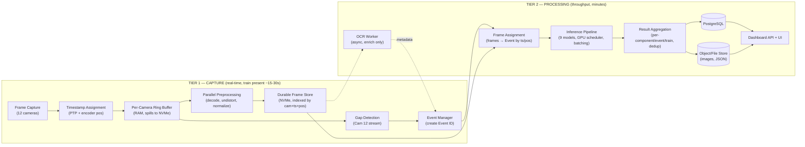

**Why this seam matters:** it is what makes the 5–7 min SLA *achievable and safe*. Trying to run inference synchronously during capture would couple GPU latency to frame-drop risk — a classic real-time anti-pattern. Decoupling lets Tier 1 be simple and provably loss-free, and lets Tier 2 be optimized purely for throughput. It also enables **reprocessing**: because raw frames are landed durably, a train can be re-inspected with a new model version without recapturing (NFR-R4, huge for MLOps).

## 4.2 End-to-End Sequence (one train)

```mermaid
sequenceDiagram
    autonomber
    participant PS as Presence Sensor
    participant CAP as Capture Workers (12)
    participant RB as Ring Buffers
    participant NVMe as Durable Frame Store
    participant GD as Gap Detector
    participant EM as Event Manager
    participant OCR as OCR Worker
    participant FA as Frame Assigner
    participant INF as Inference Workers
    participant AGG as Aggregator
    participant DB as PostgreSQL
    participant OBJ as Object Store
    participant UI as Dashboard

    PS->>CAP: ARM (train entering)
    loop while train present (~15-30s)
        CAP->>RB: frame + HW timestamp + encoder pos
        RB->>NVMe: spill/land frames (durable)
        CAP->>GD: Cam12 frames
        GD->>EM: gap boundary detected
        EM->>EM: create Event(id, coach_index, bounds)
    end
    PS->>CAP: DISARM (train cleared) — SLA clock starts
    par Async enrichment
        OCR->>NVMe: read Cam12 ROIs
        OCR-->>EM: coach number (metadata) [may be late/failed]
    and Processing
        EM->>FA: finalized Event list
        FA->>NVMe: fetch frames per Event (by ts/pos)
        FA->>INF: batched frames per model
        INF->>AGG: per-frame detections
        AGG->>AGG: dedup + aggregate per component/event/train
        AGG->>OBJ: write annotated images + result JSON
        AGG->>DB: write Events, results (transactional)
    end
    AGG->>UI: report ready (notify)
    UI->>DB: query train/coach/defects
    UI->>OBJ: fetch imagery on drill-down
```

## 4.3 Every Component, Queue, Worker, Thread (catalogue)

The following table is the authoritative inventory. Threading/queueing rationale is in Ch. 6; this is the *what*.

| Component | Instances | Concurrency unit | Input | Output | Backed by |
|---|---|---|---|---|---|
| Presence/Arm Controller | 1 | thread | GPIO/sensor | ARM/DISARM events | Tier 1 |
| Capture Worker | 12 (1/cam) | thread (I/O bound, GIL-released in C driver) | camera stream | timestamped frames | Tier 1 |
| Per-Camera Ring Buffer | 12 | lock-free SPSC/MPSC | frames | frames | Tier 1 |
| Ring→NVMe Spiller | 12 (or N) | thread | ring buffer | files + index rows | Tier 1 |
| Preprocessing Pool | N workers | **process** pool (CPU bound) | raw frames | preprocessed frames | Tier 1/seam |
| Gap Detector | 1 | thread/process | Cam 12 stream | gap boundaries | Tier 1 |
| Event Manager | 1 (leader) | thread + state store | boundaries, OCR | Event records | seam |
| OCR Worker | M | process pool (GPU or CPU) | Cam12 ROIs | coach numbers (metadata) | Tier 2 (async) |
| Frame Assigner | 1..N | process | Events + frame index | per-Event frame sets | Tier 2 |
| Inference Dispatcher/Scheduler | 1 | thread | batch requests | GPU jobs | Tier 2 |
| Inference Worker | 1..K (per GPU) | process (owns model(s)) | frame batches | detections | Tier 2 |
| Aggregator | 1..N | process | detections | aggregated results | Tier 2 |
| Storage Worker | N | process | results + images | DB rows + objects | Tier 2 |
| Dashboard API | 1..N | async web workers | HTTP | JSON | serving |
| Monitoring/Health | 1 | sidecar | all metrics | Prometheus/logs | cross-cutting |

## 4.4 Queue Topology

The pipeline is a set of **bounded queues** connecting stages. Bounded (not unbounded) is a deliberate choice — an unbounded queue converts a throughput problem into an out-of-memory crash. Bounded queues create **back-pressure**, which is the correct, observable failure signal.

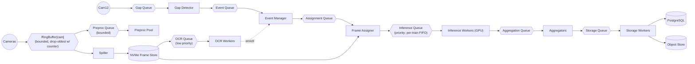

### 4.4.1 Queue design rules (normative)
1. **Every queue is bounded.** Capacity is sized in Ch. 7/13.
2. **Every queue has a documented overflow policy.** Ring buffers: drop-oldest *with an incrementing loss counter and log* (never silent). Processing queues: block/back-pressure (never drop — data already durable on NVMe).
3. **Inference queue is ordered per-train FIFO** so a train completes before the next starts (bounded latency per train), with the ability to preempt for a priority train (config).
4. **OCR queue is strictly lower priority** than inference and can be drained lazily; it must never steal GPU cycles from the SLA-critical inference path (Ch. 11 GPU scheduling enforces this).
5. **Cross-tier handoff (Tier 1 → Tier 2) is via the durable NVMe frame store + the Event/assignment queues**, not via in-memory handoff — so a Tier 2 crash never loses Tier 1 data.

## 4.5 Data Flow Failure Semantics (preview; detailed in Ch. 14)
- A frame that cannot be preprocessed is still *landed raw*; preprocessing is retried in Tier 2. Nothing is lost because durability happens *before* preprocessing.
- If Gap Detection misses a boundary, Frame Assignment can still recover Events using the encoder wheel-cadence cross-check (Ch. 8), and the operator can re-segment in the dashboard.
- If Tier 2 crashes mid-train, on restart it re-reads the durable frame store + Event records and **resumes** (idempotent, Event-ID-keyed) — no recapture.

# Chapter 5 — Software Architecture

## 5.1 Architectural Style

**Decision:** A **layered Clean Architecture** with the **domain (Event, Inspection, Detection) at the center**, framework/IO details at the edges, and dependencies pointing **inward** (Dependency Inversion). The runtime is a **set of cooperating processes** (a "modular monolith of processes" for v1) rather than a fleet of microservices.

- **Why Clean/layered:** the domain concepts (Event, Coach, Component, Defect, Inspection) are stable and safety-critical; the volatile parts (camera SDK, model runtime, DB driver, web framework) change often. Clean Architecture keeps the volatile parts out of the core so a camera-SDK swap or a model-runtime swap does not touch domain logic. This directly serves NFR-M1.
- **Why processes, not microservices (v1):** the pipeline is a single-site, single-track, latency-bounded system. Microservices would add network hops, serialization, and operational surface for **no benefit at this scale** — and would *hurt* the latency budget. Processes give us fault isolation (a crashed inference worker doesn't take down capture) and true parallelism (bypassing the Python GIL) *without* distributed-systems overhead. The seams are drawn so that any process **can** be promoted to a networked service later (Ch. 18) — the interfaces are message-based, not in-memory-object-based.
- **Alternatives:**
  - *Single-process asyncio monolith* — rejected: cannot use multiple CPU cores for preprocessing (GIL), and a single crash loses everything.
  - *Full microservices + message bus (Kafka/RabbitMQ) from day one* — rejected for v1 as premature; the message-bus pattern is adopted *internally* (queues) so the migration is mechanical when a second track/portal demands it.
  - *Actor framework (e.g., Ray)* — a strong candidate for the processing tier and explicitly recommended as the v2 substrate (Ch. 18); for v1, plain processes + queues keep the dependency surface small.

## 5.2 Layers

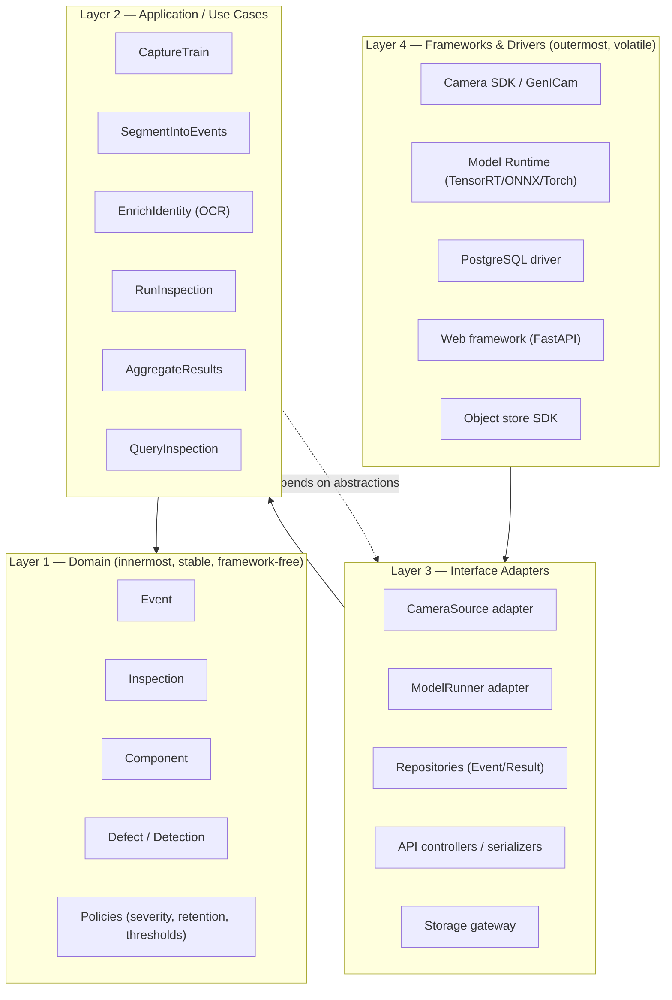

**Dependency rule:** source-code dependencies cross boundaries **only inward**. Layer 1 (domain) imports nothing from L2–L4. Use cases (L2) depend on **ports** (interfaces) that adapters (L3) implement. This is enforced with an import-linter rule in CI (a build fails if `domain` imports `infrastructure`).

## 5.3 Ports (interfaces) — the seams

These are the contracts each team implements against. Described as responsibilities, not code.

| Port (interface) | Owner of impl | Responsibility | Key methods (conceptual) |
|---|---|---|---|
| `CameraSource` | Integration/Backend | Yield timestamped frames from one camera | `open`, `frames() -> stream`, `close`, `stats` |
| `FrameStore` | Backend | Durably land & fetch frames by (cam, ts, pos) | `put`, `get_range`, `index` |
| `EventRepository` | Backend | Persist/lookup Events & lifecycle state | `create`, `update_state`, `attach_metadata`, `by_train` |
| `IdentityResolver` (OCR) | ML | Extract coach/bogie number from ROI (async) | `resolve(roi) -> (text, confidence)` |
| `BoundaryDetector` (Gap) | ML | Detect coach boundaries from stream | `detect(stream) -> boundaries` |
| `ModelRunner` | ML | Run a named model on a batch, return detections | `load`, `infer(batch) -> detections`, `unload`, `warmup` |
| `Aggregator` | Backend/ML | Combine detections into results | `aggregate(event, detections) -> result` |
| `ResultRepository` | Backend | Persist results | `save`, `by_event`, `by_train` |
| `ObjectStore` | Backend | Store images/JSON artifacts | `put`, `get`, `url_for` |
| `Notifier` | Backend | Publish "report ready", alerts | `notify` |
| `MetricSink` | DevOps | Emit metrics/logs/traces | `counter`, `gauge`, `histogram`, `event` |

**Why ports:** every port has (a) a real implementation, (b) a fake/in-memory implementation for tests, and (c) potentially multiple real implementations (e.g., `ModelRunner` backed by TensorRT *or* ONNX Runtime). Teams develop against the interface and integrate late. This is the backbone of the testing strategy (Ch. 17).

## 5.4 Modules & Package Structure

```
railinspect/
├── domain/                     # Layer 1 — pure, no I/O, no frameworks
│   ├── model/                  # Event, Inspection, Component, Detection, Track...
│   ├── policy/                 # severity rules, retention, thresholds
│   ├── events/                 # domain events (EventCreated, IdentityResolved...)
│   └── state/                  # Event state machine (Ch. 8)
├── application/                # Layer 2 — use cases orchestrating domain + ports
│   ├── capture/                # CaptureTrain, presence/arm logic
│   ├── segmentation/           # SegmentIntoEvents, frame assignment
│   ├── identity/               # EnrichIdentity (OCR orchestration)
│   ├── inspection/             # RunInspection (model orchestration)
│   ├── aggregation/            # AggregateResults
│   └── query/                  # QueryInspection (dashboard use cases)
├── ports/                      # interface definitions (abstract)
├── infrastructure/             # Layer 3/4 — adapters + drivers
│   ├── camera/                 # GenICam/GigE Vision adapter, ring buffer, spiller
│   ├── frame_store/            # NVMe frame store + index
│   ├── inference/              # ModelRunner (TensorRT/ONNX), GPU scheduler, batcher
│   ├── ocr/                    # OCR runner
│   ├── gap/                    # gap detector runner
│   ├── persistence/            # PostgreSQL repositories, migrations
│   ├── object_store/           # MinIO/S3/filesystem gateway
│   ├── messaging/              # queue abstractions (in-proc → Redis/Kafka later)
│   └── observability/          # metrics, logging, tracing
├── interfaces/                 # entrypoints
│   ├── api/                    # FastAPI app (dashboard/integration)
│   ├── workers/                # process entrypoints (capture, inference, ...)
│   └── cli/                    # ops CLI (replay, resegment, backfill)
├── config/                     # externalized config (per-site), schema-validated
└── tests/                      # unit / integration / contract / stress
```

**Rationale for this layout:** it is a *vertical-slice-friendly* structure — the ML team lives mostly in `infrastructure/inference`, `infrastructure/ocr`, `infrastructure/gap`; backend in `application`, `persistence`, `frame_store`; frontend against `interfaces/api`. The `ports/` package is the shared contract everyone agrees on **first**. `domain/` is owned jointly and changes require review from all leads (it is the shared language).

## 5.5 SOLID applied (concretely)

- **S (Single Responsibility):** each worker/process has exactly one job (capture, spill, preprocess, gap, OCR, assign, infer, aggregate, store, serve). This is also the *deployment* unit boundary.
- **O (Open/Closed):** adding a defect model = adding a `ModelRunner` plugin registered in config; no edit to `RunInspection`. Adding a camera = a config entry. (Ch. 11 plugin architecture.)
- **L (Liskov):** any `ModelRunner` (TensorRT/ONNX/CPU-fake) is substitutable; the scheduler treats them uniformly. Any `FrameStore` (NVMe/tmpfs/S3-in-test) is substitutable.
- **I (Interface Segregation):** `ModelRunner` does not know about DB; `ResultRepository` does not know about GPUs. Small, role-specific ports (see 5.3) — no god-interface.
- **D (Dependency Inversion):** use cases depend on `ports.*` abstractions; `infrastructure.*` provides implementations wired at startup by the composition root.

## 5.6 Dependency Injection & Composition Root

**Decision:** a single **composition root per process entrypoint** wires concrete adapters into use cases at startup, driven by config. No service locator; no global singletons reached into from deep code (those defeat testability and hide dependencies).

- **Why:** explicit construction makes dependencies visible, enables per-process wiring (the capture process wires cameras + ring buffers; the inference process wires GPU model runners), and makes tests trivial (wire fakes).
- **Mechanism:** lightweight — constructor injection + a small typed container/factory per entrypoint. **Avoid heavy DI frameworks** (magic, runtime surprises); Python favors explicitness.
- **Config-driven wiring:** which models load, which cameras exist, buffer sizes, thresholds — all from validated config (`config/`), so the same code runs on a 12-camera single-track site and a future 24-camera site with only config changes (NFR-M3, NFR-S2).

## 5.7 Cross-cutting concerns

- **Configuration:** typed, schema-validated (e.g., Pydantic Settings), layered (defaults → site → env → secrets), versioned in git except secrets. The **config version hash is stamped on every Event** (NFR-M4).
- **Versioning:** code version (git SHA), model versions (per model), config version — all recorded per Event for reproducibility and audit (Ch. 9).
- **Error handling:** domain uses typed results; infrastructure boundaries convert exceptions into domain-meaningful failures (e.g., `OCRUnavailable`, `FrameStoreFull`) that use cases handle deliberately — no bare `except: pass`.
- **Time & randomness:** injected, never called ad-hoc, so processing is deterministic/reproducible for replay (NFR-R4).

---

# Chapter 6 — Thread & Process Architecture

## 6.1 The GIL reality (why "thread architecture" is really "process + thread architecture")

Python 3.12 has a **Global Interpreter Lock**: only one thread executes Python bytecode at a time. This has decisive consequences that the naïve "one thread per stage" picture ignores:

- **I/O-bound work releases the GIL** (blocking C calls: camera SDK reads, socket/DMA, disk writes, `cv2`/NumPy heavy ops in C). Here, **threads are appropriate and efficient** — capture, spilling, and queue shuttling are I/O-bound and thread-friendly.
- **CPU-bound Python work does not scale on threads.** Preprocessing (decode, undistort, resize, normalize), aggregation, and any Python-level pixel work must run in **separate processes** to use multiple cores.
- **GPU inference** runs in **dedicated processes** that own a CUDA context — mixing multiple models' Python control flow in one process serializes on the GIL and complicates memory; one process per GPU worker (or per model group) is cleaner and fault-isolated.

### ⚠ CHALLENGE — "Thread Architecture" as stated is a trap
The problem statement lists an OCR *thread*, gap *thread*, preprocessing *threads*, inference *queue*, etc., implying a threaded design. **A purely threaded design will not meet the throughput requirement**, because preprocessing and inference are CPU/GPU-bound and the GIL serializes them. The correct model is **processes for CPU/GPU-bound stages, threads for I/O-bound stages within a process**, connected by queues. Python 3.13+ offers an experimental free-threaded (no-GIL) build; **do not bet v1 on it** — treat it as a future optimization (Ch. 18). This is decision **D-05**.

## 6.2 Process & thread map

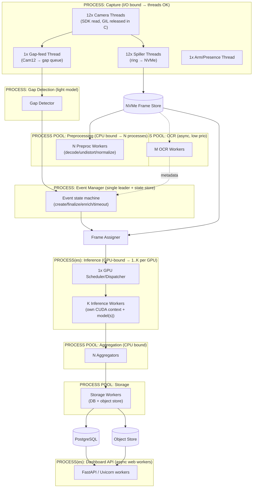

## 6.3 Per-stage concurrency decisions

| Stage | Unit | Count (v1 guidance) | Why | Risk if wrong |
|---|---|---|---|---|
| Camera capture | thread | 12 (1/cam) | I/O bound, SDK releases GIL; per-camera isolation | one blocking camera stalling others → mitigated by per-thread + bounded ring |
| Ring→NVMe spill | thread | 12 | sequential disk writes, I/O bound | disk too slow → back-pressure (Ch. 7) |
| Gap detection | process | 1 | light CNN on one stream, needs steady latency; isolate from capture GIL | co-locating in capture proc would risk frame drops |
| Preprocessing | process | = physical cores − reserved (e.g., 8–16) | CPU bound; must bypass GIL | too few → Tier-2 backlog; too many → cache/mem thrash |
| OCR | process | 2–4 | async, low priority; may share GPU or run CPU | over-provisioning steals GPU from inference (guard via scheduler) |
| Event Manager | process | **1 (single leader)** | authoritative state, avoids split-brain on Event IDs | HA needs leader election later (Ch. 18); v1 single with fast restart from DB |
| Frame assignment | process | 1–N | I/O + light CPU; parallel per Event | none major |
| GPU scheduler | thread | 1 | single arbiter of GPU time (Ch. 11) | multiple schedulers → GPU contention |
| Inference worker | process | K per GPU (K=1..few) | owns CUDA context; parallelism via batching + streams | too many → VRAM OOM; too few → GPU idle |
| Aggregation | process | N | CPU bound dedup/merge | backlog if under-provisioned |
| Storage | process | N | I/O bound (DB+objects) | DB connection pool limits |
| Dashboard API | async worker | 2–4 | I/O bound serving | none major |

## 6.4 Producer–Consumer Model

Every seam is a classic **bounded producer–consumer**. The canonical pattern:

```
Producer(s) --push--> [ bounded queue Q ] --pull--> Consumer(s)
                          │
                          ├─ full?  → back-pressure (block)  [durable stages]
                          │          or drop-oldest+count    [ring buffers only]
                          └─ empty? → consumers idle/park
```

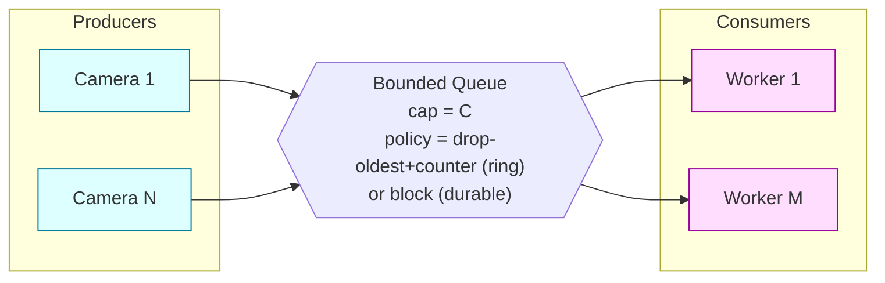

### 6.4.1 Back-pressure propagation (critical for correctness)
- **Tier 1 (before durability):** ring buffers use **drop-oldest + loss counter + log + metric** (a dropped frame is unavoidable if the disk can't keep up, but it is *never silent* — NFR-R1/NFR-F4). Sustained drops raise an alert; the *design intent* is that NVMe bandwidth is provisioned so drops are near-zero (Ch. 13 sizing).
- **Tier 2 (after durability):** queues **block/back-pressure** rather than drop, because the data is already safe on NVMe. If inference falls behind, the assignment queue backs up, which slows frame fetching, which is fine — the SLA clock is generous (minutes) and back-pressure just extends processing time, tripping an alert if the SLA is threatened.

### 6.4.2 Why bounded, not unbounded
An unbounded queue turns a transient slowdown into an unbounded memory growth → OOM → crash → lost train. Bounded queues make the system's limits **explicit and observable**. This is a hard rule (Ch. 4.4.1).

## 6.5 Thread-safety & shared state

- **Event Manager state** is owned by a single process (no shared-memory races on Event creation/IDs). Other processes interact via queues/DB, not shared memory.
- **Ring buffers** are single-producer (the camera thread) / single-or-multi-consumer (spiller + gap feed); use lock-free or lock-minimal ring structures; the producer never blocks on a consumer (drop-oldest).
- **GPU** is a shared, serialized resource arbitrated by exactly **one** scheduler (Ch. 11) — no two processes issue kernels without going through it (prevents VRAM thrash and unpredictable latency).
- **Inter-process frame transfer** uses the **durable frame store path + shared memory for hot handoff** (e.g., POSIX shared memory / Arrow Plasma-style) to avoid copying multi-MB frames through pickling queues. Passing raw frames through a standard multiprocessing `Queue` (which pickles) is a **known performance killer** and is prohibited for image payloads — queues carry *references/handles*, not pixels. This is decision **D-06**.

## 6.6 Startup, shutdown, supervision
- A **supervisor** (systemd units or a process manager; container-orchestrated in Ch. 16) starts each process, restarts on crash with backoff, and enforces health checks.
- **Graceful shutdown**: on SIGTERM, capture disarms, in-flight Events are finalized/persisted, queues drained, GPU contexts released. **Crash recovery**: on restart, processes rebuild state from PostgreSQL + the durable frame store (Event-ID keyed, idempotent).

# Chapter 7 — Buffer Management

## 7.1 The central sizing question

This chapter answers: *can 12 industrial cameras stream into 32 GB of RAM?* The short answer is **no, not as a store — only as a brief staging buffer** — and the arithmetic below is the justification for the entire capture-to-NVMe architecture. **Every number here is parameterized; the imaging team's final camera parameters (OQ-1) replace the worked assumptions.**

## 7.2 Working assumptions (to be replaced by real camera specs — OQ-1)

| Parameter | Symbol | Assumed value | Note |
|---|---|---|---|
| Area-scan resolution | — | 2048 × 2048 = 4.19 MP | typical GES machine-vision |
| Pixel format | — | Mono8 (1 B/px) or Bayer8 | color raises ×1–3 |
| Area-scan frame size | `S_f` | ~4.19 MB (Mono8) | ~12.6 MB if RGB8 |
| Area-scan frame rate | `fps_a` | 120 fps (from Ch. 3 coverage) | speed/coverage driven |
| Area-scan cameras | `N_a` | 11 (Cams 1–6, 8–12) | |
| Line-scan width | — | 8192 px | |
| Line-scan line rate | `lr` | 40 kHz | encoder-driven |
| Line-scan bytes/s | `S_l` | 8192 × 40000 × 1 B ≈ 327 MB/s | one camera |
| Presence window | `T_p` | 20 s @120 km/h (up to ~30 s @70 km/h) | train length dependent |

## 7.3 Aggregate data-rate calculation

**Per area-scan camera:**
```
rate_a = S_f × fps_a = 4.19 MB × 120 = 502.8 MB/s
```
**All area-scan cameras:**
```
rate_area_total = 502.8 MB/s × 11 ≈ 5.53 GB/s
```
**Line-scan camera:**
```
rate_line = 0.327 GB/s
```
**Aggregate capture bandwidth:**
```
R_total ≈ 5.53 + 0.33 ≈ 5.86 GB/s   (≈ 47 Gbit/s of raw pixel data)
```

**Total data volume for one train (presence window T_p = 20 s):**
```
V_train ≈ 5.86 GB/s × 20 s ≈ 117 GB per train
```

### ⚠ CHALLENGE — three hard conclusions from these numbers
1. **32 GB RAM cannot hold one train.** 117 GB ≫ 32 GB. RAM can hold only **~5.5 seconds** of full-rate capture. Therefore RAM ring buffers are **transient staging** (seconds), and **NVMe is the actual capture store**. The 32 GB budget is fine *for staging* but is not where trains live. (Confirms D-01.)
2. **~5.9 GB/s sustained write** exceeds a single SATA SSD (~0.5 GB/s) and a single Gen3 NVMe (~3.5 GB/s). It requires **multiple Gen4/Gen5 NVMe drives (each ~5–7 GB/s) in a striped array (RAID-0/software stripe) or several drives written in parallel by per-camera spillers**. This is a hard hardware requirement, decision **D-07**.
3. **The network must carry ~47 Gbit/s.** 12 cameras cannot share a single 10 GbE link. This needs **multiple 10/25 GbE links (or 100 GbE) and NIC offload**, reinforcing Ch. 3's transport decision. Decision **D-02c**.

**These three points are the most important quantitative findings in the document.** They are also strongly sensitive to the assumed fps and frame size — which is exactly why OQ-1 (fix the camera parameters) is the top open question. If, for example, encoder-phased triggering (D-02b) lets area-scan cameras run at an *effective* 40–60 fps instead of 120, `R_total` roughly halves. **The single most effective way to reduce cost and risk across storage, network, and GPU is to minimize the captured pixel volume at the source** (tighter ROI, position-triggered acquisition, mono over color, on-camera JPEG/lossless compression where defect fidelity permits). This is an explicit design lever, not an afterthought.

## 7.4 Buffer hierarchy

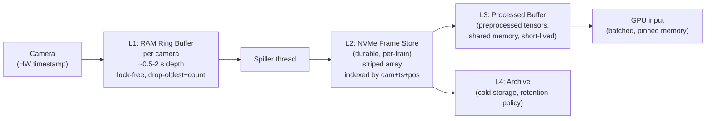

| Level | Medium | Lifetime | Purpose | Overflow policy |
|---|---|---|---|---|
| L1 Ring buffer | RAM | seconds | absorb burst / decouple camera from disk | drop-oldest + counter + log |
| L2 Frame store | NVMe (striped) | per-train → retention | durable capture, source of truth for reprocessing | back-pressure to L1; alert if near full |
| L3 Processed buffer | RAM / shared mem | ms–s | hold preprocessed tensors for GPU batching | block (back-pressure) |
| L4 Archive | HDD/NAS/object/cloud | retention window | long-term storage & audit | lifecycle expiry |

## 7.5 Ring buffer sizing

Ring buffer depth per camera = `D` seconds. RAM per camera = `S_f × fps_a × D`. Choose `D` = the maximum tolerable disk-write stall you must absorb without loss.

Example: `D = 1 s` per area-scan camera → `4.19 MB × 120 × 1 = 503 MB/camera`. For 11 area cameras = **5.5 GB RAM** just for 1-second ring buffers. With `D = 0.5 s` → **2.75 GB**. Line-scan ring (1 s) ≈ 0.33 GB.

**With a 32 GB budget:** allocate ~6–8 GB to ring buffers (D≈0.5–1 s), leaving room for OS, preprocessing tensors, model host-side memory, and the DB/API if co-located. This is *tight* and is the reason the 32 GB figure is challenged — a comfortable capture node wants **64–128 GB** (decision **D-01**). 32 GB is workable **only** if (a) ring depth is small, (b) NVMe reliably keeps up so rings stay near-empty, and (c) inference and dashboard run on the same or a different node with their own memory headroom.

## 7.6 Processed buffer

Preprocessed frames become **tensors** (float16/float32, resized to model input, e.g., 640×640×3 fp16 ≈ 2.4 MB, or full-res crops). These live in **shared memory** briefly between preprocessing and GPU batching. Sizing = `batch_size × tensor_size × in_flight_batches × models_in_flight`. Kept small and bounded; back-pressured (never dropped — data is durable on NVMe).

## 7.7 Temporary storage & the frame index

The NVMe store holds, per train, all frames plus a **frame index** (a compact table: `frame_id, camera_id, capture_ts, encoder_pos, file_offset, size, checksum`). The index is the fast path for **frame assignment** (Ch. 8): given an Event's `[ts_start, ts_end]` (or `[pos_start, pos_end]`), the assigner range-queries the index rather than scanning files. The index is itself persisted (SQLite per-train file or rows in PostgreSQL) so recovery after a crash is index-driven, not filesystem-walk-driven.

## 7.8 Overflow handling (normative)

| Condition | Detection | Action | Severity |
|---|---|---|---|
| Ring buffer full (disk can't keep up) | producer sees full ring | drop **oldest** frame, increment `frames_dropped{cam}`, log once/sec sampled | WARN → ALERT if sustained |
| NVMe approaching full | free-space monitor | reject new *train* arm with alert; never partially-capture without flag; trigger archive/cleanup | CRITICAL |
| Processing queue full | consumer lag | back-pressure upstream; extend processing time; alert if SLA at risk | WARN |
| Processed buffer full | batcher | block preprocessing; GPU is bottleneck (expected under peak) | INFO/WARN |

**Golden rule:** loss is only permissible in L1 (RAM ring) and is **always counted and logged**. No stage past durability may drop data.

## 7.9 Memory budget summary (single-node, 32 GB — the tight case)

| Consumer | Budget |
|---|---|
| OS + drivers + NIC buffers | ~4 GB |
| L1 ring buffers (D≈0.5 s) | ~3–4 GB |
| Preprocessing workers (N×) | ~4–6 GB |
| L3 processed/pinned buffers | ~2–3 GB |
| Model host-side / CUDA host pinned | ~3–4 GB |
| PostgreSQL + API (if co-located) | ~4–6 GB |
| Headroom / spikes | remainder |

**Conclusion:** 32 GB is *feasible but fragile* for a single co-located node. **Recommendation: 64–128 GB, and separate the capture node from the inference node** if train frequency is high. Reaffirms D-01.

## 7.10 Recovery
- **Ring buffer loss** is bounded and logged; the affected region is marked `partial_coverage` on the Event.
- **NVMe store** is the recovery anchor: after any Tier-2 crash, processing resumes from the durable frames + frame index + Event records — no recapture.
- **Checksums** on frame-store writes detect silent corruption (bit rot / partial write); a failed checksum flags the frame `corrupt` and the region `data_unavailable`.

---

# Chapter 8 — Event-Driven Architecture

## 8.1 Core principle (restated because everything depends on it)

- **The Event is the unit of inspection** — one coach/bogie unit. It gets a **globally unique, opaque Event ID** at creation (e.g., UUIDv7 for time-ordering, or `{portal}-{train_run}-{seq}`). This ID is the **only** primary identifier used by all downstream data.
- **Gap Detection creates Events.** Coach boundaries (inter-coach gaps seen by Cam 12) define where one Event ends and the next begins.
- **OCR only enriches metadata.** The coach/bogie number from OCR is attached to the Event as *metadata*, asynchronously. It is **never** the key. This decoupling is what allows OCR to fail, be late, or be ambiguous **without** breaking anything.

### Why not use the OCR'd coach number as the key? (the trade-off, made explicit)
- Coach numbers can be **dirty, missing, occluded, repainted, non-unique across railways, or misread**. Keying on them would make identity fragile and would couple report generation to OCR success — violating FR-10. Using a system-generated Event ID makes identity **always available, always unique, and OCR-independent**. The human-readable number is a *label*, resolvable and correctable later. This is a textbook application of separating *surrogate keys* (Event ID) from *natural keys* (coach number).

## 8.2 Event creation & the run hierarchy

```
TrainRun (a single pass through the portal)
   └── Event (a coach/bogie)         ← keyed by Event ID
         ├── FrameSet (frames from all cameras assigned to this Event)
         ├── Identity (coach number — OCR metadata, may be null/unresolved)
         └── Results (per-component detections, defects, anomalies)
```

- A **TrainRun** is created on ARM (presence sensor). It, too, has a surrogate ID (`train_run_id`).
- As the train passes, gap boundaries carve the run into ordered Events (`coach_index = 0,1,2,...`). `coach_index` is a stable ordinal even when OCR fails — so a report always has "Coach #7 (number unresolved)" rather than a hole.

## 8.3 Event lifecycle state machine

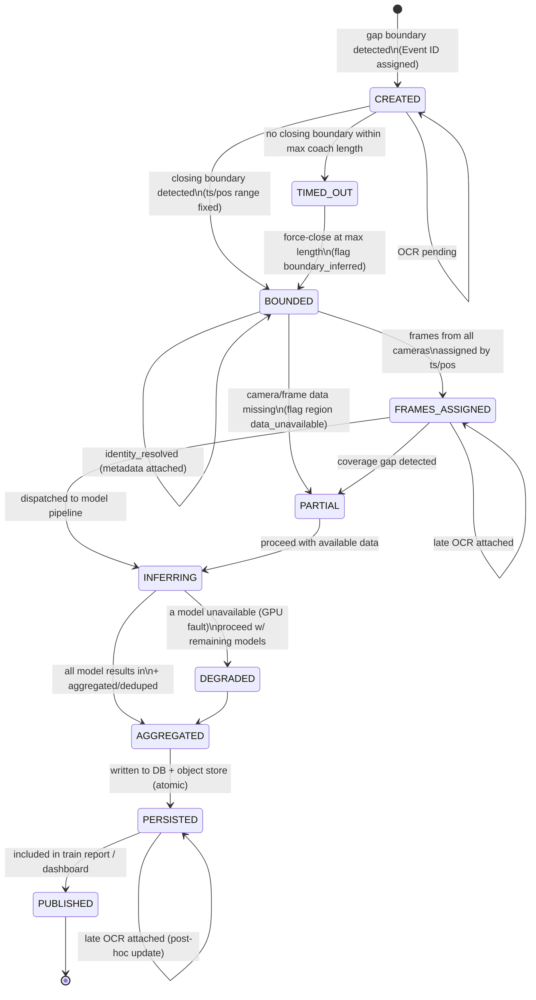

### 8.3.1 State semantics
- **CREATED → BOUNDED:** the Event has both a start and end boundary. If no end boundary arrives within `max_coach_length` (derived from encoder distance, not time), the Event **times out** and is force-closed with `boundary_inferred=true` — a coach is never lost because a gap was missed.
- **Identity is orthogonal.** The self-loops show identity can be attached at *any* state, including after `PERSISTED` (late OCR → post-hoc metadata update). The main pipeline never waits on it.
- **PARTIAL / DEGRADED** are first-class *valid* terminal-ish states: a report is still produced, clearly annotated with what was missing (camera down, coverage gap, model unavailable). Safety-critically, **a defect region that could not be imaged is reported as `data_unavailable`, not as `pass`** — absence of evidence is never reported as evidence of absence.

## 8.4 Frame assignment

Given `Event.[pos_start, pos_end]` (encoder position preferred over time, since position is speed-invariant and matches line-scan geometry):

1. Range-query the **frame index** (Ch. 7.7) for every camera: all frames whose `encoder_pos ∈ [pos_start, pos_end]` (with configurable margin for components that straddle boundaries, e.g., couplers).
2. For the **line-scan** camera, extract the **strip slice** `[pos_start, pos_end]` from the continuous strip.
3. Produce a `FrameSet` = `{camera_id → [frame refs]}` attached to the Event.
4. Overlap handling: frames near boundaries may belong to two Events (a coupler spans the gap) — assigned to both with a `boundary_shared` flag; aggregation dedups.

**Why position not time for assignment:** if the train decelerates within the portal, equal time intervals map to unequal distances; position from the encoder is the physically correct coordinate and aligns area-scan (time-native) with line-scan (position-native). PTP time is retained for cross-camera *instantaneous* alignment; encoder position for *spatial* assignment. Reconciling the two is the assigner's core job.

## 8.5 Event metadata

| Field | Source | Nullable | Notes |
|---|---|---|---|
| `event_id` | system | no | surrogate PK, opaque |
| `train_run_id` | system | no | parent run |
| `coach_index` | gap detection | no | ordinal within run |
| `pos_start/pos_end` | encoder+gap | no | spatial bounds |
| `ts_start/ts_end` | PTP | no | temporal bounds |
| `coach_number` | **OCR (metadata)** | **yes** | may be null/unresolved/low-confidence |
| `coach_number_confidence` | OCR | yes | drives auto-accept vs operator review |
| `identity_state` | system | no | `pending / resolved / unresolved / conflicted` |
| `boundary_inferred` | system | no | true if force-closed on timeout |
| `coverage_flags` | assignment | no | per-camera coverage completeness |
| `model_versions`, `code_version`, `config_version` | system | no | reproducibility (NFR-M4) |

## 8.6 Late OCR handling

```mermaid
sequenceDiagram
    participant EM as Event Manager
    participant OCR as OCR Worker
    participant DB as PostgreSQL
    Note over EM: Event already PERSISTED with coach_number = null (identity_state=pending)
    OCR->>DB: resolve coach_number for event_id (late)
    OCR-->>EM: IdentityResolved(event_id, "12345", conf=0.94)
    EM->>DB: UPDATE event SET coach_number, identity_state='resolved' WHERE event_id=?
    EM->>DB: append audit row (who/what/when = system OCR)
    Note over EM,DB: report + dashboard reflect enriched identity on next read; no reprocessing
```

- Late OCR is a **metadata update keyed by Event ID** — cheap, non-blocking, auditable. No frames re-run, no results change.
- If OCR resolves a number that **conflicts** with an operator-entered value, `identity_state=conflicted` and it surfaces for review (never silently overwrites human input).

## 8.7 OCR failure handling
- **Transient failure** (worker crash, model load error): retried on the low-priority OCR queue with backoff; Event stays `pending`.
- **Hard failure** (unreadable/occluded/absent number): after N retries → `identity_state=unresolved`. The Event is fully valid and reportable as "Coach #k (number unresolved)"; operator can enter/confirm the number in the dashboard (FR-12, FR-23).
- **Low confidence:** below `auto_accept_threshold` → `resolved` but flagged for optional operator confirmation; below `reject_threshold` → `unresolved`.
- **Never** does OCR state block `INFERRING → PERSISTED`. This is enforced structurally: the OCR path only ever *writes metadata*, it has no edge into the main state transitions.

## 8.8 Timeout handling
- **Event boundary timeout:** force-close at `max_coach_length` (see 8.3.1).
- **Processing timeout (SLA guard):** if an Event has not reached `PERSISTED` within the per-train SLA budget, it is escalated (alert), and the train report is published as **partial** with the slow Events flagged `processing_incomplete` — the SLA is honored by publishing what is ready and back-filling, never by silently missing the deadline.
- **Idle/stuck detection:** the Event Manager runs a reaper that scans for Events stuck in a non-terminal state beyond a threshold and forces them forward or to a failure state, always logged.

## 8.9 Event-driven messaging substrate
- **v1:** in-process queues + a durable Event table in PostgreSQL as the state store (the "event log" is the DB + append-only audit rows). Domain events (`EventCreated`, `IdentityResolved`, `ResultsReady`) are dispatched in-process.
- **v2 (Ch. 18):** promote domain events onto a real broker (Redis Streams / NATS / Kafka) when multiple nodes/tracks require cross-process, cross-host eventing. Because the domain already speaks in events (5.4 `domain/events`), this is an adapter swap, not a redesign — the whole point of choosing event-driven now.

### ⚠ CHALLENGE — single Event Manager is a SPOF
The Event Manager is a single leader (6.3) to keep Event-ID assignment authoritative. That is a **single point of failure** for the segmentation stage. **Mitigation for v1:** it is stateless-recoverable (rebuilds from the DB on restart in seconds; capture continues landing frames + boundaries to the durable store meanwhile, so a brief EM outage delays segmentation but loses no data). **v2:** leader election (Ch. 18). The cross-check on boundaries (encoder wheel-cadence, D-03) further hardens segmentation against both EM restarts and gap-detection misses.

# Chapter 9 — Database Design

## 9.1 Choice of PostgreSQL & the polyglot boundary

**Decision:** PostgreSQL is the **system of record** for structured inspection data (runs, events, detections, audit). Images/large artifacts live in the **object store** (Ch. 10), referenced by URI from the DB. The **frame index** (Ch. 7.7) is either per-train SQLite files or a partitioned PostgreSQL table.

- **Why PostgreSQL:** ACID (safety-critical records must be consistent — NFR-R3), rich indexing (B-tree, GiST, partial, BRIN for time-series), JSONB for semi-structured detection payloads, mature partitioning for time-series growth, strong ecosystem. It is boring, proven, and correct — the right disposition for a safety record.
- **Why not store images as BLOBs in PG:** bloats the DB, wrecks backup/restore times, poor for streaming large binaries. Images belong in object storage; the DB stores the pointer + metadata. This is a standard and deliberate split.
- **Alternatives considered:** (a) a time-series DB (Timescale) — actually a *good* fit and Timescale (a PG extension) is recommended for the metrics/telemetry side (Ch. 15), kept separate from the transactional inspection schema; (b) NoSQL document store — rejected as system-of-record because we need relational integrity across run→event→detection and auditable joins.

## 9.2 ER Diagram

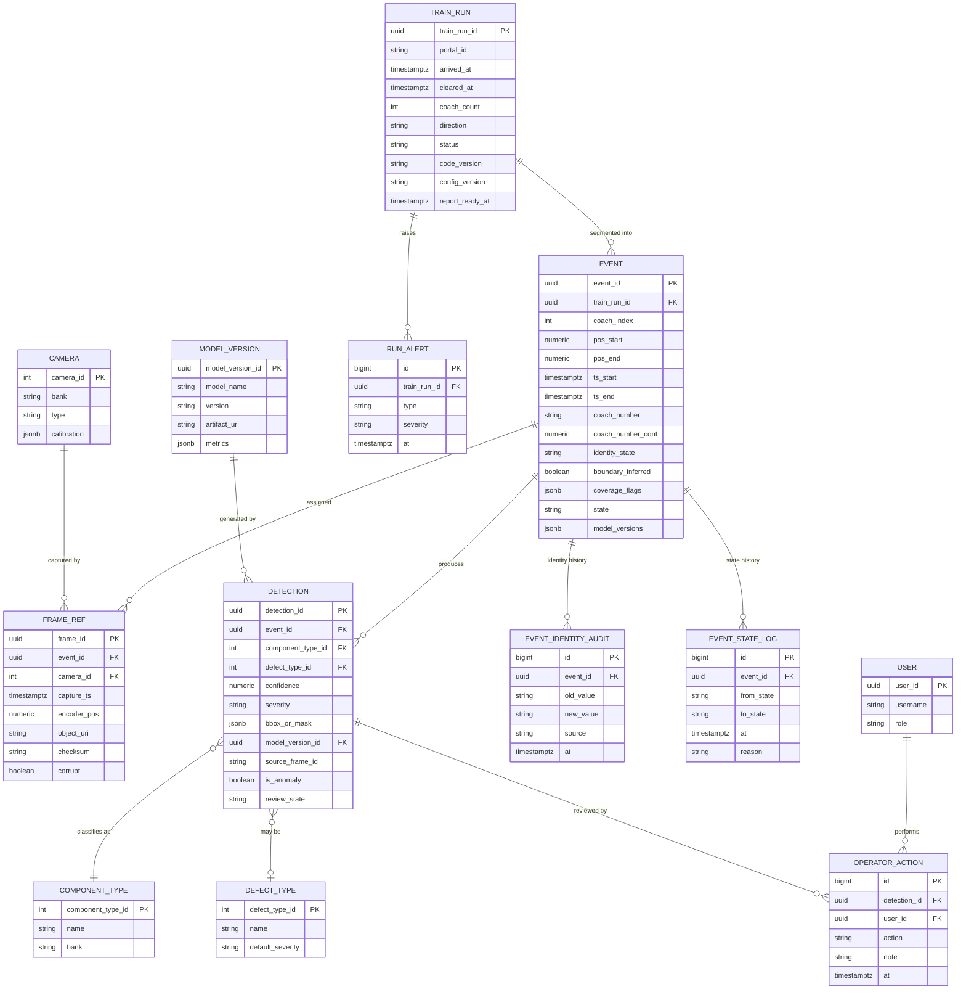

## 9.3 Schema notes & rationale

- **Surrogate UUID PKs** everywhere for runs/events/detections (Event-ID principle, Ch. 8). `coach_number` is a plain column, **never a key** — enforced by design.
- **`EVENT.state`** mirrors the state machine (Ch. 8); `EVENT_STATE_LOG` is the append-only history (auditability, NFR-SEC3, debugging).
- **`DETECTION.bbox_or_mask` as JSONB** — detection geometry varies by model (bbox, polygon, mask RLE). JSONB keeps the schema stable across model types (Open/Closed). Frequently-filtered scalar fields (`confidence`, `severity`, `defect_type_id`) are **promoted to columns** and indexed; the flexible payload stays in JSONB.
- **`MODEL_VERSION` FK on every detection** — every result is attributable to the exact model artifact that produced it (reproducibility, regression analysis, NFR-M4).
- **`FRAME_REF.object_uri`** points into the object store; `checksum` supports corruption detection (Ch. 7.10).
- **Identity audit & operator actions** are append-only for tamper-evidence (NFR-SEC3).

## 9.4 Indexes

| Table | Index | Type | Serves |
|---|---|---|---|
| EVENT | `(train_run_id, coach_index)` | B-tree | list coaches of a run in order |
| EVENT | `(coach_number)` | B-tree (partial: WHERE coach_number IS NOT NULL) | search by coach number (FR-22) |
| EVENT | `(state)` | partial B-tree (WHERE state != 'PUBLISHED') | reaper scans stuck events |
| EVENT | `(ts_start)` | BRIN | time-range scans on large history (cheap) |
| DETECTION | `(event_id)` | B-tree | fetch all detections for a coach |
| DETECTION | `(defect_type_id, severity)` | B-tree | "show me all severe wheel-shelling" (FR-22) |
| DETECTION | `(review_state)` | partial | operator review queue |
| DETECTION | `bbox_or_mask` | GIN (jsonb_path_ops) | occasional payload queries |
| FRAME_REF | `(event_id, camera_id)` | B-tree | drill-down imagery |
| FRAME_REF | `(camera_id, encoder_pos)` | B-tree | frame assignment range query |
| TRAIN_RUN | `(arrived_at DESC)` | B-tree | dashboard "recent trains" |

## 9.5 Partitioning & retention at the DB level
- **Time-based partitioning** of `EVENT`, `DETECTION`, `FRAME_REF` by month (declarative partitioning). Old partitions detach → archive → drop, aligned with the retention policy (Ch. 10). Keeps hot indexes small (dashboard p95 < 2 s, NFR-P4) even after years of data.
- **BRIN indexes** on time columns suit append-mostly, time-ordered data cheaply.

## 9.6 Query optimization
- Dashboard "recent trains + counts" is served by a **materialized view / summary table** (`train_run_summary`: coach_count, defect_count_by_severity), refreshed on `PERSISTED`, so the list view never aggregates detection rows on read.
- **Connection pooling** (PgBouncer) between storage/API workers and PG (bounded connections, per NFR).
- **Write path** batches detection inserts per Event in one transaction (atomic Event commit, NFR-R3) using `COPY`/multi-row insert, not row-by-row.
- **Read path** uses covering indexes for the common filters; heavy analytics run against a read replica (v2) or the summary tables, never the write primary under load.

## 9.7 Consistency & the atomic Event commit
An Event transitions to `PERSISTED` only when, in **one transaction**: the Event row is updated, all its detections inserted, its state-log row appended, and object-store writes have already completed (write objects first, commit DB pointer second — so a DB pointer never references a missing object). If the transaction fails, the Event stays `AGGREGATED` and is retried; partial writes are impossible (NFR-R3). This "objects-first, pointer-second, idempotent by Event ID" pattern makes reprocessing safe.

---

# Chapter 10 — Storage Design

## 10.1 Storage tiers

| Tier | Medium | Content | Access pattern |
|---|---|---|---|
| Hot capture | NVMe striped array | raw frames of in-flight & recent trains | sequential write, random read (assignment) |
| Warm | Local SSD / NAS / MinIO | annotated images + result JSON of recent trains (days–weeks) | random read (dashboard) |
| Cold archive | HDD NAS / S3-compatible / cloud | raw frames + artifacts past warm window | rare read (audit, reprocessing) |

## 10.2 Object store choice
**Decision:** an **S3-compatible object store (MinIO on-prem)** for images and JSON artifacts.
- **Why:** S3 API is the lingua franca — the same code path works on-prem (MinIO) and in cloud (S3/GCS) for the future cloud roadmap (Ch. 18); lifecycle policies, versioning, and erasure coding come built-in.
- **Alternative:** plain filesystem hierarchy on NAS — simpler, but reinvents lifecycle/replication and complicates the cloud path. Acceptable for the smallest deployments; the `ObjectStore` port (5.3) abstracts both so the choice is deployment-time.

## 10.3 Folder / key structure & naming convention

Deterministic, sortable, self-describing keys (works for both filesystem paths and S3 keys):

```
{portal_id}/{yyyy}/{mm}/{dd}/{train_run_id}/
   raw/
     cam{NN}/{encoder_pos_mm:012d}_{capture_ts_ns}_{frame_id}.{ext}
   line/
     cam07/strip_{pos_start}_{pos_end}.{ext}
   annotated/
     {event_id}/cam{NN}_{detection_id}.jpg
   results/
     {event_id}.json                 # per-event result document
   report/
     {train_run_id}_report.json       # full train report (machine)
     {train_run_id}_report.pdf        # human report (optional render)
```

**Naming rationale:**
- Date-partitioned prefix → natural lifecycle/expiry and balanced object distribution.
- `encoder_pos` zero-padded first in raw frame names → lexical sort = spatial order along the train (enormously convenient for humans and for range scans).
- `train_run_id` and `event_id` (UUIDs) in the path → globally unique, collision-free, no dependence on coach number (Event-ID principle again).
- File extension carries codec (`.png` lossless / `.jpg` lossy / `.tiff` / `.npy`) — **lossless for anything a model reads or a defect is adjudicated on; lossy JPEG acceptable only for dashboard thumbnails/annotated previews.** Storing defect evidence as lossy JPEG would compromise auditability and is prohibited for source frames.

## 10.4 Metadata storage & the JSON result format

Per-Event result document (also the API payload shape — Ch. 12) — schema-versioned:

```json
{
  "schema_version": "1.0",
  "event_id": "018f...uuidv7",
  "train_run_id": "018e...",
  "portal_id": "PTL-DEL-01",
  "coach_index": 7,
  "identity": {
    "coach_number": "12345",
    "confidence": 0.94,
    "state": "resolved",
    "source": "ocr"
  },
  "bounds": { "pos_start_mm": 154230, "pos_end_mm": 176010,
              "ts_start": "2026-07-13T10:15:02.531Z", "ts_end": "2026-07-13T10:15:03.184Z" },
  "coverage": { "cam01": "full", "cam07": "full", "cam09": "partial", "cam05": "data_unavailable" },
  "detections": [
    {
      "detection_id": "…", "component_type": "brake_pad", "defect_type": "worn_below_limit",
      "severity": "critical", "confidence": 0.89, "is_anomaly": false,
      "geometry": { "type": "bbox", "coords": [x,y,w,h] },
      "source_frame": { "camera_id": 9, "frame_id": "…", "object_uri": "s3://…" },
      "annotated_uri": "s3://…/annotated/{event_id}/cam09_{detection_id}.jpg",
      "model": { "name": "wheel_brake_det", "version": "2.3.1" },
      "review_state": "unreviewed"
    }
  ],
  "flags": { "boundary_inferred": false, "processing_incomplete": false },
  "provenance": { "code_version": "git:abc123", "config_version": "cfg:v42",
                  "model_versions": { "component_det": "1.4.0", "wheel_shelling": "0.9.2" } }
}
```

**Why a per-Event JSON alongside the DB:** the JSON is the **immutable, self-contained record** for archive and audit — it can be read decades later without the running system. The DB is the **queryable index** over the same facts. The two are consistent by the atomic-commit rule (9.7). This dual representation (queryable DB + immutable document) is standard for safety/audit systems.

## 10.5 Retention policy

| Data class | Hot (NVMe) | Warm | Cold archive | Delete after |
|---|---|---|---|---|
| Raw frames (no defect) | until processed | 7 days | 90 days | 90 days (configurable) |
| Raw frames (defect present) | until processed | 30 days | **2–7 years** (regulatory) | per regulation |
| Annotated images + result JSON | — | 90 days | 2–7 years | per regulation |
| DB records (events/detections) | — | hot partitions | archived partitions | per regulation |
| Metrics/telemetry | — | 15–30 days | 90 days–1 yr | 1 yr |

**Rationale:** defect-bearing evidence must be retained for the regulatory/liability window (a wheel defect that later causes an incident must be provable). Clean raw frames are the bulk of the volume (117 GB/train!) and are aged out fast unless a defect ties them to retention. **Retention is defect-aware**, which is what keeps storage economics viable. The exact windows are a **compliance decision** (OQ-6).

### Storage volume reality check (from Ch. 7)
~117 GB/train raw. At (illustrative) 200 trains/day that is **~23 TB/day** of raw frames — clearly unsustainable to retain in full. Hence: (a) **most raw frames are transient** (deleted after processing unless defect-linked), (b) **retained artifacts are the annotated crops + JSON**, which are megabytes, not gigabytes, per event, and (c) source-volume reduction at capture (Ch. 7.3) is the primary economic lever. This is decision **D-08** (retention vs storage cost) and a top open question (OQ-6).

## 10.6 Archive strategy
- Lifecycle rules move objects Hot→Warm→Cold by age/prefix automatically (MinIO/S3 lifecycle).
- Cold archive uses **erasure coding / replication** for durability; optional off-site/cloud replication for disaster recovery (Ch. 18).
- **Immutability / WORM** option on defect-evidence archive buckets (object-lock) so safety evidence cannot be altered or deleted before its retention expiry (NFR-SEC3, regulatory).
- Archived DB partitions are dumped alongside their objects so a cold train is fully self-restorable.

# Chapter 11 — AI Pipeline

## 11.1 The nine models and their placement

| # | Model | Consumes (cameras) | Tier / timing | Notes |
|---|---|---|---|---|
| 1 | **Gap Detection** | Cam 12 | **Tier 1** (during capture) | Light/fast; creates Events; latency-critical |
| 2 | **OCR** | Cam 12 (coach-number ROI) | **Tier 2, async low-prio** | Enriches metadata only |
| 3 | **Component Detection** | Cams 1–4 (side) | Tier 2 | Locate side components |
| 4 | **Component Defect Detection** | Cams 1–4 (on detected components) | Tier 2 | Two-stage: detect → classify defect |
| 5 | **Undercarriage Detection** | Cams 5–7 | Tier 2 | Locate underframe components |
| 6 | **Undercarriage Defect Detection** | Cams 5–7 | Tier 2 | Defect on underframe |
| 7 | **Wheel & Brake Detection** | Cams 8–11 | Tier 2 | Locate wheel/brake components |
| 8 | **Wheel Shelling Detection** | Cams 8–11 (on detected wheels) | Tier 2 | Specialized defect model |
| 9 | **Anomaly Detection** | all banks (region-level) | Tier 2 | OOD / unknown-condition safety net |

**Two-stage pattern (detect → defect):** several tasks are naturally *detector → per-region classifier* (find the brake pad, then judge wear). This is more accurate and cheaper than one monolithic model and lets defect models be retrained independently of detectors (Open/Closed). The pipeline supports staged model graphs, not just flat model lists.

## 11.2 Only Gap Detection runs in Tier 1

**Decision:** the **only** model on the real-time capture path is Gap Detection (and it must be small/fast/robust). Everything else runs in Tier 2 after capture.
- **Why:** Tier 1 cannot afford GPU-latency variability (a slow inference = dropped frames). Gap detection is unavoidable in Tier 1 because it *creates the Events*, but it operates on a **single low-rate stream** (Cam 12) and can be a tiny model or even classical CV (edge/coupler/gap heuristics) with a CNN confirm. Running the heavy 8 models here would be architecturally wrong.
- **Robustness of gap detection:** because it is safety-adjacent (a missed gap = a merged/lost coach), it is backed by the **encoder wheel-cadence cross-check** (D-03): bogies produce a periodic wheel signature; the spacing corroborates or corrects vision-based boundaries.

## 11.3 Model serving interface (the `ModelRunner` port)

Every model is wrapped behind a uniform contract (5.3). Conceptual responsibilities:
- `load(artifact_uri, device)` — load weights, allocate, **warm up** (run a dummy batch to compile CUDA kernels / build TensorRT engine, so the first real batch isn't slow).
- `infer(batch) -> detections` — synchronous batched inference; input is a list of preprocessed tensors + frame refs, output is structured detections with geometry + confidence.
- `unload()` — free VRAM (used by the scheduler to swap models — see 11.5).
- `metadata` — name, version, input spec (size, normalization), VRAM footprint, throughput profile.

This uniformity is what lets the scheduler treat 9 heterogeneous models identically and lets a model be **swapped between TensorRT/ONNX/Torch backends** without touching orchestration (Liskov).

## 11.4 Model loading & runtime backend

**Decision:** compile models to **TensorRT engines** (or ONNX Runtime with TensorRT execution provider) for inference, from a canonical **ONNX export** of each trained model.
- **Why TensorRT:** best NVIDIA GPU throughput (fusion, INT8/FP16, dynamic batching). The 5–7 min SLA over ~117 GB of frames makes inference throughput the dominant Tier-2 cost — worth the build complexity.
- **Trade-off:** TensorRT engines are **hardware/version-specific** (an engine built for one GPU/driver may not run on another) → engines are built in the deployment pipeline per target, and the **ONNX is the portable source of truth** (the artifact stored in `MODEL_VERSION.artifact_uri`). ONNX Runtime is the fallback backend where TensorRT build is impractical (broadens portability at some throughput cost).
- **Precision:** FP16 by default; INT8 with per-model calibration where accuracy validation permits (huge throughput win, but must pass the acceptance thresholds in Ch. 17 — precision is never traded for speed without a validated accuracy check on safety classes).
- **Model registry:** `MODEL_VERSION` table + object store; a model is deployed by registering a new version and updating config — no code change (Open/Closed, NFR-S1).

## 11.5 GPU scheduling — the crux of Tier 2

### ⚠ CHALLENGE — nine models on one GPU is VRAM-bound
"GPU available" (singular) plus nine models is the second-biggest risk after the 32 GB RAM issue. Nine models resident simultaneously may **not fit in one GPU's VRAM**, and even if they fit, they contend for compute. Three strategies, chosen per VRAM budget:

| Strategy | How | Pros | Cons | When |
|---|---|---|---|---|
| **A. All resident** | Load all 9; scheduler time-slices | No load/unload latency | Needs large VRAM (24–48 GB+); compute contention | If VRAM ≥ sum of footprints |
| **B. Grouped resident + swap** | Keep hot models resident; load/unload cold ones between phases | Fits smaller VRAM | Load/unload latency; engine rebuild avoided by caching | Mid-range VRAM |
| **C. Phase pipelining** | Process a whole train through model 1, then model 2, … (one/few models resident at a time) | Minimal VRAM; simple | Higher latency per train (serial phases); more VRAM churn | Small VRAM |
| **D. Multi-GPU** | Shard models/events across GPUs | Best throughput & headroom | Cost; scheduling complexity | High train frequency / SLA pressure |

**Recommendation:** design the scheduler to support **A/B/C interchangeably via config**, size the first deployment for **Strategy A or B on a 24–48 GB GPU** (e.g., a single data-center GPU), and treat **D (multi-GPU)** as the scale path (Ch. 18). The choice is data-driven once real model footprints are known (**OQ-4**, decision **D-04**).

### The single-arbiter scheduler
One **GPU scheduler** (6.3) owns all GPU submission. It:
- Maintains a **priority order**: inference (SLA-critical) ≫ OCR ≫ background (anomaly re-scan). OCR **cannot** preempt inference (enforces FR-10's spirit on the GPU).
- Forms **batches** per model (11.6) to maximize utilization.
- Uses **CUDA streams** to overlap H2D copy / compute / D2H.
- Tracks VRAM and orchestrates load/unload in Strategy B/C.
- Processes trains **FIFO per train** (bounded per-train latency) with a config override for priority trains.

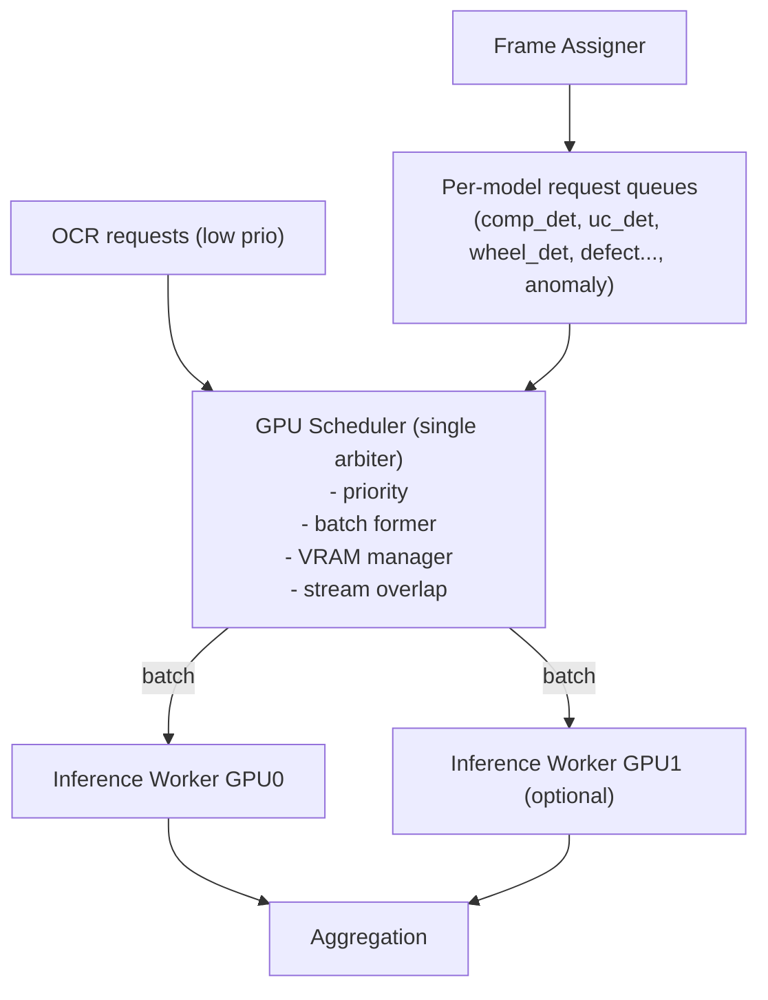

## 11.6 Batching

- **Dynamic batching:** the scheduler accumulates frames for a model up to `max_batch` or `max_wait_ms`, whichever first. Since Tier 2 is throughput-oriented and works on a *complete* set of landed frames, batches can be **large and full** (unlike an online-serving system starved for requests) — this is a major efficiency advantage of the deferred-processing design.
- **Batch by input geometry:** frames going to a model share input size (resized in preprocessing), so a batch is a clean tensor.
- **Two-stage batching:** stage-1 detectors run in big batches over all frames; stage-2 defect classifiers batch the *crops* produced by stage-1 (variable count, batched dynamically).
- **Trade-off:** larger batch = higher throughput but more VRAM and higher latency-to-first-result. With minutes of SLA budget, favor **throughput (large batches)**.

## 11.7 Plugin architecture & future model expansion

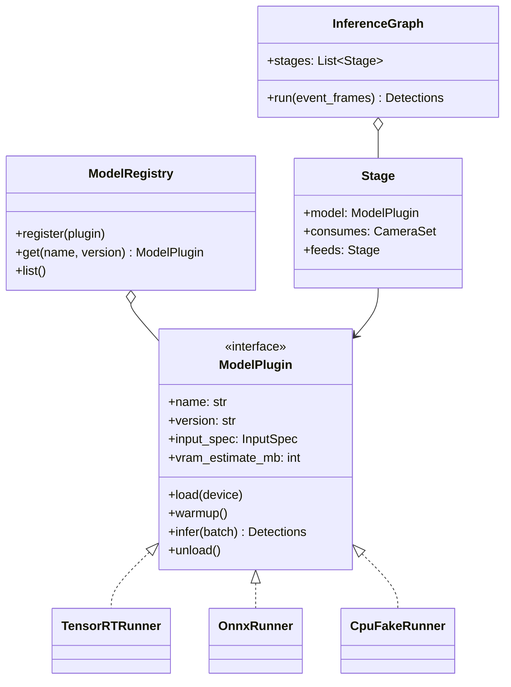

- **Adding a model** = implement `ModelPlugin` (or reuse `TensorRTRunner` with a new artifact), register a `MODEL_VERSION`, and declare a `Stage` in config (which cameras it consumes, what it feeds). **Zero core changes** (NFR-S1, Open/Closed).
- The **InferenceGraph** is declared in config as a DAG of stages, so detect→defect chains and cross-camera fan-in are data, not code.
- **Fake CPU runner** for tests lets the entire pipeline run without a GPU in CI (Ch. 17).

## 11.8 Reproducibility & model governance
- Every detection records its `model_version` (9.3). Re-running a train with the same versions yields identical results (NFR-R4) — critical for A/B validation and incident forensics.
- **Shadow/canary deployment:** a new model version can run in "shadow" (results stored, not shown) against live trains to compare against the incumbent before promotion — the deferred, replayable design makes this essentially free (re-run the durable frames). This is a major MLOps benefit of Tier 1/Tier 2 separation.

---

# Chapter 12 — Dashboard Architecture

## 12.1 Responsibilities
The dashboard is the human window into the system: list inspected trains, drill into coaches → components → defects with source imagery, search/filter, and support operator review (confirm/reject detections, resolve identity). It is **read-mostly** over the DB + object store, with a small write surface (operator actions).

## 12.2 API design

**Decision:** a **versioned REST/JSON API** (FastAPI) as the single backend contract; the frontend is a decoupled SPA. WebSocket/SSE for "report ready" push notifications.
- **Why REST not GraphQL (v1):** the access patterns are well-known and hierarchical (run→event→detection); REST with a few purpose-built endpoints + server-side filtering is simpler to cache, secure, and reason about. GraphQL is reconsidered if the frontend needs proliferate (Ch. 18).
- **Versioning:** `/api/v1/...`; the per-Event JSON schema (10.4) is `schema_version`-tagged so clients survive schema evolution.

### Endpoint sketch
| Method | Path | Purpose |
|---|---|---|
| GET | `/api/v1/trains?from=&to=&portal=&has_defects=&page=` | list runs (from summary table) |
| GET | `/api/v1/trains/{train_run_id}` | run detail + coach list |
| GET | `/api/v1/events/{event_id}` | full per-event result doc (10.4) |
| GET | `/api/v1/events?coach_number=&defect=&severity=&from=&to=` | search/filter |
| GET | `/api/v1/detections/{id}/image` | annotated/source image (redirect to signed object URL) |
| POST | `/api/v1/detections/{id}/review` | confirm/reject (+note) — audited |
| POST | `/api/v1/events/{id}/identity` | operator sets/corrects coach number — audited |
| GET | `/api/v1/health`, `/metrics` | ops |
| WS | `/api/v1/stream` | push: report-ready, alerts |

### Design rules
- **Pagination + server-side filtering always** (never ship the whole detection table to the browser — NFR-P4).
- **Images served via signed/expiring object-store URLs**, not proxied through the API (offloads bandwidth from the app tier; the object store does what it's good at).
- **Idempotent, audited writes**: every operator action writes an `OPERATOR_ACTION` audit row (NFR-SEC3) and never mutates the original model detection — it adds a review overlay (the AI verdict and the human verdict are both retained, which matters for model evaluation and liability).

## 12.3 Backend architecture

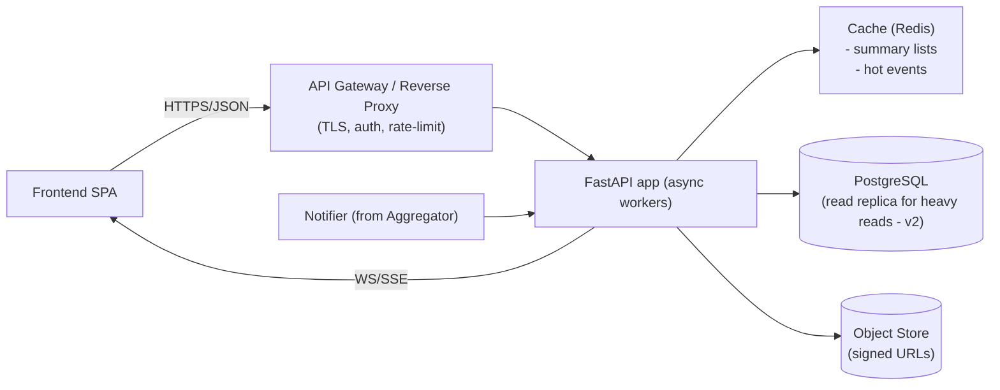
- **Async FastAPI** — I/O-bound serving; scales with a few workers behind the gateway.
- **Redis cache** for the "recent trains" list and hot event docs (dashboards are read-heavy and repetitive) — protects PG and hits NFR-P4.
- **Auth** at the gateway (OIDC/JWT), RBAC in the app (viewer/inspector/admin — NFR-SEC1).

## 12.4 Frontend flow

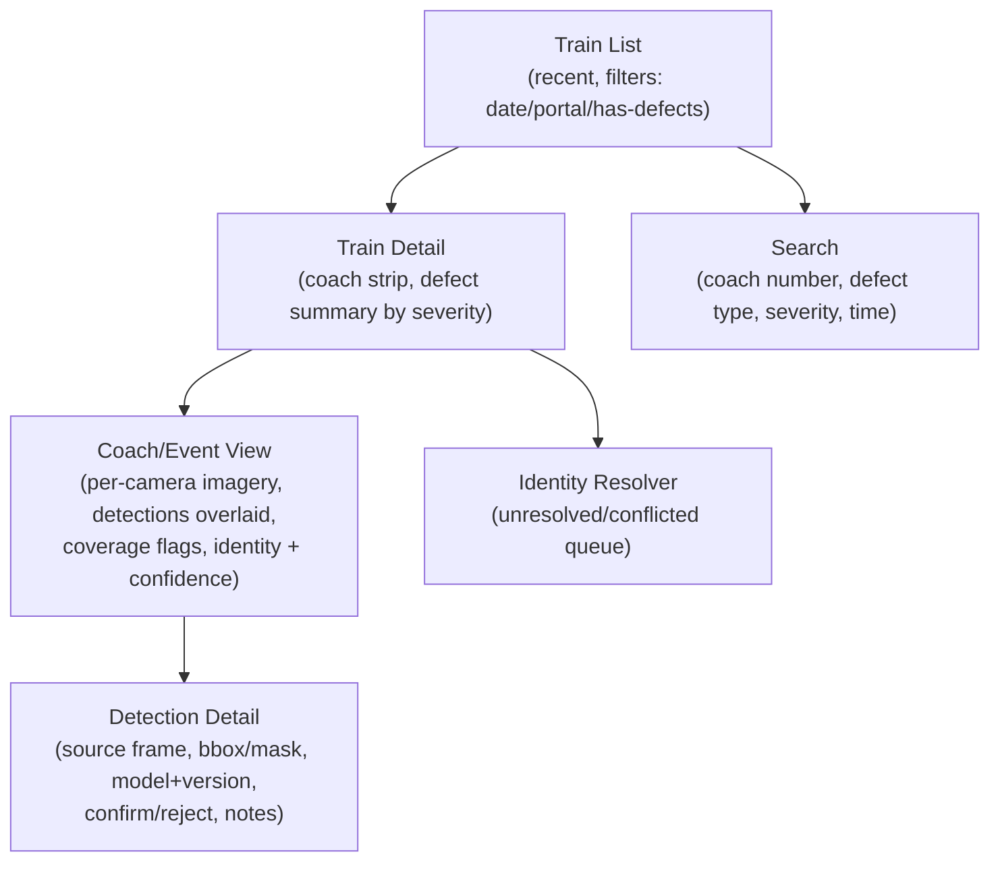

- **Train Detail** shows the coaches as an ordered strip (using `coach_index` — always present even when OCR failed), color-coded by worst severity; unresolved-identity coaches clearly marked.
- **Coach/Event View** overlays detections on the actual imagery per camera bank, honoring **coverage flags** — a `data_unavailable` region is shown as such, never blank-implying-clean (safety, Ch. 8.3.1).
- **Detection Detail** is the traceability endpoint: the exact source frame + geometry + model version that produced the verdict (FR-16).

## 12.5 Dashboard data flow (read path)

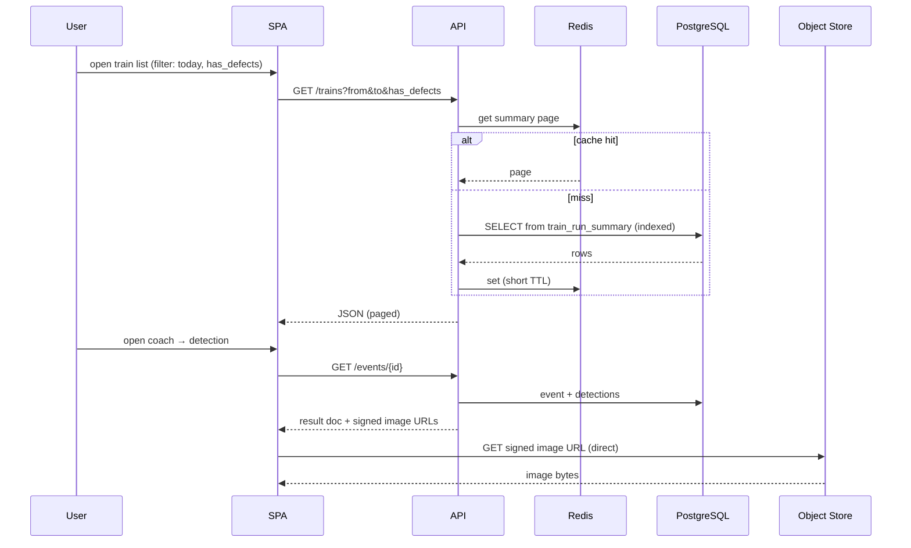

## 12.6 Search, filtering, visualization
- **Search/filter** map directly to indexed columns (9.4): coach_number (partial index), defect_type+severity (composite), time (BRIN). Full-text on notes via PG `tsvector` if needed.
- **Visualization:** per-train severity heatmap along the coach strip; trend charts (defects/day, by type) from summary tables; per-component historical view (a given coach number's defect history over time) — enabled precisely because Event IDs give stable records and OCR gives the human label to group by. (See the `dataviz` skill conventions if charts are built into the SPA.)
- **Export:** per-train report PDF/JSON download (FR-19), generated from the immutable result documents (10.4).

# Chapter 13 — Performance Analysis

All figures use the Ch. 7.2 working assumptions and are **parameterized** — real camera specs (OQ-1) and real model throughput (OQ-4) replace them. The purpose here is to show the *method*, the *budget*, and *where the cliffs are*.

## 13.1 Presence window & train geometry

| Quantity | @120 km/h (33.33 m/s) | @70 km/h (19.44 m/s) |
|---|---|---|
| Time to traverse a 24-coach rake (~528 m) | ~15.8 s | ~27.2 s |
| Time to traverse a long freight (~700 m) | ~21 s | ~36 s |
| **Presence window `T_p` used for sizing** | ~20 s (worst-case rate) | ~30 s (worst-case duration) |

**Insight:** the *highest data rate* occurs at **max speed** (fps must be higher), while the *largest total volume and longest capture* occur at **min speed over a long train** (more time capturing). The system must be sized for **both** the peak instantaneous rate (120 km/h) and the peak total volume (70 km/h, long train). This dual worst-case is a subtle but important sizing point.

## 13.2 FPS calculation (recap + coverage guarantee)

From Ch. 3.2.1, `fps_required = v / (L_fov × (1 − ρ))`. Worked results (ρ=0.3):

| Camera FoV (along-track) | fps @120 km/h | fps @70 km/h |
|---|---|---|
| 0.6 m | 79 | 46 |
| 0.4 m | 119 | 70 |
| 0.2 m (wheel zoom) | 238 | 139 |

**Design fps = worst case (120 km/h).** Running cameras at fixed fps means at 70 km/h you *over-sample* (harmless, more overlap) — unless you use **encoder-phased triggering (D-02b)**, which samples by position and captures **exactly the needed frames at any speed**, cutting the 70 km/h volume substantially. This is the single most effective volume-reduction lever and is strongly recommended.

## 13.3 Data rate & volume (recap)

| Metric | Value (assumptions of 7.2) |
|---|---|
| Aggregate capture rate `R_total` | ~5.86 GB/s (~47 Gbit/s) |
| Volume per train `V_train` | ~117 GB (@20 s) |
| RAM holding time on 32 GB | ~5.5 s (⇒ NVMe mandatory) |
| Required NVMe write bandwidth | ~5.9 GB/s sustained ⇒ multi-drive stripe (D-07) |
| Required network | ~47 Gbit/s ⇒ multi-10/25 GbE or 100 GbE (D-02c) |

## 13.4 The latency budget (the 5–7 minute SLA, decomposed)

The SLA clock starts when the train **clears** the portal (capture done). Budget for **p95 ≤ 7 min = 420 s**:

```
T_report = T_finalize_events + T_frame_assign + T_inference + T_aggregate + T_persist + T_publish
```

| Stage | Work | Budget (p95) | Notes |
|---|---|---|---|
| Finalize events | close last Event, reconcile boundaries | 5 s | most Events already created during capture |
| Frame assignment | index range-queries for all Events×cameras | 20 s | index-driven, parallelizable |
| **Inference** | 9 models over assigned frames | **300 s** | the dominant term — see 13.5 |
| Aggregation | dedup/merge detections | 30 s | CPU-parallel per Event |
| Persist | DB txn + object writes | 40 s | batched; objects-first |
| Publish | summary refresh + notify | 5 s | |
| **Total** | | **≈ 400 s (< 420 s)** | ~20 s headroom on 7-min; ~ tight on 5-min |

**Conclusion:** the SLA is **achievable but inference-bound**, with modest headroom at 7 min and *little* at 5 min. The median (p50 ≤ 5 min) is realistic only if inference is comfortably under budget. **Inference throughput is the make-or-break variable**, which is why OQ-4/D-04 (GPU sizing) is a top decision.

## 13.5 Inference budget (does it fit in ~300 s?)

Let `F` = total frames to run inference on per train. Not all 117 GB of frames go through every model — this is critical:
- **Frame reduction:** overlapping frames are deduplicated; only ROIs/components are passed to stage-2 defect models; line-scan is tiled. Assume an *effective* `F ≈ 3,000–8,000` detector-input tiles per train after dedup (parameter — OQ-4).
- Let GPU stage-1 detector throughput `= 300 img/s` (FP16, batched, mid-range engine — parameter). Stage-2 defect models run on far fewer crops.

```
T_detect ≈ F / throughput = 6000 / 300 = 20 s per detector-model
```
With ~4 detector models + ~4 defect models over crops + anomaly:
```
T_inference ≈ Σ(model_i frames / throughput_i)
```
If the sum lands near **~150–300 s**, we fit. **If real models are slower or `F` larger, we exceed budget** → responses (in priority order):
1. **Reduce `F`** at source (encoder-triggered capture, tighter ROI, mono) — cheapest.
2. **INT8 quantization** (validated) — ~2× throughput.
3. **Bigger single GPU** (more TFLOPs/VRAM).
4. **Multi-GPU / second worker node** (D-04, linear scale).

### ⚠ CHALLENGE — the SLA is a *system* property, not a given
The 5–7 min figure was stated as a requirement, but nothing guarantees it on unknown hardware with unknown models. The honest architectural position: **the two-tier design makes the SLA *tunable*** — because processing is decoupled and horizontally scalable, we can *buy* SLA compliance with GPU capacity. The decision is therefore economic (how much GPU) not architectural, and must be closed once model benchmarks exist (OQ-4).

## 13.6 Resource usage summary (single-node, tight case)

| Resource | Capture phase | Processing phase | Bottleneck? |
|---|---|---|---|
| **CPU** | moderate (packet reassembly, spill, gap, light preproc) | high (preprocessing pool, aggregation) | yes, in Tier 2 preproc |
| **RAM** | rings + buffers (~8–12 GB) | preproc tensors + buffers | **tight at 32 GB (D-01)** |
| **GPU** | idle-ish (gap only) | saturated (goal: ~100% util) | **primary SLA driver (D-04)** |
| **NVMe** | ~5.9 GB/s write | random read for assignment | **write bandwidth (D-07)** |
| **Network** | ~47 Gbit/s in | internal | **link count (D-02c)** |
| **Disk (archive)** | — | retained artifacts | volume/retention (D-08) |

## 13.7 Worst-case analysis

| Worst case | Effect | Mitigation |
|---|---|---|
| Max speed (120) + narrow-FoV wheel cams | highest fps, near-peak rate | size for it; encoder trigger caps it |
| Min speed (70) + longest freight | longest capture, largest volume | NVMe capacity for `V_train` × safety; presence-gated capture |
| Back-to-back trains (no idle gap) | Tier 2 of train N overlaps capture of N+1 | queue is per-train FIFO; **capacity must handle overlap** — this sets the true throughput requirement (D-04). If trains arrive faster than Tier 2 clears them, backlog grows unbounded → this is the real scaling limit. |
| All cameras + all models at once | peak GPU/CPU/mem | scheduler back-pressure; graceful SLA-partial publish |
| Disk near full | capture at risk | free-space guard rejects arm + alerts (never partial silent) |

**The most important worst case is train frequency, not train speed.** Speed sets per-train sizing; **arrival rate sets sustained throughput**. If the mean inter-train interval < mean per-train processing time, the system falls behind permanently. The **maximum sustainable train rate** = `1 / T_process_per_train` (with capacity for overlap), and it is a headline number that must be stated and accepted (OQ-5). This is arguably underspecified in the original brief and must be pinned down.

---

# Chapter 14 — Failure Analysis (FMEA-style)

Each failure: **detection**, **immediate response**, **data outcome**, **recovery**, **severity**. The guiding principle throughout: **fail loud, degrade gracefully, never report an un-inspected region as clean.**

## 14.1 Camera failure

| Aspect | Detail |
|---|---|
| Modes | camera offline, link down, frozen stream, PTP sync loss on one cam, lens obscured/dirty |
| Detection | per-camera heartbeat + expected-frame-count vs actual; PTP offset monitor; image-quality/blank-frame check |
| Response | mark that camera's coverage `data_unavailable` for affected Events; **continue with other 11 cameras**; alert |
| Data outcome | regions covered only by the failed camera → `data_unavailable` (NOT `pass`) |
| Recovery | auto-reconnect w/ backoff; on recovery resume; the train already passed is reported partial |
| Severity | Medium (single) / High (a full bank down → large blind region) |

## 14.2 OCR failure
Covered in depth in Ch. 8.6–8.7. **By design, zero impact on the main pipeline** — Events proceed, report generates, identity is `unresolved`/`pending`, operator resolves later. This is the payoff of the OCR-as-metadata decision. Severity: Low.

## 14.3 GPU failure

| Aspect | Detail |
|---|---|
| Modes | GPU crash/ECC error, driver hang, VRAM OOM, thermal throttle |
| Detection | inference worker health check, CUDA error, watchdog on batch latency |
| Response | restart worker (fresh CUDA context); if persistent, **fail over** to (a) second GPU if present, (b) CPU-fallback runner (slow, breaches SLA but not correctness), or (c) **queue-and-hold** the train's frames (they're durable) and alert — process when GPU restored |
| Data outcome | **no data loss** (frames durable on NVMe); SLA may breach → report published late/partial with `processing_incomplete` |
| Recovery | idempotent re-run from durable frames + Event records |
| Severity | High (SLA) but **not** data-loss — the two-tier design contains it |

## 14.4 Disk failure

| Aspect | Detail |
|---|---|
| Modes | NVMe drive failure, array degraded, disk full, silent bit-rot |
| Detection | SMART, free-space monitor, write-error, per-frame checksum mismatch |
| Response | disk-full guard **rejects new train arm + alerts** (never partial-silent capture); array in RAID/erasure survives a drive; checksum failure flags frame `corrupt`, region `data_unavailable` |
| Data outcome | with redundancy, none; without, bounded & flagged |
| Recovery | drive replace + rebuild; object store erasure-coded; DB WAL + backups |
| Severity | Critical if capture disk (blocks inspection) → **redundancy mandatory** |

## 14.5 Buffer overflow
Covered in Ch. 7.8. Ring overflow → **drop-oldest + counter + log + metric + region flag**; sustained → alert. Processing-queue overflow → back-pressure (no loss). Never a crash, never silent (NFR-F4). Severity: Low–Medium (bounded, observable).

## 14.6 Frame loss

| Aspect | Detail |
|---|---|
| Modes | ring drop (disk slow), network packet loss (GigE Vision incomplete frame), camera drop |
| Detection | frame-sequence-number gaps + expected vs actual counts per camera per Event |
| Response | flag the specific missing spatial region `partial_coverage`; report annotates it |
| Data outcome | bounded, localized, flagged (NFR-R1: ≥99.9% + logged shortfall) |
| Recovery | none per-train (train has passed); trend analysis triggers hardware review if loss is systematic |
| Severity | Medium — a lost region is a potential missed defect ⇒ **must be visible in the report** |

## 14.7 Late events / late OCR
- **Late OCR** — routine, handled (Ch. 8.6): metadata update, no reprocessing.
- **Late Event finalization** (boundary timeout): force-close with `boundary_inferred` (Ch. 8.3.1).
- **Late processing** (SLA guard): publish partial, backfill, alert (Ch. 8.8). Severity: Low–Medium.

## 14.8 Duplicate frames / duplicate events

| Aspect | Detail |
|---|---|
| Duplicate frames | same (camera, encoder_pos/ts) captured twice (retrigger jitter) → dedup by (camera_id, encoder_pos) key in the frame index; aggregation dedups overlapping detections by IoU + position |
| Duplicate/over-segmented events | gap detector fires twice for one gap → EM debounces boundaries against encoder wheel-cadence (D-03); merges spurious micro-Events below `min_coach_length` |
| Under-segmentation (missed gap) | two coaches merged → cross-check flags a too-long Event (> max_coach_length) and splits at expected bogie spacing; operator can re-segment |
| Idempotency | re-processing keyed by Event ID → replays produce identical results, no duplicate rows (upsert by Event ID) |
| Severity | Medium — segmentation errors corrupt the coach→defect mapping; the encoder cross-check is the key mitigation (D-03) |

## 14.9 Recovery strategy (consolidated)

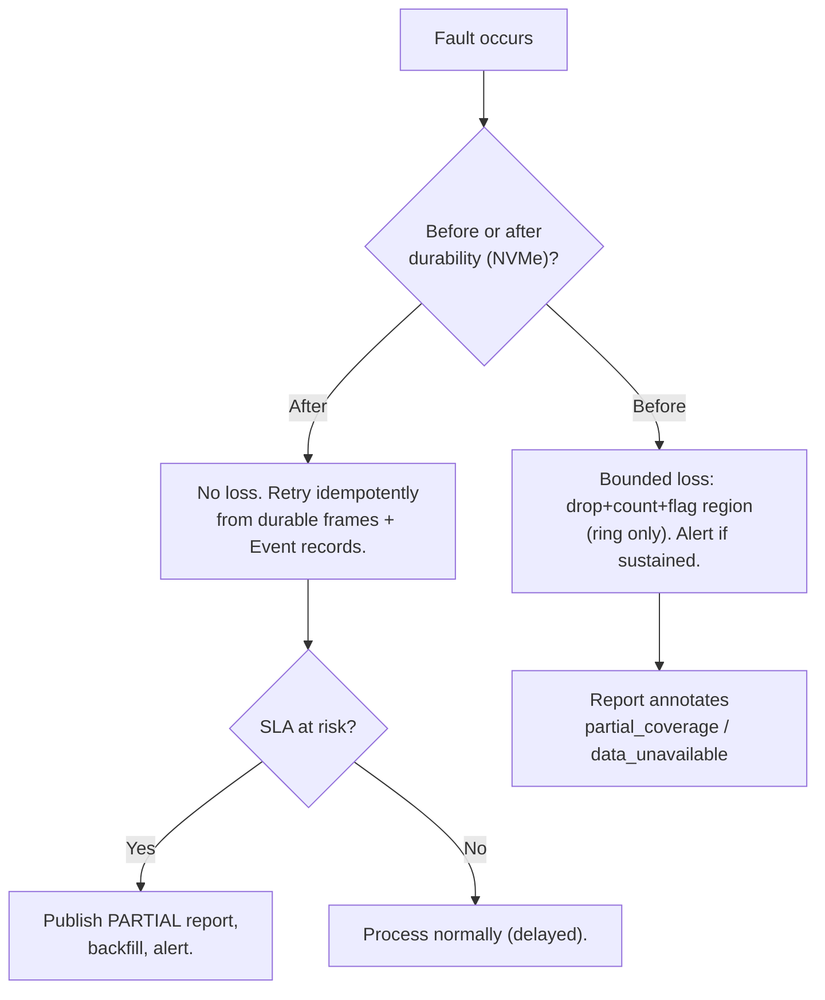

**Recovery invariants:**
1. Durability boundary (NVMe write) is the recovery anchor — everything after it is replayable.
2. Every recovery path is **idempotent and Event-ID-keyed**.
3. Every degradation is **visible in the report** — no silent recovery that hides a coverage gap.
4. A single component failure **never** takes down the portal (NFR-A2, NFR-F1).

# Chapter 15 — Monitoring & Observability

## 15.1 Why observability is a first-class requirement here
This is an **unattended, trackside, safety-adjacent** system. When a train passes, there is no second chance to capture it. Observability is not a nice-to-have — it is how the system proves it did its job (every inspection auditable) and how operators know *before* a train arrives that the portal is healthy enough to inspect it. The design covers the three pillars — **logs, metrics, traces** — plus **health** and **alerting**, and adds a domain-specific concept: **per-train inspection completeness telemetry**.

## 15.2 Metrics (Prometheus model)

| Category | Metric (examples) | Type | Alert threshold |
|---|---|---|---|
| Capture | `frames_captured_total{camera}`, `frames_dropped_total{camera}`, `capture_rate_bytes` | counter/gauge | dropped > 0 sustained |
| Sync | `ptp_offset_ns`, `encoder_signal_ok`, `frame_ts_jitter_ns` | gauge | offset > threshold |
| Buffers | `ring_fill_ratio{camera}`, `nvme_free_bytes`, `queue_depth{stage}` | gauge | ring > 0.8; nvme_free < guard |
| Events | `events_created_total`, `events_state{state}`, `boundary_inferred_total`, `segmentation_mismatch_total` | counter/gauge | mismatch spike |
| Identity | `ocr_resolved_total`, `ocr_unresolved_total`, `ocr_conf_histogram` | counter/hist | unresolved ratio high |
| Inference | `inference_batch_latency_seconds{model}`, `gpu_util`, `gpu_mem_used`, `model_throughput_img_s` | hist/gauge | util low w/ backlog; OOM |
| SLA | `report_latency_seconds` (train clear → published), `trains_processed_total`, `trains_sla_breached_total` | hist/counter | p95 > 7 min |
| Storage/DB | `db_txn_latency`, `object_write_latency`, `pg_connections`, `partition_size` | hist/gauge | latency spikes |
| Availability | `portal_ready` (can inspect next train?), `worker_up{name}` | gauge | portal_ready == 0 |

**The headline SLO dashboards:** (1) `report_latency_seconds` p50/p95 vs the 5/7-min lines; (2) `portal_ready` uptime; (3) per-camera `frames_dropped`; (4) GPU utilization vs backlog. If these four are green, the system is meeting its promises.

## 15.3 Logging
- **Structured JSON logs** (one event per line), correlation by `train_run_id` and `event_id` on **every** log line crossing the pipeline — so an operator can `grep`/query the entire life of one coach across all processes. This correlation ID is the single most useful debugging affordance.
- **Levels:** DEBUG (dev), INFO (lifecycle transitions), WARN (bounded degradation: drops, retries), ERROR (component fault), CRITICAL (portal cannot inspect).
- **Shipping:** local files (rotated) + shipped to a central log store (Loki/ELK). Trackside nodes buffer logs locally so a network blip doesn't lose audit trail.
- **Audit logs** (operator actions, identity changes, config changes) are **separate, append-only, tamper-evident** (NFR-SEC3) — not mixed with operational logs.

## 15.4 Tracing
- **OpenTelemetry** spans across the pipeline stages of a single train (capture→assign→infer→aggregate→persist→publish), so the latency budget (13.4) is measured, not assumed. A trace per `train_run_id` shows exactly which stage consumed the SLA — invaluable for tuning and for proving the budget in acceptance testing.

## 15.5 Health dashboard
A dedicated **operations health view** (distinct from the inspection dashboard, Ch. 12), showing:
- **Portal readiness** (traffic-light): cameras online, PTP locked, disk headroom, GPU healthy, workers up → *is the portal ready for the next train?*
- Live per-camera stream status + last-frame preview + drop counters.
- Current train being processed + its stage + ETA to report.
- Recent SLA compliance, recent alerts, backlog depth.
- Model versions currently deployed.

## 15.6 Alerting
| Severity | Example | Channel | Response |
|---|---|---|---|
| CRITICAL (page) | portal not ready; capture disk full; GPU down with no fallback; SLA breach trend | PagerDuty/SMS | immediate |
| WARNING | sustained frame drops; PTP drift; queue backlog rising; OCR unresolved ratio high | Slack/email | investigate |
| INFO | model deployed; retention job ran; train processed | dashboard/log | none |

**Alert design principle:** alerts fire on **symptoms that threaten the mission** (can't inspect, will miss SLA, losing data), not on every transient blip (which trains noise-blindness). Every CRITICAL has a runbook (Ch. 17 / ops docs).

## 15.7 Telemetry storage
Metrics in Prometheus (or TimescaleDB for long retention + SQL), Grafana dashboards, 15–90 day retention (Ch. 10.5). Telemetry is **isolated from the transactional DB** so a metrics flood never impacts inspection persistence.

---

# Chapter 16 — Deployment Architecture

## 16.1 Deployment philosophy & environment
This is an **industrial edge** deployment: on-premise, trackside (or in a nearby equipment room), on an **isolated OT network** (NFR-SEC5), operating unattended. It is *not* a cloud-native web app, and the deployment reflects that: local-first, resilient to network loss, with the cloud as an *optional* backhaul (Ch. 18), never a dependency for core inspection.

## 16.2 Node topology

### ⚠ CHALLENGE — one node is likely insufficient; recommend a 2-node split
The brief implies one node (32 GB, one GPU). Given Ch. 7/13, the recommended v1 topology is **two purpose-built nodes** on the trackside LAN:

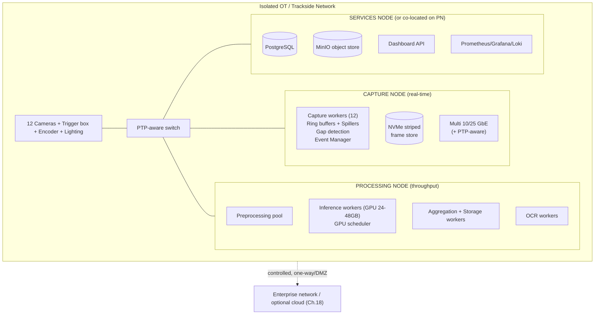

- **Capture node**: sized for the ~5.9 GB/s NVMe write + ~47 Gbit/s ingest; modest GPU (gap detection only). RAM ≥ 32 GB (64 GB recommended).
- **Processing node**: the GPU box (24–48 GB VRAM), high core count for preprocessing, RAM ≥ 64 GB.
- **Services**: PG + MinIO + API + monitoring; can co-locate on the processing node for the smallest sites, or be a small third node for isolation.
- **Rationale for the split**: it decouples the loss-sensitive real-time tier from the resource-hungry processing tier (they have opposite resource profiles and opposite failure tolerances), and lets each scale independently. A single node forces capture and inference to fight for RAM/PCIe/CPU — exactly the contention the two-tier architecture exists to avoid. This is decision **D-09**.

## 16.3 Containerization (Docker)
- **Every process is a container**: `capture`, `gap`, `event-manager`, `preproc`, `ocr`, `inference`, `aggregator`, `storage`, `api`, plus `postgres`, `minio`, `prometheus`, `grafana`.
- **GPU containers** use the NVIDIA Container Toolkit (`--gpus`); TensorRT engines are built in a deploy step matched to the target GPU/driver (11.4) and baked into (or mounted for) the inference image.
- **Base images** pinned/digest-locked; multi-stage builds; non-root; minimal surface. Model artifacts and TensorRT engines are **mounted volumes / pulled from the registry**, not baked into source images (so a model update doesn't rebuild the app image).
- **Config & secrets** via mounted config + a secrets mechanism (Docker/OS secrets; Vault at scale) — never in images (NFR-SEC2).

## 16.4 Docker Compose (v1 orchestration)

**Decision:** Docker Compose for v1 single-site orchestration.
- **Why:** the deployment is a fixed set of services on 1–3 known nodes. Compose is simple, declarative, debuggable, and matches the operational reality (a site technician can `compose up`). Kubernetes here would be **operational overkill** — its value (multi-node scheduling, autoscaling, self-healing across a cluster) doesn't pay off on a fixed trackside box, and it adds a large ops burden for an unattended edge site.
- **Structure:** device passthrough for cameras/trigger/GPIO/GPU; host networking or macvlan for the camera VLAN + PTP; named volumes for NVMe frame store, PG data, MinIO data; healthchecks + `restart: unless-stopped` (the supervisor role, Ch. 6.6); resource limits per service.
- **Multi-node v1:** Compose per node + a shared config, or Docker Swarm if light multi-node scheduling is wanted without full K8s.

## 16.5 Future Kubernetes (v2)
K8s becomes worthwhile when there are **many portals/tracks** to manage centrally (Ch. 18): a fleet operator wants one control plane, rolling model upgrades across sites, GPU scheduling across a pool, and self-healing. Migration path is smooth because:
- Everything is already a container with healthchecks.
- Stages already communicate via queues/durable store, not in-memory coupling → they become Deployments/Jobs.
- The `messaging` port swaps in-proc queues for a broker (Ch. 8.9) → cross-pod eventing.
- GPU nodes use the NVIDIA device plugin; inference workers become a GPU-scheduled Deployment/`InferenceService` (KServe).
This is provisioned-for, not built, in v1 (avoid speculative generality — YAGNI applied deliberately).

## 16.6 GPU deployment specifics
- NVIDIA driver + CUDA + cuDNN + TensorRT pinned versions; **TensorRT engine build is target-specific** (16.3) — the deploy pipeline builds engines on/for the exact GPU model.
- **MPS (Multi-Process Service)** considered for sharing one GPU among inference + OCR workers with better isolation than naive context-sharing; the single-scheduler design (11.5) already serializes submission, so MPS is an optimization, not a requirement.
- **GPU health**: DCGM exporter → Prometheus (temp, ECC, util, mem).

## 16.7 Industrial edge considerations
- **Environmental**: trackside means vibration, dust, temperature extremes, EMI → industrial-rated enclosures, conformal-coated boards, IP-rated camera housings, cleaning/wiper strategy for lenses (a dirty lens = `data_unavailable`, monitored). These are **integrator deliverables** (Appendix B) but the software surfaces their health (lens-obscured detection, 14.1).
- **Power**: UPS-backed so an in-progress inspection completes and state flushes on power loss (graceful shutdown, 6.6). Generator/redundant feed per site policy.
- **Remote management**: out-of-band management (IPMI/iDRAC) for the unattended site; a controlled DMZ/one-way path to enterprise for logs/reports/updates — **no inbound internet to the OT segment** (NFR-SEC5).
- **Update strategy**: staged, canary per site; model updates are config+artifact (no app rebuild); rollback = repoint to previous `MODEL_VERSION`/engine (11.8).

---

# Chapter 17 — Testing Strategy

## 17.1 Testing philosophy
The system has two very different testable surfaces: **software correctness** (pipeline, events, DB, API — deterministic, testable with fakes) and **ML/imaging performance** (accuracy, capture quality — statistical, testable only with real/representative data). The strategy treats them separately and provides a **hardware-in-the-loop** path plus a fully **simulated** path so most of the system can be tested **without a train and without a GPU** (essential for CI and for parallel team development).

## 17.2 The test pyramid + the simulation harness

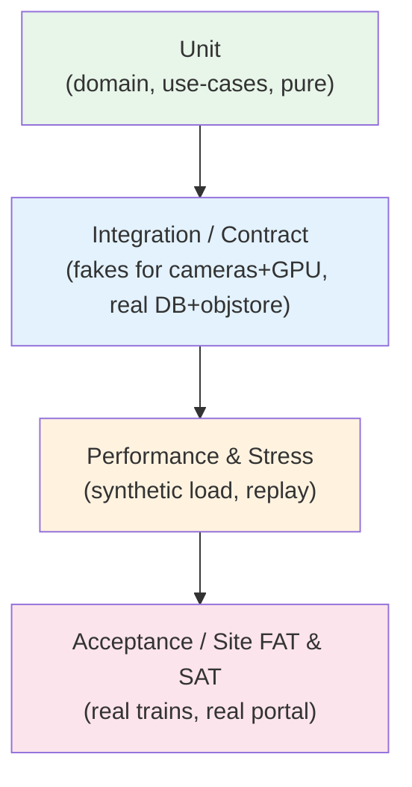

**Simulation harness (key enabler):** a **`CameraSource` fake** replays recorded or synthetic frame sequences (with realistic timestamps/encoder positions), a **`ModelRunner` CPU-fake** returns canned/deterministic detections, and a **train generator** produces multi-coach passes with configurable gaps, speeds, dropped frames, OCR-unreadable coaches, and injected defects. This harness lets the **entire pipeline run end-to-end on a laptop in CI**, and lets QA reproduce specific failure scenarios deterministically. Building this harness is a **first-milestone deliverable**, not an afterthought — it unblocks every other team (Appendix D).

## 17.3 Unit testing
- **Domain layer**: Event state machine transitions (all edges of Ch. 8.3, including timeout/partial/degraded), severity/retention policies, dedup logic — pure, fast, 100%-of-branches target on the state machine (it is safety-critical).
- **Use cases**: with all ports faked — e.g., `RunInspection` with a fake `ModelRunner`, `EnrichIdentity` with a fake OCR that returns late/failed/conflicting results (proves FR-10/FR-11/FR-12 structurally).
- **Property-based tests** for frame-assignment (any set of frames + boundaries assigns correctly; overlapping frames land in both events; position/time reconciliation is monotonic).

## 17.4 Integration & contract testing
- **Contract tests** per port: every real adapter and its fake must pass the *same* contract test suite (guarantees Liskov substitutability — the fake used in unit tests behaves like the real thing).
- **Integration**: real PostgreSQL + real MinIO (in containers) + faked cameras/GPU → verifies atomic Event commit (9.7), object-first/pointer-second ordering, idempotent reprocessing (replay a train twice → identical rows), late-OCR update path, partition/retention jobs.
- **Pipeline integration**: full simulated train through all stages → assert report completeness, coverage flags, traceability (every detection → source frame).

## 17.5 Stress testing
| Scenario | Method | Pass criteria |
|---|---|---|
| Peak data rate | synthetic 12-camera feed at 120 km/h fps for T_p | zero silent loss; drops (if any) counted; NVMe keeps up |
| Long freight @70 km/h | 700 m simulated pass | full capture; volume within NVMe budget |
| Back-to-back trains | queue N trains with no idle gap | backlog bounded; SLA held or gracefully partial; **find the max sustainable train rate (OQ-5)** |
| Buffer overflow | throttle NVMe below rate | drop-oldest+count+alert, no crash |
| Queue saturation | slow a consumer | back-pressure, no OOM, no loss past durability |
| Memory soak | 24–72 h continuous | no leak (stable RSS); no FD/handle leak |

## 17.6 Performance testing
- Measure the **latency budget** (13.4) with OpenTelemetry traces on replayed real trains → validate p50 ≤ 5 min, p95 ≤ 7 min on target hardware (this is where OQ-4/D-04 is *closed with data*).
- **GPU throughput benchmark** per model (img/s at FP16/INT8) → feeds the inference budget (13.5) and the GPU sizing decision.
- **Load test** the dashboard API (concurrent users) → NFR-P4 (p95 < 2 s).

## 17.7 ML accuracy / acceptance testing (the hard one)
- **Per-model, per-class metrics** on a held-out, representative test set: precision, recall, F1, and crucially **recall on safety-critical defect classes** (a missed critical defect is the failure that matters). Acceptance thresholds are **set per class by the safety authority** (OQ-3) — e.g., wheel-shelling recall ≥ X%, brake-wear recall ≥ Y%.
- **Confusion analysis** especially false-negatives (missed defects) and the `data_unavailable`-vs-`pass` distinction (the system must never label an unimaged region clean).
- **Anomaly model** validated on injected OOD cases.
- **Field validation**: a supervised period where every AI verdict is human-reviewed (the `OPERATOR_ACTION` overlay, Ch. 12) to build a real-world precision/recall baseline before the system is trusted unattended. The dual-verdict data (AI + human) is retained and feeds retraining (Ch. 18).

## 17.8 Acceptance testing (FAT / SAT)
- **FAT (Factory Acceptance Test)**: full system on the bench with the simulation harness + recorded real trains → all functional/non-functional requirements demonstrated against Ch. 2 traceability matrix.
- **SAT (Site Acceptance Test)**: on the installed trackside portal with **real trains at 70 and 120 km/h**, over a defined number of passes, measuring: capture completeness, segmentation correctness, identity resolution rate, per-class accuracy, SLA compliance, and availability over a burn-in period. SAT sign-off is the gate to unattended operation.
- **Regression suite**: every model version and code change re-runs the recorded-train corpus; no metric regresses beyond tolerance (11.8 shadow deployment supports this).

## 17.9 Test data management
- A **corpus of recorded real trains** (raw frames + ground-truth labels + expected reports) is a project asset, versioned (DVC/LFS), and is the backbone of regression + accuracy testing. Because the architecture stores durable raw frames (Ch. 7), production naturally *grows* this corpus — a virtuous loop for continuous ML improvement.

---

# Chapter 18 — Future Roadmap

## 18.1 Scaling dimensions (and what each requires)

| Dimension | Trigger | Architectural response | Already provisioned? |
|---|---|---|---|
| **Higher train frequency** | trains arrive faster than Tier 2 clears | more inference workers / GPUs; multi-node processing pool | Yes — stages are horizontally scalable, per-train FIFO |
| **More cameras** | new inspection angle | config entry + capacity (NVMe/net/GPU) | Yes — camera is config (NFR-S2) |
| **Higher FPS / resolution** | finer defects | more NVMe/net bandwidth; more preproc/GPU | Yes — parameterized sizing |
| **More models** | new defect types | register plugin + config graph | Yes — Open/Closed (NFR-S1) |
| **Multiple tracks** | second/third line | portal instance per track; shared services or per-track | Partially — needs broker + fleet control |
| **Multiple portals / fleet** | network of sites | central control plane, cross-site correlation | Roadmap (K8s + broker + cloud) |
| **Distributed processing** | single-node ceiling | actor framework (Ray) / cluster; broker-backed events | Roadmap (interfaces already message-based) |
| **Cloud integration** | central analytics/DR | S3 replication, cloud dashboard, cloud (re)training | Roadmap (S3 API already used) |

## 18.2 v2 substrate evolution
- **Messaging**: in-proc queues → **Redis Streams / NATS / Kafka** (durable, cross-host events). The `messaging` port (5.4, 8.9) makes this an adapter swap.
- **Compute**: processes+queues → **Ray** (or K8s Jobs) for elastic multi-node inference, keeping the same `ModelRunner`/`InferenceGraph` contracts.
- **Orchestration**: Docker Compose → **Kubernetes** for fleet management (16.5).
- **Event Manager HA**: single leader → **leader election** (etcd/Raft) removing the SPOF (8.9).

## 18.3 Cloud integration (optional, carefully bounded)
- **Backhaul only**: reports, metrics, and defect-evidence artifacts replicate to cloud for central analytics, cross-portal fleet views, and disaster recovery. **Core inspection never depends on cloud connectivity** (edge-autonomous — a WAN outage must not stop inspecting trains).
- **Cloud MLOps**: the growing labeled corpus (17.9) feeds cloud training pipelines; new models flow back to edge sites as versioned artifacts (11.4/11.8). This closes the continuous-improvement loop.
- **Data governance**: what leaves the OT segment, encrypted, over a controlled path, per site/regulatory policy (NFR-SEC).

## 18.4 Advanced capabilities (longer horizon)
- **Predictive maintenance**: trend a specific coach/component's defect trajectory over time (enabled by stable Event IDs + resolved identities) → predict failures before they occur, not just detect them.
- **3D / stereo reconstruction** of the undercarriage from multi-camera overlap for measurement-grade defect sizing.
- **Active learning**: the anomaly model + operator rejections auto-nominate hard cases for labeling.
- **Digital twin** of rolling stock integrating inspection history across portals.

## 18.5 What NOT to build yet (deliberate non-goals)
To avoid speculative complexity that would slow v1: no microservices, no K8s, no message broker, no multi-track, no cloud dependency in v1. Each is *provisioned for* via clean interfaces but built only when a concrete trigger (18.1) justifies its operational cost. Premature distribution is the most common way systems like this fail to ship.

---

# Appendix A — Architectural Risks (ranked)

| # | Risk | Likelihood | Impact | Mitigation | Owner |
|---|---|---|---|---|---|
| R-1 | **Imaging quality inadequate at line speed** (motion blur, lighting, GSD) → models can't detect regardless of software | High | Critical | Coupled imaging design (Ch.3); strobe/line-scan; SAT at 70 & 120 km/h before trust; this is the true critical path | Integration/Imaging |
| R-2 | **32 GB RAM / single node insufficient** → capture loss or contention | High | High | Capture-to-NVMe (Ch.7); recommend 64–128 GB + 2-node split (D-01, D-09) | Architecture/DevOps |
| R-3 | **Single GPU can't meet SLA over 9 models** | Med-High | High | GPU sizing from benchmarks; INT8; multi-GPU path (D-04); volume reduction at source | ML/DevOps |
| R-4 | **NVMe write bandwidth / network bandwidth under-provisioned** (~5.9 GB/s, ~47 Gbit/s) | Med | Critical | Striped NVMe, multi-NIC/100GbE, encoder-triggered volume reduction (D-07, D-02c) | DevOps/Integration |
| R-5 | **Gap detection mis-segments coaches** (missed/double gaps) | Med | High | Encoder wheel-cadence cross-check (D-03); timeout force-close; operator re-segment | ML/Backend |
| R-6 | **PTP sync loss** degrades cross-camera alignment | Low-Med | Med | PTP-aware switches, redundant grandmaster, encoder-position fallback, monitoring | Integration |
| R-7 | **Train frequency exceeds sustainable throughput** → permanent backlog | Med | High | Define & accept max train rate (OQ-5); scale Tier 2; back-pressure visibility | Architecture/Ops |
| R-8 | **Event Manager SPOF** | Low | Med | Fast stateless recovery from DB; leader election in v2 | Backend |
| R-9 | **Storage cost explosion** (117 GB/train) | Med | Med | Defect-aware retention (Ch.10.5); transient raw frames; source volume reduction (D-08) | Architecture/Ops |
| R-10 | **ML accuracy below safety thresholds** (esp. false negatives) | Med | Critical | Per-class acceptance gates (OQ-3); supervised field validation; anomaly safety-net | ML/Safety |
| R-11 | **Python GIL / wrong concurrency model** throttles throughput | Med | Med | Process-based CPU/GPU stages; shared-memory frame handoff (D-05, D-06) | Backend |
| R-12 | **Lens contamination / environmental** degrades capture silently | Med | High | Lens-obscured detection → `data_unavailable`; cleaning strategy; health monitoring | Integration |

# Appendix B — Open Questions (must be answered before implementation)

| # | Question | Blocks | Needed from |
|---|---|---|---|
| OQ-1 | **Exact camera specs**: resolution, pixel format (mono/color), fps/line-rate, FoV, GSD, exposure, per camera | Ch.7/13 sizing; storage/net/GPU budgets; nearly everything | Imaging/Integration + camera vendor |
| OQ-2 | Physical layout: cameras per side, both-sides coverage, wheel-camera count/geometry, portal dimensions | Coverage map; frame assignment | Integration/Civil |
| OQ-3 | **Per-class accuracy acceptance thresholds** (esp. safety-critical recall) | Acceptance testing; go-live | Railway Safety Authority |
| OQ-4 | Real per-model VRAM footprint & throughput (img/s) on the target GPU | GPU sizing (D-04); SLA feasibility | ML team (benchmarks) |
| OQ-5 | **Max train frequency** the portal must sustain (trains/hour, inter-arrival distribution) | Tier-2 throughput sizing; backlog risk | Railway Operations |
| OQ-6 | Regulatory **retention periods** for defect evidence & records | Storage sizing & cost; archive design | Legal/Regulatory |
| OQ-7 | Lighting/strobe design & power budget (couples with exposure at speed) | Image quality (R-1) | Imaging/Integration |
| OQ-8 | Train length distribution & max (rake vs freight) | Presence window, NVMe capacity | Railway Operations |
| OQ-9 | Encoder/tachometer source & resolution (or wheel-sensor placement) | Line-scan geometry, position coordinate, cross-check | Integration |
| OQ-10 | Network/power/environmental site constraints & OT security policy | Deployment (Ch.16) | Site/IT/Security |
| OQ-11 | Direction-of-travel handling (bidirectional portal? mirrored numbering?) | Segmentation, identity | Operations/Backend |
| OQ-12 | Existing systems to integrate (asset DB, maintenance/CMMS) & API contract | Dashboard/integration scope | Customer IT |

# Appendix C — Assumptions

1. Single track, single portal, single direction for v1 (bidirectional is OQ-11).
2. Trains pass at 70–120 km/h without stopping; the portal never actuates the train.
3. Camera parameters in Ch.7.2 are **placeholders** until OQ-1; all sizing scales from them.
4. A wheel encoder/tachometer position signal is available and reliable (OQ-9).
5. PTP-aware network hardware and a grandmaster clock are procured (not commodity switches).
6. Lighting/strobe is engineered to freeze motion at 120 km/h (OQ-7) — assumed solved by integrator; flagged as top risk R-1.
7. GPU is an NVIDIA data-center/pro card with ≥24 GB VRAM (revisit at D-04).
8. The OT segment is network-isolated; cloud is optional backhaul only.
9. Defect classes and their severity mapping are provided by the ML/safety teams.
10. "Report ready in 5–7 min" clock starts when the train clears the portal.
11. Nine models are the v1 set; more will follow via the plugin interface.
12. Storage retention is defect-aware (clean raw frames are transient).

# Appendix D — Recommended Implementation Roadmap

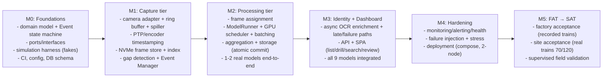

**Sequencing rationale:** the **simulation harness and interfaces come first (M0)** so all teams work in parallel against contracts without waiting for hardware or GPUs. The **capture tier (M1)** is next because it is the hardest real-time/hardware-coupled part and gates everything downstream. Processing (M2) proves the SLA path with 1–2 models before scaling to 9 (M3). Hardening and acceptance (M4–M5) are explicit phases, not afterthoughts. **Imaging/lighting hardware bring-up (R-1) runs in parallel from day one** on the integrator track — it is the true long-pole and must not wait for software.

# Appendix E — Prioritized Technical Decisions Requiring Stakeholder Approval

| ID | Decision | Options | Recommendation | Why it matters | Priority |
|---|---|---|---|---|---|
| **D-01** | RAM & node memory | 32 GB (as stated) / 64 / 128 GB | **64–128 GB**, capture ≠ inference node | 32 GB is fragile (Ch.7.9) | P0 |
| **D-02** | Camera acquisition params | (a) fixed-fps free-run (b) **encoder-phased trigger** (c) transport GigE vs CoaXPress | **(b) encoder-phased**; GigE Vision baseline, CoaXPress for Cam7 if needed | Sets volume/net/GPU cost (Ch.13) | P0 |
| **D-03** | Segmentation robustness | vision-only gap / **vision + encoder cross-check** | **cross-check** | Coach mis-segmentation is high-impact (R-5) | P0 |
| **D-04** | GPU capacity & residency | 1 GPU all-resident / grouped-swap / phase / **multi-GPU** | Decide from OQ-4 benchmarks; design supports all | Determines SLA feasibility | P0 |
| **D-05** | Concurrency model | threads / **processes+threads** / free-threaded 3.13 | **processes for CPU/GPU, threads for I/O** | GIL throughput (R-11) | P1 |
| **D-06** | Frame IPC | pickled queue / **shared memory handles** | **shared memory** | multi-MB frames can't go through pickle | P1 |
| **D-07** | Capture storage | single SSD / **striped NVMe array** | **striped Gen4/5 NVMe** | ~5.9 GB/s write (R-4) | P0 |
| **D-08** | Retention policy | keep-all / **defect-aware tiered** | **defect-aware** | 117 GB/train economics (R-9) | P1 |
| **D-09** | Node topology | 1 node / **2–3 node split** | **capture + processing (+ services)** | resource-profile conflict (R-2) | P0 |
| **D-10** | Inference backend | Torch / ONNX RT / **TensorRT (ONNX source)** | **TensorRT**, ONNX RT fallback | throughput vs portability | P1 |
| **D-11** | Object store | filesystem / **MinIO (S3 API)** | **MinIO** | cloud path + lifecycle | P2 |
| **D-12** | Orchestration v1 | **Compose** / Swarm / K8s | **Compose** (K8s in v2) | avoid edge over-engineering | P2 |
| **D-13** | Precision | FP16 / **INT8 (validated)** | **INT8 where accuracy passes** | ~2× throughput vs safety recall | P1 |

# Appendix F — Glossary

| Term | Meaning |
|---|---|
| ADS | Architecture Design Specification (this document) |
| Event / Event ID | One coach/bogie inspection unit; its opaque, globally-unique primary key |
| TrainRun | A single train's pass through the portal |
| Tier 1 / Tier 2 | Capture (real-time) / Processing (throughput) tiers |
| PTP | Precision Time Protocol (IEEE 1588) — sub-µs network time sync |
| GSD | Ground Sample Distance — metres per pixel |
| Line scan / Area scan | Row-at-a-time (position-sampled) / full-frame (time-sampled) camera |
| Ring buffer | Fixed-size RAM staging buffer, drop-oldest under overflow |
| Frame store / index | Durable NVMe frame storage + queryable index by (cam, ts, pos) |
| Back-pressure | Flow control where a full downstream slows the upstream |
| `data_unavailable` | A region that could not be imaged — never reported as `pass` |
| SLO / SLA | Service-level objective / agreement (here: 5–7 min report) |
| FAT / SAT | Factory / Site Acceptance Test |
| Two-stage model | Detector → per-region defect classifier |
| SPOF | Single Point Of Failure |

---

## Closing Statement

This specification's central architectural moves are four: **(1)** a hard seam between a loss-sensitive real-time **capture tier** and a throughput-oriented **processing tier**, joined by a durable NVMe frame store that makes all processing replayable and idempotent; **(2)** an **Event-ID-centric, event-driven** model in which gap detection creates the units of inspection and OCR only ever enriches metadata — never blocks, never keys; **(3)** a **Clean/layered, port-and-adapter** software design that keeps the volatile parts (cameras, models, DB, web) out of a stable safety-critical core and lets six teams build in parallel against contracts and fakes; and **(4)** an honest, quantified confrontation with the physics — the **32 GB RAM, single-GPU, and area-scan-at-line-speed** assumptions are shown by the numbers to be the program's principal risks, and are converted into explicit, stakeholder-owned decisions (D-01, D-04, D-02) rather than buried assumptions.

The document is a blueprint, but it is deliberately *not* a green light: the P0 decisions in Appendix E and the open questions in Appendix B — above all **the imaging/lighting design at line speed (R-1) and the real camera and model parameters (OQ-1, OQ-4)** — must be closed before build, because they, not the software, determine whether the system is physically capable of the mission. The architecture is designed to make those the *only* things that must be true; everything downstream of a good image and an adequate compute budget is engineering this document has already de-risked.

*End of Part I (Baseline v1.0).*

---
---

# PART II — CHIEF ARCHITECT'S FINAL REVIEW & DETAILED DESIGN SUPPLEMENT (v1.1)

> **Purpose of Part II.** Part I is a strong, self-aware baseline. This part is the **Chief Architect's final design review before production approval**. It does two things: (1) records the **review verdict** — weaknesses, missing sections, hidden assumptions, and residual risks that Part I under-specifies; and (2) supplies the **normative detail** that implementation teams need to proceed with minimal ambiguity, in the exact areas the review found thin: camera synchronization procedures, the full thread/worker responsibility matrix, dimensioned producer–consumer queues, an end-to-end (capture→archive) event lifecycle, **formal ADRs**, parameterized RAM and storage sizing, GPU scheduling, failure-recovery workflows (including the **database-outage gap**), critical-workflow sequence diagrams, a **consolidated SLO register**, an extended risk register, and the open questions that gate build.
>
> Part II **does not modify** Part I; where it deepens a Part I chapter it cites it (e.g., "extends Ch. 8.3"). Where Part I and Part II disagree numerically, Part II is the controlling version for v1.1.

---

# Appendix G — Chief Architect's Review: Verdict, Weaknesses & Hidden Assumptions

## G.1 Overall verdict

**Conditional approval to proceed to detailed design, NOT to build.** The architecture is sound: the Tier-1/Tier-2 seam, the Event-ID-as-surrogate-key principle, the port-and-adapter core, and the honest confrontation with the RAM/GPU/imaging physics are all correct and load-bearing. The document is unusually candid about its own risks, which is itself a quality signal.

Approval is **conditioned** on closing the P0 decisions (Appendix E) and P0 open questions (Appendix B) — above all OQ-1 (camera parameters), OQ-4 (model footprints), OQ-5 (train frequency), and R-1 (imaging at line speed). None of these are software problems; all of them determine whether the software's budgets are real. **A green light on software design must not be read as a green light on the system.**

## G.2 Weaknesses & missing sections found in the baseline (and where Part II closes them)

| # | Finding | Severity | Closed in |
|---|---|---|---|
| F-1 | **No formal ADRs.** Appendix E is a decision *table*, not decision *records* — it lacks context, consequences, rejected-alternatives rationale, and status/supersession tracking needed for an auditable design trail. | High | **§L** |
| F-2 | **Database outage is absent from the FMEA.** Ch. 14 covers camera, OCR, GPU, disk, buffer, and frame loss — but PostgreSQL being down/slow/failing-over during an atomic Event commit is unaddressed, despite Ch. 9.7 making the DB the commit anchor. | High | **§P.6** |
| F-3 | **No consolidated SLO register.** Targets exist but are scattered (Ch. 2.3, 13, 15.2). There is no single table binding metric → objective → measurement window → error budget → breach action, which is what an operations org signs against. | Med-High | **§R** |
| F-4 | **Storage growth is only illustrated for one day.** Ch. 10.5 gives "~23 TB/day raw" but no systematic daily/monthly/yearly projection separating raw vs annotated vs metadata vs reports vs DB, and no NVMe *working-set* (not just archive) sizing. | Med-High | **§N** |
| F-5 | **Queues are "bounded" but never dimensioned.** Ch. 4.4/6.4/7.8 state the *policy* but give no capacities, high-water marks, or **retry policies** (attempts, backoff, dead-letter). Implementers cannot build to "bounded." | Med | **§J** |
| F-6 | **Event lifecycle stops at PUBLISHED.** The state machine (Ch. 8.3) does not model the post-publish life: retention, archive, WORM-lock, and expiry — even though the request and Ch. 10 require capture→archive. | Med | **§K** |
| F-7 | **Timestamp validation & clock-drift handling are named, not specified.** Ch. 3.3 chooses PTP but does not define the *validation rules*, drift thresholds, holdover behaviour, or the state transitions when sync degrades mid-train. | Med | **§H** |
| F-8 | **Back-pressure has no numeric trip points.** "Alert if SLA at risk" is not actionable without thresholds; §J and §R supply them. | Med | **§J, §R** |
| F-9 | **Recovery is described but not drawn as workflows.** Ch. 14 is a table-based FMEA; the request asks for failure-recovery *workflows*. | Med | **§P** |
| F-10 | **No explicit GPU-worker crash-during-batch semantics** (partial batch, in-flight CUDA context, poisoned-input detection). | Med | **§O.5, §P.3** |
| F-11 | **Time source for the SLA clock is asserted but not instrumented.** "Clock starts when train clears portal" needs a defined, monitored signal (disarm debounce) or the SLA is unmeasurable. | Low-Med | **§H.5, §R** |
| F-12 | **No poison-pill / bad-frame quarantine path.** A frame that repeatedly crashes preprocessing or a model could stall a stage; needs a quarantine + dead-letter path. | Low-Med | **§J.5, §P** |

## G.3 Hidden assumptions surfaced (not stated in Part I, but load-bearing)

These are assumptions the baseline *relies on silently*. Each is promoted here to an explicit, owned item (and added to Appendix C-II, §S.3):

- **HA-1 — NVMe endurance (DWPD).** At ~5.9 GB/s sustained write, a capture drive writes ~510 TB/day at 100% duty. Even at 200 trains/day (~23 TB/day *retained-churn*, far more if drives stay hot) this shreds consumer-grade flash in months. **The design silently assumes enterprise/data-center NVMe with high DWPD and over-provisioning.** → ADR-014, R-13.
- **HA-2 — The SLA clock has slack because trains are not back-to-back.** The 5–7 min budget (Ch. 13.4) assumes a single train processes in isolation. Ch. 13.7 admits arrival rate is the real limit but the budget arithmetic never models overlap. **Hidden assumption: mean inter-arrival ≫ per-train processing time.** → OQ-5, R-7, §R.4.
- **HA-3 — Encoder is singular and reliable.** Line-scan geometry, spatial frame assignment, and the segmentation cross-check *all* depend on one encoder signal. Its loss degrades three subsystems at once, yet it is treated as always-present (Assumption 4). **It is a hidden SPOF of equal weight to the Event Manager.** → R-14, ADR-015, OQ-9.
- **HA-4 — Preprocessing is cheap enough to fit the budget.** Ch. 13.4 allots inference 300 s but never budgets the CPU preprocessing of ~thousands of multi-MP frames (decode/undistort/normalize/resize). On a shared node this competes with everything. **Hidden assumption: preprocessing is not the bottleneck** — unproven. → §R.2, R-15.
- **HA-5 — One coach = one Event = one report unit maps cleanly.** Articulated stock, permanently-coupled sets, and locomotives break the "gap ⇒ coach" heuristic. Part I mentions couplers straddling boundaries but assumes gap detection maps to the operational unit. → OQ-11, OQ-13(new), R-5.
- **HA-6 — Wall-clock correctness for audit.** Reports carry timestamps used for regulatory audit; this needs the PTP grandmaster GPS-disciplined *and monitored for absolute-time correctness*, not just relative sync. → §H.4.
- **HA-7 — Object-store write is durable before DB commit.** Ch. 9.7's "objects-first, pointer-second" assumes the object store fsyncs/replicates before returning. On MinIO with certain configs, an ack does not guarantee durability across a node loss. → §P.6, ADR-016.
- **HA-8 — Model outputs are trustworthy enough to auto-flag `pass`.** The system reports non-defect regions as clean when covered; this assumes per-class recall clears the safety bar (OQ-3). Until validated, `pass` is itself a hidden safety assumption. → R-10, §R.6.

## G.4 What Part I got right (explicitly endorsed, do not relitigate)

The capture→NVMe seam (ADR-001), Event-ID surrogate key with OCR-as-metadata (ADR-002), bounded queues with drop-only-before-durability (ADR-005), processes-for-CPU/GPU + threads-for-I/O (ADR-004), and defect-aware retention (ADR-009) are **endorsed as-is**. These are the correct decisions and are not reopened by this review.

---

# Appendix H — Camera Synchronization Architecture (Normative Detail)

*Extends Ch. 3.3. Ch. 3.3 chose PTP + hardware trigger + encoder; this appendix specifies the topology, the timestamp **validation** rules, the **clock-drift** handling, and the sync-related state transitions.*

## H.1 The three independent clocks (and why conflating them is a bug)

| Clock | Domain | Purpose | Accuracy needed | Source |
|---|---|---|---|---|
| **Time** (`capture_ts`) | PTP / IEEE-1588 | Cross-camera *instantaneous* alignment | ≤ 300 µs (⇒ 1 cm @120 km/h) | PTP grandmaster → camera on-board clock |
| **Position** (`encoder_pos`) | Wheel encoder ticks | *Spatial* frame assignment; line-scan geometry | ≤ 1 mm/tick | Tachometer/encoder → trigger box |
| **Wall clock** (`arrived_at`, report times) | GPS-disciplined absolute UTC | Audit, cross-portal correlation | ≤ 1 ms (human/audit scale) | GPS-disciplined grandmaster |

**Rule (normative):** alignment uses **time**; assignment uses **position**; audit uses **wall clock**. No subsystem may substitute one for another. `host_recv_ts` is diagnostic only (never alignment) — restated from Ch. 3.3.2 and enforced by code review.

## H.2 Synchronization signal chain (hardware trigger)

```mermaid
flowchart TB
    GPS["GPS Receiver\n(antenna, sky view)"] --> GM["PTP Grandmaster\n(GPS-disciplined, holdover OCXO/Rb)"]
    GM -->|"IEEE-1588 (E2E/P2P)"| SW1["PTP Boundary/Transparent Switch (primary)"]
    GM -.->|BMCA failover| SW1
    GM2["PTP Grandmaster (standby)"] -.->|BMCA| SW1
    SW1 --> CAMS["Camera ordinary clocks\n(GigE Vision + PTP)"]
    ENC["Wheel Encoder\n(quadrature A/B/Z)"] --> TB["Trigger / I/O Controller (FPGA)"]
    PRES["Presence Sensor\n(inductive loop + photo-eye, 2oo2)"] --> TB
    TB -->|"frame trigger (encoder-phased, D-02b)"| CAMS
    TB -->|"line trigger (1 per N µm)"| LINE["Line-scan Cam 7"]
    TB -->|"strobe trigger (phase-locked to exposure)"| LIGHT["Strobe controller"]
    TB -->|"encoder stream + arm/disarm"| HOST["Capture Host"]
    SW1 -->|PTP time| HOST
    CAMS -->|"frames + HW ts + trigger seq#"| HOST
```

**Key additions over Ch. 3.3:**
- **Trigger box is an FPGA/hard-real-time controller**, not software — jitter budget is sub-µs; a soft trigger cannot meet it.
- **Presence sensing is 2oo2** (two independent sensors must agree to ARM) to avoid a false arm (wasted capture) or missed arm (lost train). Disagreement → alert + fail-safe ARM (capture rather than miss).
- **Trigger sequence number** is emitted with every trigger pulse and echoed by each camera in frame metadata → the host can prove *which trigger produced which frame* per camera, independent of timestamps. This is the primary cross-camera frame-correspondence key; PTP time is the fallback.

## H.3 Timestamp validation rules (per frame, at capture)

Every frame is validated at ingest before it is admitted to the ring buffer. A frame failing a **hard** rule is still *landed* (never silently dropped) but flagged; a **soft** violation is annotated.

| Rule | Class | Check | Action on violation |
|---|---|---|---|
| TV-1 Monotonicity | Hard | `capture_ts[n] > capture_ts[n-1]` per camera | flag `ts_nonmonotonic`; fall back to trigger-seq ordering |
| TV-2 Trigger correspondence | Hard | frame's `trigger_seq` present & matches expected | flag `trigger_orphan`; exclude from cross-cam alignment |
| TV-3 Inter-frame interval | Soft | `Δt` within `[1/fps ± jitter_tol]` (e.g., ±5%) | flag `interval_anomaly`; count toward drop detection |
| TV-4 PTP offset in-bound | Hard | camera PTP offset ≤ `sync_max_offset_ns` at frame time | flag `sync_degraded`; switch alignment to encoder-position |
| TV-5 Cross-camera skew | Soft | max pairwise `capture_ts` skew for same trigger_seq ≤ 300 µs | flag `skew_high`; reduce cross-cam confidence in report |
| TV-6 Host-transfer sanity | Soft | `host_recv_ts − capture_ts` ≤ `transfer_budget` | flag `transfer_lag`; diagnostics only |
| TV-7 Encoder co-stamp | Hard | `encoder_pos` present & monotonic-with-direction | flag `pos_missing`; frame usable for alignment, not assignment |

**Aggregate gate:** if > `sync_bad_frame_ratio` (e.g., 2%) of a camera's frames in a presence window fail TV-1/TV-2/TV-4, that camera's coverage for the affected Events is downgraded to `partial_coverage` and the report notes reduced confidence.

## H.4 Clock-drift & holdover handling

**PTP offset is monitored continuously** (`ptp_offset_ns`, Ch. 15.2). Drift is handled by a small state machine per PTP domain:

```mermaid
stateDiagram-v2
    [*] --> LOCKED: offset ≤ warn_thresh (e.g., 50 µs)
    LOCKED --> WARN: offset > warn_thresh
    WARN --> LOCKED: offset recovers (hysteresis)
    WARN --> DEGRADED: offset > hard_thresh (e.g., 300 µs) OR grandmaster lost
    DEGRADED --> HOLDOVER: grandmaster unreachable\n(free-run on local oscillator)
    HOLDOVER --> LOCKED: grandmaster restored & re-disciplined
    DEGRADED --> LOCKED: alt grandmaster via BMCA
    HOLDOVER --> FAILSAFE: holdover exceeds max_holdover_s\n(drift unbounded)
    FAILSAFE --> LOCKED: sync restored
```

- **LOCKED / WARN:** normal capture; WARN raises a maintenance warning but does not affect data.
- **DEGRADED / HOLDOVER:** frames captured in these states are stamped `sync_degraded=true`; **cross-camera alignment automatically falls back to encoder-position** (which is PTP-independent — the whole reason position is a first-class coordinate, Ch. 8.4). The train is *still inspected*; the report annotates "cross-camera confidence reduced."
- **FAILSAFE:** if holdover exceeds `max_holdover_s` (grandmaster GPS lost for long enough that oscillator drift could exceed the alignment budget), absolute wall-clock is flagged `time_unverified` — inspection still proceeds on encoder-position; only audit-time precision is affected, and this is logged.
- **GPS-disciplining monitor:** the grandmaster's own GPS lock is monitored (satellites in view, 1-PPS present). Loss of GPS → wall-clock enters holdover independently of PTP; surfaces HA-6.

**Redundant grandmaster (Should, per NFR-A):** two grandmasters, BMCA failover; a standalone GPS loss on the primary must not desync the portal.

## H.5 The SLA clock (closes F-11)

The "train cleared" instant is defined as **the debounced DISARM edge from the 2oo2 presence system**, timestamped on the PTP wall clock, recorded as `TRAIN_RUN.cleared_at`. Debounce = `disarm_debounce_ms` (avoids a gap between cars re-arming). The SLA metric `report_latency_seconds` = `report_ready_at − cleared_at`. Both endpoints are explicit DB columns (Ch. 9.2), so the SLA is **measurable by construction**, not inferred.

---

# Appendix I — Thread & Worker Architecture (Complete Responsibility Matrix)

*Extends Ch. 6. Ch. 6 gives the process/thread map; this appendix gives the exhaustive per-worker responsibility, ownership, failure-domain, and restart contract so no worker is ambiguous to implementers.*

## I.1 Master worker responsibility matrix

| Worker | Process/Thread | Count | Tier | Owns (exclusive state) | Reads | Writes | Restart contract | Failure domain |
|---|---|---|---|---|---|---|---|---|
| Arm/Presence Controller | thread | 1 | T1 | ARM/DISARM debounce state | GPIO 2oo2, encoder | ARM/DISARM events, `TRAIN_RUN` create | restart→re-read GPIO; missed arm = fail-safe capture | isolated; loss stops new-train detection only |
| Camera Capture | thread | 12 | T1 | one camera SDK handle | camera stream, PTP, trigger_seq | ring buffer[cam] | per-thread restart; peers unaffected | one camera |
| Ring→NVMe Spiller | thread | 12 | T1 | write cursor per cam | ring buffer[cam] | NVMe frames + index rows | restart→resume from last flushed offset | one camera's spill |
| Gap-feed | thread | 1 | T1 | Cam12 tap cursor | ring buffer[12] | gap queue | restart→resume from cursor | segmentation input |
| Gap Detector | process | 1 | T1/seam | model context | gap queue | boundary events | restart (few s); encoder cross-check covers gap | segmentation |
| Event Manager (leader) | process | 1 | seam | **authoritative Event state + ID sequence** | boundaries, OCR, encoder | `EVENT`, `EVENT_STATE_LOG` | restart→rebuild from DB (idempotent); SPOF (R-8) | segmentation/lifecycle |
| Preprocessing | process pool | cores−reserved | seam/T2 | none (stateless) | NVMe frames | processed tensors (shm) | any worker restart; work re-dispatched | throughput only |
| OCR | process pool | 2–4 | T2 async | none | Cam12 ROIs | identity metadata → EM | restart; queue retried | metadata only (never blocks) |
| Frame Assigner | process | 1–N | T2 | none | `EVENT` bounds, frame index | `FRAME_REF`, FrameSets | stateless restart | per-Event assignment |
| GPU Scheduler | thread | **1** | T2 | GPU submission order, VRAM ledger | per-model queues | GPU jobs | restart→rebuild from queue state; single arbiter | GPU throughput |
| Inference Worker | process | K/GPU | T2 | one CUDA context + model(s) | tensor batches | detections | restart→fresh context, re-run batch | one GPU worker |
| Aggregator | process pool | N | T2 | none | detections | aggregated results | stateless restart | per-Event aggregation |
| Storage Worker | process pool | N | T2 | none | results, images | object store, then DB (atomic) | stateless; idempotent upsert by Event ID | persistence |
| Reaper | thread (in EM) | 1 | T2 | none | `EVENT` where state≠terminal | forced transitions + logs | runs on EM | stuck-event recovery |
| Retention/Archive | process (cron) | 1 | bg | none | age/prefix policy | lifecycle transitions, WORM-lock | idempotent, resumable | archive only |
| Dashboard API | async workers | 2–4 | serve | none | DB, cache, object store | audit rows | stateless, load-balanced | serving |
| Health/Monitoring | sidecar | 1 | x-cut | none | all metrics | Prometheus/logs | restart | observability only |

## I.2 Thread-vs-process rationale per worker (the GIL decision, per worker)

```mermaid
flowchart LR
    Q{"Is the worker's hot loop\nCPU-bound Python?"}
    Q -->|"No — blocks in C/IO\n(capture, spill, serve)"| T["THREAD\n(GIL released in C call)"]
    Q -->|"Yes — pixel/tensor Python\n(preproc, aggregate)"| P["PROCESS\n(bypass GIL, multi-core)"]
    Q -->|"Owns a CUDA context\n(inference)"| G["DEDICATED PROCESS\n(fault-isolated, one context)"]
    Q -->|"Authoritative shared state\n(Event Manager)"| S["SINGLE PROCESS\n(no shared-memory races)"]
```

This is the concrete application of ADR-004/ADR-005; every worker in I.1 maps to exactly one leaf.

## I.3 Ownership & concurrency invariants (normative)

1. **Exactly one** GPU Scheduler and **exactly one** Event Manager exist at any instant (leader). Duplicate detection via a lease (DB advisory lock / file lock) — a second instance refuses to start.
2. **No image pixels traverse a pickling queue** (ADR-006). Queues carry handles (shm segment id + offset + shape/dtype + checksum); the frame lives in shared memory or on NVMe.
3. **Shared-memory segments are reference-counted**; a consumer decrements on release; the producer never reuses a segment with refcount > 0. A crashed consumer's refcounts are reclaimed by the supervisor on restart (segment TTL).
4. **Every worker exposes** `liveness` (am I running) and `readiness` (can I accept work) — the supervisor and health view (Ch. 15.5) consume both.

---

# Appendix J — Producer–Consumer Queue Architecture (Dimensioned)

*Closes F-5, F-8, F-12. Ch. 4.4/6.4/7.8 gave policy; this appendix gives **capacities, high-water marks, retry policies, and dead-letter paths**. All values are v1 defaults, config-overridable, and parameterized on OQ-1.*

## J.1 Queue register

| # | Queue | Producer→Consumer | Element | Capacity (default) | Overflow policy | Back-pressure trip | Durable? |
|---|---|---|---|---|---|---|---|
| Q1 | Ring buffer[cam] (area) | Camera→Spiller/Gap | frame handle | `fps×D`, D=0.5 s ⇒ **60 frames** (~250 MB) | drop-oldest + counter + log | fill > 80% ⇒ WARN | No (RAM) |
| Q1L | Ring buffer (line) | Camera→Spiller | line block | 0.5 s ⇒ ~164 MB | drop-oldest + counter | fill > 80% | No |
| Q2 | Gap queue | Gap-feed→Gap Detector | Cam12 frame ref | 256 | block (data durable on spill) | depth > 128 | ref only |
| Q3 | Event queue | Gap Detector→Event Mgr | boundary event | 1024 | block | depth > 512 | ref only |
| Q4 | Assignment queue | Event Mgr→Assigner | Event id | 4096 | block | depth > 2048 | Event in DB |
| Q5 | OCR queue | Frame store→OCR | Cam12 ROI ref | 2048 | block; **lowest priority** | never steals GPU | ref only |
| Q6 | Per-model inference queues | Assigner→Scheduler | batch request (handles) | 512 / model | block | depth > 256 ⇒ SLA-risk WARN | handles→NVMe |
| Q7 | Aggregation queue | Inference→Aggregator | detection set | 4096 | block | depth > 2048 | results recomputable |
| Q8 | Storage queue | Aggregator→Storage | result doc | 4096 | block | depth > 2048 | results recomputable |
| Q9 | Notify/WS queue | Storage→API | event | 1024 | drop-oldest (notifications only) | n/a | No |
| DLQ | Dead-letter | any stage | failed item + context | 10 000 | persist to disk; alert | any arrival ⇒ WARN | Yes (disk) |

**Sizing principle:** RAM ring buffers are sized in *seconds of tolerable disk stall* (§M); all Tier-2 queues are sized so that `capacity × element-handle-size ≪ node RAM` (handles are bytes, not pixels — a 4096-deep queue of handles is < 10 MB). Depth, not memory, is the constraint in Tier 2, and depth maps to **latency**, which is why trip points fire well before capacity.

## J.2 The two overflow regimes (restated with numbers)

- **Before durability (Q1/Q1L only):** drop-oldest. At the design point (spill keeps up), steady-state ring fill is < 10%. A sustained fill > 80% means NVMe cannot keep up (R-4) → `frames_dropped_total{cam}` increments, region flagged `partial_coverage`, ALERT if drops persist > `drop_alert_window` (e.g., 2 s).
- **After durability (Q2–Q8):** **never drop** — block/back-pressure. Blocking propagates upstream to the frame *fetch* rate, harmlessly extending Tier-2 processing time (minutes of budget). If back-pressure threatens the SLA, `trains_sla_breached` risk fires and the SLA-guard (Ch. 8.8) publishes partial.

## J.3 Retry policy (normative, per failure class)

| Failure class | Where | Retries | Backoff | On exhaustion |
|---|---|---|---|---|
| Transient infra (DB conn, object-store 5xx, worker restart) | storage, OCR, inference | 5 | exponential 100 ms→3.2 s, jitter | → DLQ + ALERT; item preserved (data durable) |
| OCR unreadable/ambiguous | OCR | 3 | linear 1 s | Event → `identity_unresolved` (Ch. 8.7), **not** DLQ (valid outcome) |
| Poison input (repeatably crashes a stage) | preproc, inference | 2 | none | → quarantine (§J.5); stage continues |
| GPU CUDA error | inference | 3 (fresh context each) | 500 ms | failover per §P.3 (GPU FMEA) |
| Atomic Event commit failure | storage | 5 | exp 200 ms→6.4 s | Event stays `AGGREGATED`, reaper retries; alert if > `commit_retry_max_age` |

**Idempotency is the safety net:** because every retry is keyed by Event ID and processing is deterministic (NFR-R4), retries can never double-write (upsert semantics, Ch. 9.7). Retries are therefore *always safe* — the retry policy governs *when to give up and escalate*, not correctness.

## J.4 Priority & fairness

- **Strict priority classes on the GPU:** inference (SLA) ≫ OCR ≫ background re-scan (Ch. 11.5). OCR cannot preempt inference; it runs only in inference idle gaps.
- **Per-train FIFO** on Q6 (a train finishes before the next starts) with a `priority_train` override (config) that inserts at head-of-line at the *next* batch boundary (never mid-batch).
- **Fairness within a train:** round-robin across that train's Events so no single slow Event starves its siblings past the per-Event timeout.

## J.5 Dead-letter & poison-pill quarantine (closes F-12)

Any item that (a) exhausts transient retries, or (b) is classified poison (repeatably faults a stage), is moved to the **DLQ** with full context (input handle, stage, exception, train/event id, attempt log) and persisted to disk. The originating **stage continues** with the next item — one bad frame never stalls a pipeline. DLQ arrivals raise a WARN and are triaged in the ops health view (Ch. 15.5); a DLQ'd frame's region is flagged `data_unavailable` on its Event so the safety property (never report un-inspected as clean) still holds.

---

# Appendix K — Event Lifecycle State Machine (Capture → Archive)

*Extends Ch. 8.3, which ended at PUBLISHED. This is the **full** lifecycle including retention, archive, WORM, and expiry — closes F-6. It supersedes Ch. 8.3 as the controlling state model for v1.1.*

## K.1 Full lifecycle diagram

```mermaid
stateDiagram-v2
    [*] --> CREATED: gap boundary (Event ID assigned)
    CREATED --> BOUNDED: closing boundary (ts/pos fixed)
    CREATED --> TIMED_OUT: no close within max_coach_length
    TIMED_OUT --> BOUNDED: force-close (boundary_inferred=true)
    BOUNDED --> FRAMES_ASSIGNED: frames assigned by ts/pos
    BOUNDED --> PARTIAL: camera/frame data missing
    FRAMES_ASSIGNED --> PARTIAL: coverage gap detected
    FRAMES_ASSIGNED --> INFERRING: dispatched to pipeline
    PARTIAL --> INFERRING: proceed with available data
    INFERRING --> DEGRADED: a model unavailable (GPU fault)
    INFERRING --> AGGREGATED: all model results in
    DEGRADED --> AGGREGATED: proceed with remaining models
    AGGREGATED --> PERSISTED: atomic DB+object commit (Ch.9.7)
    AGGREGATED --> AGGREGATED: commit retry (transient)
    PERSISTED --> PUBLISHED: included in train report
    PUBLISHED --> RETAINED_HOT: in NVMe/warm window
    RETAINED_HOT --> ARCHIVED_WARM: age > warm_ttl (lifecycle)
    ARCHIVED_WARM --> ARCHIVED_COLD: age > cold_ttl
    ARCHIVED_COLD --> WORM_LOCKED: defect-bearing ⇒ object-lock to retention_expiry
    ARCHIVED_COLD --> EXPIRED: non-defect ⇒ retention elapsed
    WORM_LOCKED --> EXPIRED: regulatory retention_expiry reached
    EXPIRED --> [*]: purged (audit stub retained)

    %% identity enrichment — orthogonal, any state incl. post-archive
    CREATED --> CREATED: OCR pending
    PERSISTED --> PERSISTED: late OCR attached
    RETAINED_HOT --> RETAINED_HOT: operator identity correction (audited)
```

## K.2 New post-publish state semantics

| State | Meaning | Data location | Mutability | Exit trigger |
|---|---|---|---|---|
| `RETAINED_HOT` | recently published; fast-access | NVMe (raw, transient) + warm store (artifacts) | metadata mutable (identity/review) | age > `warm_ttl` |
| `ARCHIVED_WARM` | aged out of hot; artifacts still online | SSD/NAS/MinIO warm | metadata mutable | age > `cold_ttl` |
| `ARCHIVED_COLD` | long-term; rare access | HDD/S3 cold, erasure-coded | metadata append-only | defect-branch or expiry |
| `WORM_LOCKED` | defect evidence under regulatory hold | object-lock bucket | **immutable** (object-lock) | `retention_expiry` |
| `EXPIRED` | retention elapsed; purged | audit stub only (Event id + hash + verdict) | immutable stub | terminal |

**Normative retention rules:**
- **Defect-bearing Events branch to `WORM_LOCKED`** at cold-archive time and are immutable until `retention_expiry` (regulatory, OQ-6). This is what makes a defect provable years later.
- **Non-defect Events** age straight to `EXPIRED`; their bulky raw frames were already transient (deleted post-processing, Ch. 10.5).
- **`EXPIRED` leaves an audit stub** (Event id, train, coach index, verdict summary, content hash) so "this coach was inspected and passed on date X" remains provable after purge — absence of imagery is not absence of the inspection record.
- **Identity correction remains possible in any retained state** (audited, Ch. 8.6) but not after `WORM_LOCKED`/`EXPIRED` (the record is frozen; a correction after lock is a new audit annotation, not a mutation).

## K.3 State ↔ storage-tier ↔ SLO binding

The lifecycle states map 1:1 to storage tiers (Ch. 10.1) and to the retention table (Ch. 10.5). The Retention/Archive worker (§I.1) is the sole actor that drives `RETAINED_HOT → … → EXPIRED`; it is idempotent, resumable, and every transition writes `EVENT_STATE_LOG` (auditability, NFR-SEC3).

---

# Appendix L — Architecture Decision Records (ADRs)

*Closes F-1. Formal ADRs for every major decision. Format: **Status · Context · Decision · Consequences · Alternatives rejected · Supersedes/Related.** ADR IDs map to the Part I decision table (D-xx) where applicable; new decisions surfaced by this review are ADR-014+.*

---

### ADR-001 — Two-tier capture/processing seam with durable NVMe handoff
**Status:** Accepted (endorsed by review). **Relates:** D-01, D-07, D-09.
**Context:** ~5.86 GB/s ingest, 117 GB/train, 32 GB RAM, 5–7 min SLA. Synchronous inference during capture couples GPU latency to frame-drop risk.
**Decision:** Split into Tier-1 (real-time capture→NVMe, loss-sensitive) and Tier-2 (deferred, throughput). Cross-tier handoff is the **durable NVMe frame store + frame index**, never in-memory.
**Consequences:** (+) capture is provably loss-free and simple; processing is independently scalable; reprocessing/replay is free (MLOps, shadow deploy). (−) requires high-endurance NVMe (ADR-014) and doubles storage-path complexity; introduces a landing latency (bounded, seconds).
**Alternatives rejected:** all-in-RAM (physically impossible, 117≫32 GB); synchronous inference (real-time anti-pattern, drops frames on GPU stall).

### ADR-002 — Event-ID surrogate key; OCR is metadata-only
**Status:** Accepted (endorsed). **Relates:** FR-07, FR-10.
**Context:** Coach numbers are dirty/missing/occluded/non-unique; report generation must not depend on OCR success.
**Decision:** System-generated opaque Event ID (UUIDv7 or `{portal}-{run}-{seq}`) is the sole primary key; the OCR'd coach number is asynchronous metadata that only ever *enriches*, never keys, never blocks.
**Consequences:** (+) identity always available/unique; OCR can fail/be-late/ambiguous with zero pipeline impact; late enrichment is a cheap metadata update. (−) human-facing identity may lag; requires `coach_index` ordinal fallback and an operator-resolution UI.
**Alternatives rejected:** coach-number-as-key (fragile, couples reporting to OCR, non-unique across railways).

### ADR-003 — Clean/layered ports-and-adapters, modular monolith of processes
**Status:** Accepted (endorsed). **Relates:** NFR-M1, §5.
**Context:** Single-site, latency-bounded; six teams building in parallel; volatile edges (camera SDK, model runtime, DB, web) vs stable safety-critical domain.
**Decision:** Domain at center, dependencies inward, ports as contracts; runtime = cooperating processes, not microservices.
**Consequences:** (+) parallel team development against fakes; SDK/model/DB swaps don't touch domain; fault isolation without distributed-systems tax. (−) in-process eventing must be migrated to a broker for multi-node (provisioned via `messaging` port).
**Alternatives rejected:** asyncio single-process monolith (GIL, single crash loses all); day-one microservices+Kafka (premature, hurts latency budget); Ray for v1 (dependency surface).

### ADR-004 — Processes for CPU/GPU stages, threads for I/O stages
**Status:** Accepted. **Relates:** D-05, R-11.
**Context:** Python GIL serializes CPU-bound bytecode; capture/spill are I/O-bound (GIL released in C); preprocessing/aggregation/inference are CPU/GPU-bound.
**Decision:** Threads for I/O-bound workers; process pools for CPU-bound; dedicated processes for CUDA-context owners. Do **not** bet v1 on free-threaded 3.13.
**Consequences:** (+) true multi-core throughput; fault isolation. (−) inter-process transfer needs shared memory (ADR-006); more processes to supervise.
**Alternatives rejected:** all-threads (GIL throttles throughput); free-threaded 3.13 (experimental, unproven for v1).

### ADR-005 — Bounded queues; drop only before durability
**Status:** Accepted. **Relates:** NFR-F4, §J.
**Decision:** Every queue bounded with a documented policy; ring buffers drop-oldest+count+log; all post-durability queues block/back-pressure, never drop.
**Consequences:** (+) limits are explicit/observable; no OOM. (−) requires sizing every queue (§J) and numeric trip points (§R).
**Alternatives rejected:** unbounded queues (convert slowdown → OOM → lost train).

### ADR-006 — Shared-memory frame IPC (handles, not pixels)
**Status:** Accepted. **Relates:** D-06.
**Decision:** Multi-MB frames pass by shared-memory handle (or NVMe ref); queues carry handle+shape+dtype+checksum. Pickling image payloads is prohibited.
**Consequences:** (+) eliminates copy/serialize cost. (−) refcounting + segment lifecycle + crash reclamation needed (§I.3).
**Alternatives rejected:** multiprocessing.Queue of pixels (known perf killer).

### ADR-007 — PTP time + encoder position + GPS wall-clock (three clocks)
**Status:** Accepted. **Relates:** D-02b, §H.
**Decision:** Alignment via PTP time; assignment via encoder position; audit via GPS-disciplined wall clock; hardware trigger for exposure; encoder-phased triggering as the target so coverage is speed-independent.
**Consequences:** (+) speed-invariant coverage; graceful sync degradation via position fallback. (−) mandates PTP-aware switches, FPGA trigger box, redundant grandmaster (procurement, Appendix B).
**Alternatives rejected:** NTP (ms-class, insufficient); software timestamps (jitter); frame-counter-only (can't align line vs area).

### ADR-008 — PostgreSQL system-of-record; images in object store
**Status:** Accepted. **Relates:** D-11, §9, §10.
**Decision:** PG for structured/auditable records (ACID); S3-compatible object store (MinIO) for images/JSON; DB holds URIs + checksums; frame index in partitioned PG or per-train SQLite.
**Consequences:** (+) relational integrity + fast backup; cloud-portable object path; lifecycle built-in. (−) two stores to keep consistent → atomic-commit rule (ADR-016).
**Alternatives rejected:** BLOBs in PG (bloat, backup pain); NoSQL SoR (loses relational audit joins).

### ADR-009 — Defect-aware tiered retention
**Status:** Accepted. **Relates:** D-08, §N, §K.
**Decision:** Clean raw frames are transient (deleted post-processing); defect-bearing evidence branches to WORM-locked cold archive for the regulatory window; annotated artifacts + JSON retained warm→cold.
**Consequences:** (+) storage economics viable (§N); safety evidence provable. (−) retention windows depend on OQ-6; requires WORM/object-lock and defect-linkage at archive time.
**Alternatives rejected:** keep-all (23 TB/day raw — economically impossible).

### ADR-010 — TensorRT engines from canonical ONNX; FP16 default, INT8 where validated
**Status:** Accepted. **Relates:** D-10, D-13.
**Decision:** ONNX is the portable source of truth (stored in `MODEL_VERSION`); TensorRT engines built per target GPU in the deploy pipeline; ONNX Runtime fallback; INT8 only after per-class accuracy validation (Ch. 17).
**Consequences:** (+) max throughput on target. (−) engines are hardware/driver-specific (build per target); INT8 gated on safety-recall validation.
**Alternatives rejected:** ship Torch to prod (slow); INT8 unconditionally (unvalidated recall loss on safety classes — unacceptable).

### ADR-011 — Single-arbiter GPU scheduler; config-selectable residency (A/B/C/D)
**Status:** Accepted, capacity TBD by OQ-4. **Relates:** D-04, §O.
**Decision:** Exactly one scheduler owns GPU submission; residency strategy (all-resident / grouped-swap / phase-pipeline / multi-GPU) is config-selectable; size first deployment for A or B on a 24–48 GB GPU.
**Consequences:** (+) no VRAM thrash; predictable latency; scales to multi-GPU without redesign. (−) scheduler is a critical singleton; final strategy blocked on real model footprints (OQ-4).
**Alternatives rejected:** every worker submits freely (VRAM thrash, unpredictable latency).

### ADR-012 — Docker Compose for v1; Kubernetes deferred to v2
**Status:** Accepted. **Relates:** D-12, §16.
**Decision:** Compose on 1–3 fixed nodes for v1; K8s only when many portals/tracks need central control.
**Consequences:** (+) matches edge ops reality; low ops burden. (−) manual multi-node; migration when fleet grows (smooth — all containerized).
**Alternatives rejected:** K8s day-one (operational overkill for a fixed trackside box).

### ADR-013 — Two-node topology (capture ∥ processing) for v1
**Status:** Accepted (review-recommended over stated single node). **Relates:** D-01, D-09, R-2.
**Decision:** Separate capture node (I/O + NVMe + light GPU) from processing node (big GPU + cores + RAM); services co-located or third node.
**Consequences:** (+) opposite resource profiles no longer contend; independent scaling/failure. (−) higher hardware cost than the (infeasible) single-node brief.
**Alternatives rejected:** single 32 GB node (capture/inference fight for RAM/PCIe/CPU — the contention the two-tier design exists to avoid).

---

### ADR-014 — Enterprise high-endurance NVMe (new, from HA-1)
**Status:** Proposed — **requires approval (P0).** **Relates:** R-4, R-13, HA-1.
**Context:** ~5.9 GB/s sustained write. Consumer NVMe (low DWPD, thermal throttling, SLC-cache cliff) fails on both endurance and *sustained* bandwidth (post-cache write collapse).
**Decision:** Specify data-center NVMe (high DWPD ≥ 1–3, power-loss-protection, steady-state bandwidth rated — not burst) in a striped array sized in §M; monitor `nvme_wear_pct` and `nvme_write_bw`.
**Consequences:** (+) meets sustained bandwidth + multi-year endurance; PLP protects in-flight writes on power loss. (−) materially higher storage cost; must be in the BOM.
**Alternatives rejected:** consumer NVMe (bandwidth collapses after SLC cache; wears out in months); single SATA/Gen3 (insufficient bandwidth).

### ADR-015 — Encoder redundancy / plausibility (new, from HA-3)
**Status:** Proposed — **requires approval (P0).** **Relates:** R-14, D-03, OQ-9.
**Context:** One encoder underpins line-scan geometry, spatial assignment, *and* the segmentation cross-check. Its loss degrades three subsystems simultaneously — a hidden SPOF equal to the Event Manager.
**Decision:** Dual encoders (or encoder + independent axle/Doppler speed sensor) with plausibility cross-check; on single-encoder loss, fall back to time-based assignment with `pos_degraded` flag and reduced line-scan geometry confidence; alert.
**Consequences:** (+) removes a silent SPOF; graceful degradation. (−) added sensor cost + fusion logic.
**Alternatives rejected:** single encoder assumed reliable (Part I Assumption 4 — unacceptable for a safety system).

### ADR-016 — Object-durable-before-DB-commit, verified (new, from HA-7)
**Status:** Proposed. **Relates:** §9.7, §P.6.
**Context:** "Objects-first, pointer-second" only holds if the object write is *durable* (replicated/fsynced) before the DB commits its URI. A MinIO ack under some configs does not guarantee cross-node durability.
**Decision:** Configure the object store for write-durability (erasure-set quorum / fsync) and **verify** (read-after-write or ETag/versionId check) before the DB transaction commits the pointer. On verification failure → retry (§J.3); never commit a dangling pointer.
**Consequences:** (+) no DB pointer ever references a missing object even across a node loss. (−) added write latency (budgeted in the 40 s persist stage, §13.4).
**Alternatives rejected:** trust the ack (risks dangling pointers → broken drill-down, failed audit).

**ADR log discipline:** ADRs are immutable once Accepted; a change is a *new* ADR that `Supersedes` the old (status → Superseded). The `config_version`/`code_version` stamped per Event (NFR-M4) lets any Event be traced to the ADR set in force when it was produced.

---

# Appendix M — RAM Sizing for Ring Buffers (Parameterized Calculation)

*Extends Ch. 7.5. Gives the general formula, a worked table across the design space, and the node RAM budget as a function of buffer duration — so the buffer-duration knob (configurable) is quantified, not asserted.*

## M.1 The formula

For one area-scan camera:
```
RAM_ring(cam)  = S_f × fps × D
S_f            = W × H × bytes_per_px
```
Aggregate ring RAM across the portal:
```
RAM_ring_total = N_a × (S_f × fps_a × D)  +  (line_bytes_per_s × D)
```
where `D` = ring depth in seconds (the max tolerable disk-write stall absorbed without loss), `N_a` = area-scan camera count, and the line term uses `line_width × line_rate × bytes_per_px`.

## M.2 Worked table (Ch. 7.2 assumptions: 2048², Mono8 ⇒ S_f=4.19 MB, fps=120, N_a=11; line=8192×40k×1B=327 MB/s)

| Buffer depth `D` | Per area cam | 11 area cams | Line cam | **Total ring RAM** |
|---|---|---|---|---|
| 0.25 s | 126 MB | 1.38 GB | 82 MB | **~1.46 GB** |
| 0.50 s | 251 MB | 2.77 GB | 164 MB | **~2.93 GB** |
| 1.00 s | 503 MB | 5.53 GB | 327 MB | **~5.86 GB** |
| 2.00 s | 1.01 GB | 11.06 GB | 654 MB | **~11.7 GB** |

## M.3 Sensitivity to the imaging parameters (why OQ-1 dominates)

The same table under three plausible OQ-1 outcomes (D=0.5 s):

| Scenario | S_f | fps | Total ring RAM @0.5 s |
|---|---|---|---|
| Baseline (Mono8, 4.19 MP, 120 fps) | 4.19 MB | 120 | ~2.93 GB |
| Color (RGB8) same res/fps | 12.6 MB | 120 | ~8.7 GB |
| Encoder-phased (D-02b) effective 60 fps, Mono8 | 4.19 MB | 60 | ~1.5 GB |
| Higher-res (12 MP) Mono8, 120 fps | 12 MB | 120 | ~8.3 GB |

**Reading:** color and higher resolution roughly triple ring RAM; **encoder-phased triggering roughly halves it** — reinforcing D-02b as the single most effective volume lever (also drives NVMe/net/GPU, §N).

## M.4 Node RAM budget vs buffer depth (32 GB stated vs 64/128 GB recommended)

| Consumer | 32 GB node (D=0.5 s) | 64 GB node (D=1 s) | 128 GB node (D=2 s) |
|---|---|---|---|
| OS + drivers + NIC buffers | 4 GB | 4 GB | 6 GB |
| L1 ring buffers | 3 GB | 6 GB | 12 GB |
| Preprocessing pool tensors | 5 GB | 10 GB | 20 GB |
| L3 processed/pinned (GPU feed) | 3 GB | 6 GB | 12 GB |
| Model host-side / CUDA pinned | 4 GB | 8 GB | 16 GB |
| PG + API (if co-located) | 5 GB | 10 GB | 16 GB |
| **Headroom** | **~8 GB (fragile)** | **~20 GB (comfortable)** | **~46 GB (ample)** |

**Recommendation (reaffirms D-01/ADR-013):** 32 GB is feasible only at D≈0.5 s *with capture and inference on separate nodes*. For a co-located node, **64 GB minimum, 128 GB preferred.** The buffer-duration knob `D` is the operator's lever to trade RAM for disk-stall tolerance; §J trip points assume D≥0.5 s.

---

# Appendix N — Storage Growth Estimation (Daily / Monthly / Yearly)

*Closes F-4. Extends Ch. 10.5. Separates **transient raw churn** (sizes the NVMe working set + endurance) from **retained data** (sizes warm/cold archive) across daily/monthly/yearly, parameterized on train frequency (OQ-5) and camera params (OQ-1).*

## N.1 Per-train quantities (baseline assumptions)

| Quantity | Symbol | Baseline | Basis |
|---|---|---|---|
| Raw captured / train (transient) | `V_raw` | 117 GB | Ch. 7.3 |
| Coaches / train | `C` | 24 | typical rake |
| Retained annotated images / train | `V_ann` | ~360 MB | ~50 crops/coach × ~300 KB × 24 |
| Result JSON / train | `V_json` | ~5 MB | ~200 KB × 24 events |
| Report (JSON+PDF) / train | `V_rpt` | ~4 MB | machine + human render |
| DB metadata / train | `V_db` | ~5 MB | ~2400 detection rows × ~2 KB |
| Defect-linked raw retained / train | `V_def` | ~600 MB | ~5% coaches × ~500 MB relevant raw crops |
| **Retained / train (total)** | `V_ret` | **~1.0 GB** | `V_ann+V_json+V_rpt+V_db+V_def` |

## N.2 Growth by train frequency (raw churn vs retained)

**Raw churn** = data written to NVMe then (mostly) deleted post-processing — sizes **bandwidth + endurance + working set**, not long-term capacity.
**Retained** = data that accumulates in warm/cold archive.

| Trains/day | Raw churn/day (`V_raw`) | Retained/day (`V_ret`) | Retained/month (30d) | Retained/year (365d) |
|---|---|---|---|---|
| 50 | 5.85 TB | 50 GB | 1.5 TB | 18.3 TB |
| **200** (Part I illustrative) | **23.4 TB** | **200 GB** | **6.0 TB** | **73 TB** |
| 500 | 58.5 TB | 500 GB | 15 TB | 182.5 TB |

## N.3 Retained breakdown per year @200 trains/day

| Class | Per year | Retention driver | Tier |
|---|---|---|---|
| Annotated images | ~26 TB | 90 d → 2–7 yr if defect-linked | warm→cold |
| Defect-linked raw | ~44 TB | **2–7 yr WORM** (regulatory, OQ-6) | cold/WORM |
| Result JSON | ~0.37 TB | per regulation | warm→cold |
| Reports | ~0.29 TB | per regulation | warm→cold |
| DB metadata | ~0.37 TB | partitioned, archived | PG→archive |
| **Total retained/yr** | **~71 TB** | | mixed |

## N.4 NVMe working-set sizing (the number Part I omitted)

The capture NVMe must hold **all in-flight + not-yet-processed + recently-processed-not-yet-aged raw**, not one train. Working set:
```
W_nvme = V_raw × (trains_in_flight + processing_backlog + hot_retention_margin)
```
At 200 trains/day, worst-case back-to-back (HA-2/R-7): if up to ~4 trains can be un-aged simultaneously (1 capturing + up to ~3 processing/backlog), `W_nvme ≈ 117 GB × 4 ≈ 470 GB` minimum, and a safety factor of ×2–3 for burst/backlog gives a **1–1.5 TB striped capture array** as the floor, **3–4 TB recommended** to absorb backlog without rejecting arms (Ch. 7.8 disk-full guard). Endurance: at ~23 TB/day writes, over-provisioned data-center NVMe (ADR-014) is mandatory.

## N.5 Archive sizing & the economic lever

- **Warm (SSD/NAS/MinIO):** ~90 days of annotated+JSON+reports ≈ `V_ret_online × 90 ≈ 0.37 TB/day×90 ≈` a few TB → **~5–10 TB warm**.
- **Cold (HDD/S3, erasure-coded):** dominated by defect-linked raw under multi-year WORM → **~70–500 TB/yr** depending on frequency and OQ-6 window; grows linearly; use lifecycle tiering and optional cloud backhaul (Ch. 18).
- **The lever (restated, quantified):** halving captured pixel volume at source (encoder-phased trigger, tighter ROI, mono, on-camera lossless) halves raw churn *and* proportionally shrinks defect-linked cold archive — the dominant multi-year cost. This is why D-02b/OQ-1 are P0 economically, not just technically.

**Every figure here scales linearly with `V_raw`, `V_ret`, and trains/day — confirm OQ-1, OQ-5, OQ-6 before procurement.**

---

# Appendix O — GPU Scheduling Strategy (Detailed)

*Extends Ch. 11.5–11.6. Adds the scheduling algorithm, batch-formation policy, prioritization, VRAM management, and crash-during-batch semantics (F-10).*

## O.1 Scheduler responsibilities (single arbiter, ADR-011)

```mermaid
flowchart TB
    subgraph SCHED["GPU Scheduler (single thread, single arbiter)"]
        ADM["Admission\n(per-train FIFO, priority classes)"]
        BATCH["Batch Former\n(per-model, geometry-homogeneous)"]
        VRAM["VRAM Ledger\n(residency A/B/C, load/unload)"]
        STREAM["CUDA Stream Mgr\n(H2D / compute / D2H overlap)"]
        WD["Watchdog\n(per-batch latency, CUDA health)"]
    end
    Qmodels["Per-model queues (Q6)"] --> ADM --> BATCH --> STREAM
    OCRq["OCR queue (Q5, lowest prio)"] --> ADM
    VRAM --- BATCH
    STREAM --> WORKERS["Inference Workers (K per GPU)"]
    WD --> WORKERS
    WORKERS --> AGG["Aggregation (Q7)"]
```

## O.2 Scheduling algorithm (per scheduling tick)

1. **Admit** highest-priority ready work: `priority_train` head-of-line, else oldest train (FIFO); within a train, round-robin Events (fairness, §J.4).
2. **Form batches** per model up to `max_batch` or `max_wait_ms` (dynamic batching, Ch. 11.6). Tier-2 works on *complete* landed frame sets ⇒ batches are large/full (major efficiency vs online serving).
3. **Check VRAM ledger:** if the target model is resident (Strategy A) → submit; if not (B/C) → unload coldest model, load target (cached engine, no rebuild), submit. Never exceed VRAM headroom (OOM guard).
4. **Submit on a CUDA stream**, overlapping H2D copy of batch N+1 with compute of N and D2H of N−1.
5. **OCR** is admitted only when no inference batch is ready (strict lower priority) — enforces FR-10's spirit on the GPU.
6. **Watchdog** times each batch; on overrun or CUDA error → §P.3 GPU-failure path.

## O.3 Residency strategies (recap + selection rule)

Strategies A/B/C/D from Ch. 11.5 stand. **Selection is data-driven from OQ-4** (measured per-model VRAM + throughput):
```
if Σ(vram_i) + working_set ≤ VRAM_total × 0.9:      Strategy A (all resident)
elif hot-set fits and swap_latency ≪ SLA_slack:      Strategy B (grouped + swap)
elif VRAM tiny:                                       Strategy C (phase pipeline)
if per-train processing > SLA at max train rate:      Strategy D (multi-GPU)
```
The scheduler implements all four behind one interface; the choice is config (D-04).

## O.4 Batching policy detail

- **Stage-1 detectors:** large homogeneous batches over all dedup'd frames of a train.
- **Stage-2 defect classifiers:** dynamic batches of the *crops* stage-1 emits (variable count) — batched by input geometry after preprocessing resizes to model input.
- **Anomaly model:** region-level, lowest inference priority (safety net, runs after primary detectors).
- **Batch-size vs latency:** with minutes of budget, favor throughput (large batches). `max_wait_ms` is small in Tier-2 because work arrives in bursts (a whole train at once), so batches fill immediately — the online-serving "starved batch" problem does not occur.

## O.5 Crash-during-batch semantics (closes F-10)

| Failure | Detection | Handling |
|---|---|---|
| Worker crash mid-batch | scheduler sees worker death / no D2H | whole batch re-queued (idempotent, handles still valid on NVMe); fresh CUDA context; retry (§J.3) |
| CUDA OOM | allocation error | reduce `max_batch` for that model, retry; if persistent, drop to Strategy C for the train; alert |
| Poison input crashes a model repeatably | 2 retries fault identically | quarantine that frame (§J.5), flag its region `data_unavailable`, continue batch without it |
| Watchdog timeout (hang) | per-batch latency > `batch_watchdog_ms` | kill+restart worker, re-queue batch, count toward GPU-fault trend |

**Invariant:** no batch failure loses data (frames durable) or double-writes (Event-ID idempotent upsert). Worst case is *latency*, absorbed by SLA slack or surfaced as `processing_incomplete` (Ch. 8.8).

---

# Appendix P — Failure-Recovery Workflows

*Closes F-2, F-9, F-10. Ch. 14 is a table-based FMEA; this appendix renders the **recovery workflows** as diagrams and adds the missing **database-outage** case (§P.6). Guiding rule (Ch. 14): fail loud, degrade gracefully, never report an un-inspected region as clean.*

## P.1 OCR failure recovery

```mermaid
flowchart TB
    S["OCR requested for Event"] --> T{"Result?"}
    T -->|success, conf≥auto| R1["identity_state=resolved\n(metadata attached)"]
    T -->|"low conf (<auto,≥reject)"| R2["resolved + flag_for_review"]
    T -->|"unreadable/occluded/absent"| RT{"retries < N?"}
    RT -->|yes| BK["backoff, re-queue (low prio)"] --> S
    RT -->|no| U["identity_state=unresolved\nreport 'Coach #k (number unresolved)'"]
    T -->|worker crash| RT
    U --> OP["operator resolves in dashboard (audited)"]
    R1 --> DONE["main pipeline UNAFFECTED throughout"]
    R2 --> DONE
    U --> DONE
```
**Key property (ADR-002): OCR has no edge into the main state transitions — it only writes metadata.** Severity: Low.

## P.2 Camera disconnect recovery

```mermaid
flowchart TB
    D["Heartbeat miss / link down / frozen stream / blank frames"] --> M["Mark camera coverage data_unavailable for affected Events"]
    M --> C["Continue capture with other 11 cameras"]
    C --> AL["Alert (Medium; High if a full bank down)"]
    C --> RC{"Reconnect?"}
    RC -->|yes, backoff| RES["Resume; subsequent Events full coverage"]
    RC -->|no| PART["Affected Events reported PARTIAL\nregion = data_unavailable (never 'pass')"]
    RES --> END["Passed train reported with per-camera coverage flags"]
    PART --> END
```
Severity: Medium (single) / High (bank). **No lost train** (NFR-F1).

## P.3 GPU failure recovery

```mermaid
flowchart TB
    G["CUDA error / hang / OOM / thermal / ECC"] --> WD["Watchdog trips → kill worker"]
    WD --> R1["Restart worker (fresh CUDA context), re-queue batch (idempotent)"]
    R1 --> OK{"Recovered?"}
    OK -->|yes| NORM["Resume; SLA slack absorbs delay"]
    OK -->|"no (persistent)"| FO{"Failover options"}
    FO -->|2nd GPU present| G2["Route batches to GPU2"]
    FO -->|no 2nd GPU| CPU["CPU-fallback runner (slow) OR queue-and-hold train (frames durable)"]
    CPU --> ALERT["Alert; publish PARTIAL with processing_incomplete"]
    G2 --> NORM
    ALERT --> LATER["Process when GPU restored (replay durable frames)"]
```
**No data loss** (frames on NVMe). Severity: High (SLA) but not data-loss — the two-tier design contains it (Ch. 14.3).

## P.4 Buffer overflow recovery

```mermaid
flowchart TB
    B["Ring fill > 80% (disk can't keep up)"] --> D["Drop OLDEST frame + increment frames_dropped{cam} + log(sampled)"]
    D --> F["Flag affected spatial region partial_coverage on Event"]
    F --> S{"Sustained > drop_alert_window?"}
    S -->|yes| AL["ALERT: NVMe under-provisioned (R-4)"]
    S -->|no| CONT["Continue (bounded, counted, visible)"]
    AL --> CONT
```
Post-durability queues **block, never drop** (§J.2). Never a crash, never silent (NFR-F4). Severity: Low–Medium.

## P.5 Disk-full recovery

```mermaid
flowchart TB
    M["Free-space monitor: nvme_free < guard"] --> A{"Train currently capturing?"}
    A -->|no| REJ["Reject next ARM + CRITICAL alert\n(never partial-silent capture)"]
    A -->|"yes (in-flight)"| FIN["Finish in-flight capture if space allows;\nelse drop-oldest+flag (bounded)"]
    REJ --> CLEAN["Trigger archive/cleanup of aged non-defect raw (Ch.10.5)"]
    CLEAN --> RECHK{"Free ≥ resume_guard?"}
    RECHK -->|yes| RESUME["Re-enable ARM"]
    RECHK -->|no| PAGE["Escalate: portal_ready=0 (cannot inspect)"]
```
Severity: Critical if capture disk (blocks inspection) ⇒ redundancy + headroom mandatory (§N.4).

## P.6 Database-outage recovery (NEW — closes F-2)

The single largest gap in the baseline FMEA. PostgreSQL can be down, failing over, slow, or read-only during an atomic Event commit (Ch. 9.7).

```mermaid
flowchart TB
    DBX["DB unreachable / timeout / failover / read-only"] --> WHERE{"Which path?"}
    WHERE -->|"Capture/segmentation (Tier 1)"| T1["Frame store + frame index (NVMe/SQLite) keep landing frames.\nEvent Manager buffers boundaries to a LOCAL durable journal (append-only file)."]
    T1 --> T1R["On DB restore: EM replays journal → creates/updates Events idempotently.\nNO train lost (capture never depended on DB)."]
    WHERE -->|"Persist (Tier 2)"| T2["Storage worker: objects already written+verified (ADR-016).\nDB commit fails → Event stays AGGREGATED."]
    T2 --> RETRY["Retry with exp backoff (§J.3, 5 attempts).\nStill down → item to STORAGE DLQ (disk), reaper re-drives on restore."]
    RETRY --> BP["Storage queue back-pressures (bounded);\nSLA-guard may publish PARTIAL for slow Events (processing_incomplete)."]
    WHERE -->|"Dashboard (serving)"| RD["Serve from Redis cache (stale-OK, TTL);\nreads degrade to 'last known' with a staleness banner;\nwrites (operator review) queued + audited on restore."]
    T1R --> INV["Invariants preserved: no dangling pointers (objects-first, verified),\nno double-writes (Event-ID idempotent), no silent loss."]
    T2 --> INV
    RD --> INV
```

**Normative requirements added by this review:**
- **DB-P1** — The Event Manager MUST have a **local durable journal** (append-only file on the capture node) for boundaries/state so a DB outage during a train loses nothing; replayed idempotently on restore.
- **DB-P2** — Storage workers MUST treat DB commit as retryable and route exhausted commits to a disk-backed DLQ; the reaper re-drives DLQ on DB restore. Objects are written+**verified durable** first (ADR-016), so no dangling pointer is ever committed.
- **DB-P3** — The API MUST degrade to cache-served reads with an explicit staleness indication and MUST queue+audit operator writes rather than fail them.
- **DB-P4** — Recommend **PG HA** (streaming replication + automatic failover, e.g., Patroni) for NFR-A1; connection pool (PgBouncer) must fail fast (bounded timeout) so storage workers back-pressure rather than hang.
- Severity: **High** (blocks persistence + dashboard) but **not data-loss** given DB-P1/P2 — symmetric with the GPU-failure containment. Added to the risk register as **R-16** and to Ch. 14 as §14.10 (by reference).

## P.7 Consolidated recovery invariants (extends Ch. 14.9)

1. The **durability boundary** (NVMe write, verified) is the recovery anchor; everything after is replayable.
2. Every recovery path is **idempotent and Event-ID-keyed**.
3. **Every degradation is visible in the report** — no silent recovery hides a coverage gap.
4. A single component failure **never** takes down the portal (NFR-A2/F1).
5. **(new)** No stateful singleton (Event Manager, GPU Scheduler) depends on a remote service being up to avoid data loss — each has a **local durable journal** and rebuilds idempotently.

---

# Appendix Q — Critical-Workflow Sequence Diagrams

*Extends Ch. 4.2 / 8.6 / 12.5. Adds sequence diagrams for the critical workflows not yet drawn: back-to-back trains (the real throughput limit, R-7), reprocessing/replay, and priority-train preemption.*

## Q.1 Back-to-back trains (throughput overlap — the real scaling limit)

```mermaid
sequenceDiagram
    autonumber
    participant PS as Presence
    participant CAP as Capture (T1)
    participant NVMe as Frame Store
    participant SCHED as GPU Scheduler
    participant INF as Inference (T2)
    Note over PS,INF: Train N clears; Train N+1 arrives before N finishes processing
    PS->>CAP: DISARM train N (SLA clock N starts)
    CAP->>NVMe: train N frames durable
    PS->>CAP: ARM train N+1 (capture begins)
    par Capture N+1 (T1, real-time)
        CAP->>NVMe: train N+1 frames durable
    and Process N (T2, throughput)
        NVMe->>SCHED: train N Events (per-train FIFO head)
        SCHED->>INF: train N batches
        INF-->>SCHED: detections
    end
    Note over SCHED: Train N completes BEFORE train N+1 admitted (FIFO)
    SCHED->>INF: train N+1 batches (only after N done)
    Note over PS,INF: If T_process > inter-arrival ⇒ backlog grows unbounded (R-7).\nMax sustainable rate = 1 / T_process_per_train (OQ-5). Back-pressure + alert if breached.
```
**This is the diagram Part I's Ch. 13.7 described in prose.** Capture (T1) of N+1 overlaps processing (T2) of N because they are decoupled by the durable store and (ideally) on separate nodes (ADR-013). The limit is `T_process_per_train` vs inter-arrival — the headline throughput number that must be accepted (OQ-5).

## Q.2 Reprocessing / replay (MLOps, shadow, incident forensics)

```mermaid
sequenceDiagram
    autonumber
    participant OPS as Ops CLI
    participant NVMe as Frame Store (durable)
    participant EM as Event Manager
    participant INF as Inference (new model version)
    participant DB as PostgreSQL
    OPS->>NVMe: replay train_run_id (frames retained)
    OPS->>EM: recreate Events from frame index (idempotent, same Event IDs)
    EM->>INF: re-run with MODEL_VERSION = v-new (shadow or promote)
    INF->>DB: write detections tagged model_version=v-new
    Note over DB: Original verdicts retained; A/B compare by model_version.\nDeterministic given fixed models (NFR-R4). No recapture.
```
Enabled *for free* by ADR-001 (durable frames) — a major MLOps payoff (Ch. 11.8).

## Q.3 Priority-train preemption

```mermaid
sequenceDiagram
    autonumber
    participant CFG as Config/Operator
    participant SCHED as GPU Scheduler
    participant INF as Inference
    CFG->>SCHED: mark train_run_id priority
    Note over SCHED: Current batch of normal train runs to completion (no mid-batch abort)
    SCHED->>INF: finish in-flight batch
    SCHED->>SCHED: insert priority train at head-of-line
    SCHED->>INF: priority train batches next
    Note over SCHED: Normal train resumes after; per-train FIFO preserved for the rest
```
Preemption is at **batch boundaries** (never mid-batch) to keep GPU state clean (§J.4, O.2).

---

# Appendix R — Performance Targets & Service-Level Objectives (Consolidated SLO Register)

*Closes F-3, F-8, F-11. Consolidates the scattered targets (Ch. 2.3, 13, 15.2) into one signable register binding metric → objective → window → error budget → breach action. This is the operations contract.*

## R.1 SLO register

| SLO | Metric | Objective | Window | Error budget | Breach action |
|---|---|---|---|---|---|
| **SLO-1 Report latency** | `report_latency_seconds` (cleared_at→report_ready_at, §H.5) | p50 ≤ 300 s, p95 ≤ 420 s | 30 d | 5% of trains may exceed p95 | scale Tier-2 (D-04); publish PARTIAL past deadline |
| **SLO-2 Capture completeness** | frames_captured / expected per Event | ≥ 99.9%, shortfall logged | per train | 0.1% frames, all counted | investigate NVMe/net (R-4); flag region |
| **SLO-3 Frame loss (silent)** | silent (uncounted) drops | **0** (hard) | always | zero tolerance | P0 defect — silent loss is prohibited |
| **SLO-4 Segmentation correctness** | coaches correctly bounded | ≥ 99% | 30 d | 1% (all logged) | encoder cross-check (D-03); operator re-segment |
| **SLO-5 Portal availability** | `portal_ready` uptime | ≥ 99.5% monthly | 30 d | ~3.6 h/month | HA (§P.6), redundancy |
| **SLO-6 Dashboard latency** | list/search p95 | < 2 s | 7 d | 5% | cache/index/read-replica |
| **SLO-7 GPU utilization** | `gpu_util` during Tier-2 | ≥ 80% when backlog>0 | per train | — | low util + backlog ⇒ scheduler/batch bug |
| **SLO-8 Max sustainable train rate** | trains/hr without growing backlog | ≥ target (OQ-5) | measured @SAT | backlog must drain within idle | scale Tier-2; cap arm rate |
| **SLO-9 Identity resolution** | OCR resolved / total | ≥ target (e.g. 95%) | 30 d | rest operator-resolved | tune OCR/lighting; never blocks pipeline |
| **SLO-10 Safety-critical recall** | per-class recall (OQ-3) | ≥ authority threshold | validation set + field | **near-zero for critical FN** | gate go-live; anomaly safety-net; field review |

## R.2 Resource-utilization targets (closes HA-4 preprocessing budget)

| Resource | Capture phase | Processing phase | Target / ceiling |
|---|---|---|---|
| CPU | moderate | high (preproc + aggregation) | ceiling 85% sustained; **preproc must fit within the T_inference-shadow** (budget it explicitly, §R.3) |
| RAM | rings + buffers | preproc tensors | ≤ 80% (headroom per §M) |
| GPU | idle-ish (gap only) | ≥ 80% util, no OOM | primary SLA driver (D-04) |
| NVMe write | ~5.9 GB/s | random read | sustained-rated, < 80% of array bandwidth |
| Network | ~47 Gbit/s in | internal | < 70% of provisioned links |

## R.3 Latency budget with preprocessing made explicit (extends Ch. 13.4)

Part I's 400 s budget omitted a standalone preprocessing line (folded implicitly). Restated with preprocessing explicit and overlapped with inference:

| Stage | p95 budget | Note |
|---|---|---|
| Finalize events | 5 s | mostly done during capture |
| Frame assignment | 20 s | index-driven |
| **Preprocessing** | **(overlapped)** | pipelined with inference; must sustain ≥ inference input rate or it becomes the bottleneck (HA-4) |
| Inference | 300 s | dominant term (§O) |
| Aggregation | 30 s | CPU-parallel |
| Persist (obj+verify+DB) | 40 s | ADR-016 verification included |
| Publish | 5 s | |
| **Total** | **≈ 400 s (< 420 s p95)** | ~20 s headroom at 7 min; tight at 5 min |

**Normative:** preprocessing throughput (frames/s) MUST be benchmarked (OQ-4 companion) and shown ≥ inference consumption rate; otherwise the 300 s inference line is fiction because the GPU starves. Add metric `preproc_throughput_fps` with alert when GPU-idle-with-backlog correlates with preproc saturation.

## R.4 The throughput SLO is the real headline (R-7 / HA-2)

`SLO-8` is emphasized: per-train latency (SLO-1) is a *within-train* property; **sustained throughput is the system's true capacity limit.** If mean inter-arrival < `T_process_per_train`, backlog grows without bound regardless of per-train latency. The **maximum sustainable train rate must be measured at SAT and formally accepted** (OQ-5) — it is a headline acceptance number, not a derived one.

---

# Appendix S — Extended Risk Register & Open Architectural Questions

*Extends Appendix A (risks) and Appendix B (open questions) with items surfaced by this review. Continues the existing numbering.*

## S.1 New risks (append to Appendix A)

| # | Risk | Likelihood | Impact | Mitigation | Owner |
|---|---|---|---|---|---|
| R-13 | **NVMe endurance/bandwidth under consumer-grade assumption** (HA-1) — SLC-cache collapse + wear-out | Med-High | Critical | Data-center NVMe, PLP, over-provision, wear monitoring (ADR-014) | DevOps/Procurement |
| R-14 | **Single encoder is a hidden SPOF** (HA-3) — degrades line-scan geometry + assignment + segmentation cross-check at once | Med | High | Dual encoder / speed-sensor fusion, plausibility check, time fallback (ADR-015) | Integration |
| R-15 | **Preprocessing is the unbudgeted bottleneck** (HA-4) — GPU starves, SLA fiction | Med | High | Benchmark preproc fps ≥ inference rate; scale preproc pool; GPU-idle+backlog alert (§R.3) | Backend/ML |
| R-16 | **Database outage during commit** (F-2) — persistence + dashboard blocked | Med | High | EM local journal, storage DLQ, cache-degraded reads, PG HA (§P.6) | Backend/DevOps |
| R-17 | **Object durability not guaranteed before DB pointer commit** (HA-7) → dangling pointers | Low-Med | Med | Write-durable + verify before commit (ADR-016) | Backend |
| R-18 | **Articulated/coupled/loco stock breaks gap⇒coach mapping** (HA-5) | Med | Med | Stock-type-aware segmentation profiles; operator re-segment; OQ-13 | ML/Ops |
| R-19 | **Wall-clock/audit-time drift on GPS loss** (HA-6) — audit timestamps unverified | Low | Med | GPS-lock monitor, holdover bounds, `time_unverified` flag (§H.4) | Integration |
| R-20 | **Trigger-box (FPGA) single point of failure** — loss stops synchronized acquisition | Low | High | Health-monitored; spare/redundant trigger path; free-run+PTP fallback mode | Integration |

## S.2 New open questions (append to Appendix B)

| # | Question | Blocks | Needed from |
|---|---|---|---|
| OQ-13 | **Rolling-stock composition profiles** (articulated sets, permanently-coupled rakes, locomotives, wagons) & how each maps to Events | Segmentation correctness (R-18) | Operations/ML |
| OQ-14 | **NVMe endurance/bandwidth target** (DWPD, sustained-write rating, PLP) & array config | Storage BOM (R-13, §N.4) | DevOps/Procurement |
| OQ-15 | **DB HA topology & RPO/RTO** for the inspection record | Availability (R-16, SLO-5) | DevOps/DBA |
| OQ-16 | **Encoder redundancy strategy** (dual encoder vs speed-sensor fusion) | Segmentation/geometry SPOF (R-14) | Integration |
| OQ-17 | **Preprocessing throughput target** on target CPU (frames/s per core) | Latency budget realism (R-15, §R.3) | Backend/ML |
| OQ-18 | **Object-store durability config** (erasure set, quorum, fsync) & verify method | Commit correctness (R-17) | Backend/DevOps |

## S.3 Explicit assumptions register (promotes the hidden assumptions of §G.3)

Assumptions HA-1 … HA-8 (§G.3) are hereby promoted to the assumptions list (append to Appendix C) and each is now owned by a risk (R-13…R-20) and/or an open question (OQ-13…OQ-18) and/or an ADR (ADR-014…016). **No load-bearing assumption in this design is now silent.**

---

## Closing Statement (Part II — Review)

Part I is a genuinely strong architecture: its four central moves (the capture/processing seam, Event-ID-with-OCR-as-metadata, ports-and-adapters, and the honest confrontation with the RAM/GPU/imaging physics) are correct and endorsed without reservation. This review does not overturn them.

What Part II adds is the **rigor an enterprise review demands before build**: formal, auditable ADRs; a database-outage recovery path that the baseline omitted; a signable SLO register that turns scattered targets into an operations contract; parameterized RAM and storage sizing that quantify the knobs Part I only named; and — most importantly — the **promotion of eight hidden assumptions** (NVMe endurance, encoder SPOF, preprocessing budget, object durability, stock-composition mapping, wall-clock audit integrity, throughput-as-real-limit) into owned risks, ADRs, and open questions.

**The verdict stands: conditional approval to detailed design, not to build.** The gating items are unchanged from Part I's honest self-assessment — imaging at line speed (R-1), real camera and model parameters (OQ-1, OQ-4), and the max sustainable train rate (OQ-5) — now joined by the P0 additions this review surfaced: NVMe endurance (ADR-014/OQ-14), encoder redundancy (ADR-015/OQ-16), and DB HA (R-16/OQ-15). Close those at the decision gate, and the software below is de-risked and buildable.

*End of Architecture Design Specification ADS-RAIP-001 v1.1 (Part I baseline + Part II review supplement).*


