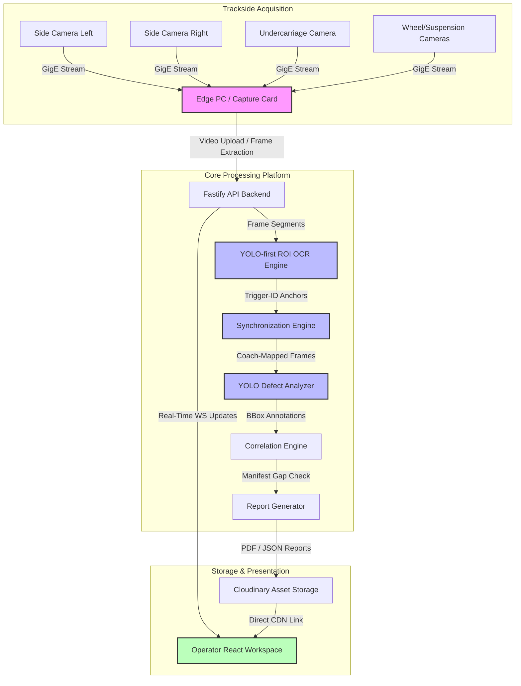

# Phase 1: System Overview & Industrial Context

## 1. Executive Summary

**VandeInspect AI** is an enterprise-grade, distributed AI-powered vision inspection and predictive maintenance platform designed specifically for the **Vande Bharat** semi-high-speed trainsets operated by Indian Railways. 

Manual safety and structural inspections of train coach undercarriages, suspensions, wheel assemblies, and bogies are highly time-consuming, subjective, and prone to human oversight. VandeInspect AI automates this critical workflow by leveraging a high-speed multi-camera acquisition system installed at trackside inspection bays (inspection pits). 

As a train passes through the inspection zone, the trackside system captures high-resolution video streams from multiple perspectives. The platform ingests these multi-view video feeds, extracts individual frames, synchronizes the temporal sequences across cameras using a deterministic trigger-pulse identification model, groups frames into logical coaches via advanced OCR-based boundary detection, and analyzes the components for defects (such as cracks, rust, component deformation, and missing items) using deep learning algorithms (YOLOv8). 

Ultimately, VandeInspect AI consolidates these findings into audit-ready PDF and JSON inspection reports complete with confidence scores, defect annotations, and overall coach health metrics. This enables maintenance engineers to transition from reactive maintenance models to proactive, condition-based scheduling.

---

## 2. Problem Statement

Indian Railways operates one of the largest rail networks in the world, with the Vande Bharat trainsets representing a major technological leap toward modernizing passenger transport. These trainsets operate at high speeds (up to 160 km/h), placing substantial dynamic stress on their mechanical and structural assemblies. Consequently, daily visual inspections are mandatory to ensure passenger safety and operational reliability.

### The Inspection Challenge
1. **Mechanical Stress**: Underbody and suspension elements undergo severe vibration, thermal cycles, and ballast impact, making them susceptible to micro-cracks, component loosening, and structural fatigue.
2. **Short Turnaround Windows**: Maintenance schedules require inspection bays to complete full train inspections within tight turnaround windows (often less than 2-4 hours) between journeys.
3. **Data Silos**: Current systems, where they exist, capture footage but fail to map detected faults to the actual coach structure or serial number, forcing technicians to scroll through hours of video manually.

---

## 3. Existing System Limitations

The current inspection paradigm relies heavily on manual inspections conducted in maintenance pits by railway engineers using torches and visual checklists. Where automated wayside inspection systems (Wayside Inspection Systems - WIS) exist, they suffer from several fundamental system limitations:

| Limitation Area | Manual Inspection | Traditional Wayside Inspection |
| :--- | :--- | :--- |
| **Inspection Latency** | **Extremely High**: A full physical walkthrough of a 16-coach Vande Bharat train takes 60 to 90 minutes. | **High**: Videos are captured but must be manually transferred and reviewed post-run. |
| **Subjectivity & Human Error** | **High**: Under poor lighting or technician fatigue, micro-cracks or missing safety split-pins are easily missed. | **High False-Alarm Rates**: Simple rule-based vision algorithms trigger alarms on color changes, shadows, or dirt. |
| **Bogie-to-Defect Mapping** | **Manual Logging**: Defects are logged on paper clipboards; matching a defect to coach `SEC-22345` is prone to transcription errors. | **No Logical Association**: The video is stored as a raw file. To find a defect, technicians must estimate timestamps. |
| **Temporal Alignment** | **N/A** | **Timestamp Drift**: Multi-camera systems align footage using CPU system clocks. Network latency and frame drops cause multi-second drifts. |
| **Scalability** | **Linear Cost**: Inspecting more trains requires hiring more certified engineers, creating operational bottlenecks. | **High Computational Overhead**: Systems try to run OCR and object detection on full high-res frames concurrently, crashing GPUs. |

---

## 4. Proposed AI Solution: VandeInspect AI

VandeInspect AI addresses these structural bottlenecks by introducing an integrated hardware-software framework that combines edge frame extraction, process-isolated deep learning inference, deterministic camera synchronization, and structured reporting.

```mermaid
graph LR
    subgraph Input
        V[2 Videos Uploaded]
    end

    subgraph Acquisition & OCR
        V --> FE["Frame Extractor (OpenCV)"]
        FE --> OCR["YOLO-First OCR (PaddleOCR)"]
        OCR --> SYNC["Deterministic Sync (trigger_id Alignment)"]
    end

    subgraph Defect & Manifest Audit
        SYNC --> DA["YOLO Defect Analyzer (Binary Classification)"]
        DA --> CORR["Correlation Engine (Manifest Audit)"]
        CORR --> RB["Report Builder (fpdf2 Engine)"]
    end

    subgraph Outputs
        RB --> PDF["Audit-Ready PDF (Cloudinary)"]
    end

    style V fill:#e0f2fe,stroke:#0284c7,stroke-width:2px
    style FE fill:#fef08a,stroke:#ca8a04,stroke-width:2px
    style OCR fill:#fef08a,stroke:#ca8a04,stroke-width:2px
    style SYNC fill:#fef08a,stroke:#ca8a04,stroke-width:2px
    style DA fill:#fed7aa,stroke:#ea580c,stroke-width:2px
    style CORR fill:#fed7aa,stroke:#ea580c,stroke-width:2px
    style RB fill:#fed7aa,stroke:#ea580c,stroke-width:2px
    style PDF fill:#dcfce7,stroke:#16a34a,stroke-width:2px
```

### Key Solution Pillars

1. **Deterministic Multi-Camera Synchronization**: Instead of aligning streams via system clocks, the platform syncs all camera feeds using `trigger_id` sequences mapped directly to hardware camera trigger pulses (production mode) or raw video frame numbers (test upload mode).
2. **YOLO-First ROI OCR Pipeline**: Rather than running heavy OCR engines over high-resolution, full-size images (which is slow and introduces background noise), the system uses a lightweight YOLOv8 network (`train_num_detector.pt`) to locate the bogie region containing the coach number. It then extracts this Region of Interest (ROI) with dynamic padding, executes a two-pass PaddleOCR sequence, and filters results using custom regex validation and a voting buffer.
3. **Binary Defect Classification**: To bypass naming conflicts across varied training datasets (e.g. "Battery Box" vs "Battery"), the defect detector uses a binary classifier (`defect=0` / `normal=1`). This setup maximizes model recall (critical for safety inspection) and prevents catalog mismatch errors.
4. **Manifest Correlation**: The system correlates detected components against a master structural manifest database. This step automatically flags missing critical safety parts (such as secondary suspension springs, brake pads, and axle box bolts).
5. **Interactive Operator Workspace**: The React-based dashboard lets operators review the train hierarchy (Train → Coach → Camera → Frame → Component → Defect), inspect annotated defect bounding boxes, and sign off on audit-ready inspection reports.
