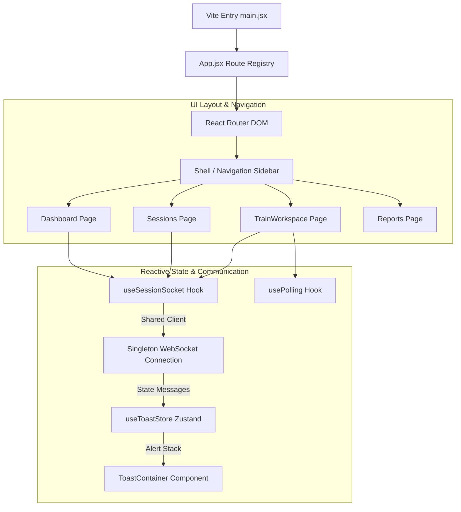

# Phase 2: Frontend Architecture

## 1. Technologies & Architecture Overview

The VandeInspect AI frontend is developed using **React 18** and **Vite** to provide a fast, responsive, and real-time operational interface. Modern, component-driven development practices are followed, styled with **Tailwind CSS** for layout responsiveness, and powered by **Lucide React** for UI icons. 

### Core Tech Stack
* **Vite**: Rapid hot-reloading bundler.
* **React 18**: Component-based user interface rendering.
* **React Router v6**: Client-side hash/history routing.
* **Zustand**: Lightweight, reactive state management (for global alerts and toast messages).
* **Lucide React**: Vector-based icons.
* **Tailwind CSS**: Utility-first CSS styling framework.

### Client-Side Architecture Layout
The application runs as a Single Page Application (SPA). To maintain low latency, the frontend utilizes room-based WebSocket subscriptions via a shared singleton instance. This setup updates the UI immediately as background GPU workers process frame segments. If WebSocket connectivity is lost, it falls back to polling via custom React hooks to prevent UI stale states.



---

## 2. Page Hierarchy & Routing Map

The frontend routing is managed via `React Router`, exposing eight distinct pages representing operations, analytics, infrastructure health, and configuration:

1. **Dashboard (`/dashboard`)**: Displays the general system health status, active session queue counters, system-wide key performance indicators (KPIs), and current pipeline processing throughput.
2. **Sessions (`/sessions`)**: The core entry point for historical audits. Displays a tabular view of all inspection runs, filterable by date, train number, and status, and hosts the multipart video uploader.
3. **Live Queue (`/live-queue`)**: A dedicated real-time tracker displaying currently executing pipeline tasks, active camera feeds, and worker task allocations.
4. **Train Workspace (`/train/:sessionId`)**: The core diagnostic workspace where operators analyze a specific session. It houses the train coach list, camera layout selectors, frame timelines, OCR results, and component-level defect logs.
5. **Reports (`/reports`)**: A formal page containing final PDF report download buttons, compliance logs, and QA sign-off checklists.
6. **Analytics (`/analytics`)**: Renders historical statistics on defect recurrences, most affected coaches, and OCR failure rates.
7. **Infrastructure (`/infrastructure`)**: Displays the hardware status of connected edge cameras, GPU temperatures, RAM utilization, and microservice status.
8. **Settings (`/settings`)**: Hosts threshold configurations, OCR VoteManager minimum hits adjustment, YOLO confidence defaults, and Cloudinary folder mappings.

---

## 3. Global State Management (Zustand)

Global states that require accessibility from outside the React rendering tree (such as notifications triggered during background WebSocket events) are governed via **Zustand**. 

### Toast Store Implementation
The notification system is decoupled from React's context to prevent redundant component re-renders. A global store maintains the list of active toasts, and exposure functions are exported directly.

```javascript
import { create } from 'zustand';

export const useToastStore = create((set) => ({
  toasts: [],
  push: (toast) => {
    const id = Date.now() + Math.random();
    set((s) => ({ toasts: [...s.toasts, { id, ...toast }] }));
    return id;
  },
  remove: (id) => set((s) => ({ toasts: s.toasts.filter((t) => t.id !== id) })),
}));

// Convenience helpers — call from anywhere (including vanilla JS services)
export const toast = {
  success: (message, title) => useToastStore.getState().push({ type: 'success', message, title }),
  warning: (message, title) => useToastStore.getState().push({ type: 'warning', message, title }),
  error:   (message, title) => useToastStore.getState().push({ type: 'error',   message, title }),
  info:    (message, title) => useToastStore.getState().push({ type: 'info',    message, title }),
};
```

---

## 4. Custom Hooks & Real-Time Sync

To handle communication with the Fastify orchestrator, the UI uses two custom hooks: a WebSocket listener and a polling fallback.

### 4.1 WebSocket Gateway Hook (`useSessionSocket.js`)
Rather than opening multiple connections per component, the application implements a **shared singleton WebSocket**. Multiple hook invocations subscribe to a single callback registry (`subscribers`). The hook handles room subscription messages (`{ type: "subscribe", sessionId }`) and parses events matching the context.

```javascript
import { useState, useEffect, useRef, useCallback } from 'react';

const WS_BASE = (import.meta.env.VITE_API_BASE_URL || 'http://localhost:8001')
  .replace(/^http/, 'ws');

let sharedWs = null;
const subscribers = new Set(); // Callback registry

function getSharedWs() {
  if (sharedWs && (sharedWs.readyState === WebSocket.OPEN || sharedWs.readyState === WebSocket.CONNECTING)) {
    return sharedWs;
  }
  sharedWs = new WebSocket(`${WS_BASE}/ws`);

  sharedWs.onmessage = (e) => {
    try {
      const event = JSON.parse(e.data);
      for (const cb of subscribers) cb(event);
    } catch (_) {}
  };

  sharedWs.onclose = () => {
    sharedWs = null;
    setTimeout(getSharedWs, 3000); // Reconnect loop
  };

  sharedWs.onerror = () => {
    sharedWs?.close();
  };

  return sharedWs;
}

function subscribeSession(sessionId) {
  const ws = getSharedWs();
  if (!sessionId) return;
  if (ws.readyState === WebSocket.OPEN) {
    ws.send(JSON.stringify({ type: 'subscribe', sessionId }));
  } else {
    ws.addEventListener('open', () => {
      ws.send(JSON.stringify({ type: 'subscribe', sessionId }));
    }, { once: true });
  }
}

export function useSessionSocket(sessionId = null) {
  const [lastEvent, setLastEvent] = useState(null);
  const [connected, setConnected] = useState(false);
  const wsRef = useRef(null);

  const onEvent = useCallback((event) => {
    if (!sessionId || !event.sessionId || event.sessionId === sessionId) {
      setLastEvent(event);
    }
  }, [sessionId]);

  useEffect(() => {
    subscribers.add(onEvent);
    wsRef.current = getSharedWs();

    const checkState = () => setConnected(wsRef.current?.readyState === WebSocket.OPEN);
    const interval = setInterval(checkState, 1000);
    checkState();

    if (sessionId) subscribeSession(sessionId);

    return () => {
      subscribers.delete(onEvent);
      clearInterval(interval);
    };
  }, [onEvent, sessionId]);

  return { lastEvent, connected };
}
```

### 4.2 Fallback Polling Hook (`usePolling.js`)
If the browser connection is blocked by a VPN or firewall, or if a backend WebSocket fails, the components fall back to active REST polling. The custom hook utilizes a standard `useRef` block to store the timer reference, preventing memory leaks on component unmounting.

```javascript
import { useEffect, useRef, useCallback } from 'react';

export function usePolling(callback, delay, active = true) {
  const savedCallback = useRef();

  useEffect(() => {
    savedCallback.current = callback;
  }, [callback]);

  useEffect(() => {
    if (!active || delay === null) return;

    function tick() {
      savedCallback.current();
    }

    // Immediate first tick
    tick();

    const id = setInterval(tick, delay);
    return () => clearInterval(id);
  }, [delay, active]);
}
```

---

## 5. UI Evolution: Plans vs. Actual Implementation

During development, the interface design shifted away from traditional dashboard patterns to address the realities of operating a high-throughput railway yard:

* **Mock Data to API Integration**: The early prototypes relied on static local JSON lists. In the current implementation, all tables (Sessions, Dashboard, Reports, Workspace) are connected to the Node.js API with custom adapter helpers to handle differences in database keys.
* **Progress Bar Precision**: Instead of using linear time-based mock increments (e.g., ticking to 90%), the progress indicator is tied directly to the backend database stages (`pipeline_stages` records). The progress bar moves only as stages (e.g., `frame_extraction`, `ocr_running`, `defect_analysis`) switch from `PENDING` to `COMPLETED`.
* **Dynamic Overlay Canvas**: The initial workspace design loaded static, pre-drawn bounding boxes. The current component maps YOLO defect arrays dynamically onto a React canvas overlay. This overlay automatically resizes based on image resolution, supporting responsive zoom modals and detailed inspections.
