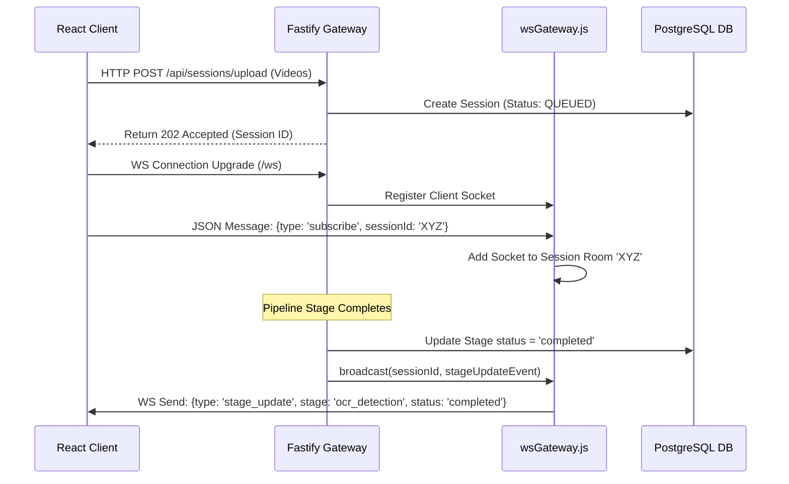

# Phase 3: Backend Architecture & Orchestration

## 1. Fastify Gateway Server Design

The core of VandeInspect AI's backend is a **Fastify** server running on port `8001`. Fastify was chosen over Express for its high throughput, low overhead, built-in schema serialization, and native plugin ecosystem. 

The backend acts as an API gateway, orchestrating REST requests, WebSocket messaging, and the lifecycle of long-running GPU/CPU inspection pipeline jobs.

### Server Lifecycle & Registration
The application initializes Fastify with built-in logging, CORS support, multipart parsing configured for high-capacity file transfers, and a room-based WebSocket server:

```javascript
const fastify = require('fastify')({ logger: true });
const cors = require('@fastify/cors');
const multipart = require('@fastify/multipart');
const websocketPlugin = require('@fastify/websocket');
const config = require('./config');
const prisma = require('./db/client');
const wsGateway = require('./services/wsGateway');

// Enable Cross-Origin Resource Sharing for the React Client
fastify.register(cors, {
  origin: config.frontendUrl,
  methods: ['GET', 'POST', 'PUT', 'PATCH', 'DELETE', 'OPTIONS'],
});

// Configure Multipart parser with a 2 GB file size limit for high-res train videos
fastify.register(multipart, {
  limits: { fileSize: 2 * 1024 * 1024 * 1024, files: 10 },
});

// Register WebSocket support
fastify.register(websocketPlugin);
```

---

## 2. API Routes Mapping & Registry

The API routing structure is organized by functional domain, prefixing each set of endpoints under `/api`. 

* **`/api/sessions`**: Handles upload creations, starts pipelines, and queries session details.
* **`/api/sessions/:id/intelligence`**: Serves detected components, defects, and missing component lists.
* **`/api/sessions/:id/reports`**: Triggers PDF/JSON generation and serves Cloudinary URLs.
* **`/api/dashboard`**: Pulls system KPIs and lists currently processing queue items.
* **`/api/health`**: Simple health-check verification showing database connectivity state.
* **`/api/config`**: Serves and updates global pipeline defaults (like Frame Intervals and thresholds).

---

## 3. Real-Time WebSocket Rooms Gateway

To prevent dashboard and workspace widgets from spamming the server with HTTP polling requests, the backend broadcasts real-time pipeline transitions over a WebSocket gateway at `/ws`.

The WebSocket server utilizes a **room-based publisher-subscriber pattern** managed by `wsGateway.js`. This allows client sockets to subscribe to updates for a specific session by sending a `{ type: "subscribe", sessionId }` message. Global dashboard listeners receive state changes for all active sessions.



---

## 4. Pipeline Orchestrator (`pipelineOrchestrator.js`)

When video uploads are processed and frames are extracted, the backend triggers the async analysis pipeline. 

The orchestrator utilizes **sliding-window concurrency** to feed frames to the GPU workers without overloading system resources, periodically updating the Neon database with progress and sending WebSocket updates to clients.

### Pipeline Orchestration Algorithm

```javascript
const axios = require('axios');
const prisma = require('../db/client');
const config = require('../config');
const { broadcast, broadcastAll } = require('./wsGateway');

const OCR_CONCURRENCY = 4;  // sliding-window boundary
const PROGRESS_EVERY = 10;  // DB update throttle

async function runOcrPipeline(sessionId, fastify) {
  const log = fastify ? fastify.log : console;
  
  try {
    // 1. Set stage state to RUNNING
    await prisma.pipelineStage.updateMany({
      where: { session_id: sessionId, stage: 'ocr_detection' },
      data: { status: 'running', started_at: new Date(), detail_message: 'Queuing frames...' },
    });
    broadcast(sessionId, { type: 'stage_update', sessionId, stage: 'ocr_detection', status: 'running' });

    // 2. Load all frames order-aligned by trigger_id
    const frames = await prisma.frame.findMany({
      where: { session_id: sessionId },
      orderBy: { trigger_id: 'asc' },
      select: { id: true, trigger_id: true, cloudinary_url: true },
    });

    const total = frames.length;
    let processed = 0;
    let ocrValid = 0;

    // 3. Process batches of frames using sliding-window concurrency
    for (let i = 0; i < frames.length; i += OCR_CONCURRENCY) {
      const batch = frames.slice(i, i + OCR_CONCURRENCY);

      const results = await Promise.allSettled(
        batch.map((frame) =>
          axios.post(`${config.services.ocr}/ocr`, {
            frame_url: frame.cloudinary_url,
            frame_id: frame.id,
            trigger_id: Number(frame.trigger_id),
            session_id: sessionId,
          }, { timeout: 30_000 })
        )
      );

      for (const res of results) {
        if (res.status === 'fulfilled' && res.value.data?.is_valid) {
          ocrValid++;
        }
      }
      processed += batch.length;

      // Throttle DB writes and broadcast socket updates to avoid overload
      if (processed % PROGRESS_EVERY === 0 || processed === total) {
        const pct = Math.round((processed / total) * 100);
        await prisma.pipelineStage.updateMany({
          where: { session_id: sessionId, stage: 'ocr_detection' },
          data: {
            detail_message: `OCR: ${processed}/${total} frames (${ocrValid} valid)`,
            stats: { processed, total, valid: ocrValid, progress_pct: pct },
          },
        });
        broadcast(sessionId, { type: 'progress_update', sessionId, stage: 'ocr_detection', processed, total, pct });
      }
    }

    // 4. Mark OCR complete and hand off to the synchronization engine
    await prisma.pipelineStage.updateMany({
      where: { session_id: sessionId, stage: 'ocr_detection' },
      data: { status: 'completed', completed_at: new Date() },
    });
    
    // Call Sync Engine, Correlation Engine, and finalize session...
  } catch (err) {
    log.error({ msg: 'OCR pipeline failed', error: err.message });
    // Handle failures and broadcast session_failed
  }
}
```

---

## 5. Direct HTTP Loopback vs. Queue Systems

During planning, using a broker like RabbitMQ was proposed to decouple backend services and workers. For the initial version, the system pivot-steered to **direct HTTP Loopback requests over localhost** (ports `5000` to `5006`):

1. **Lower Overhead**: Direct HTTP requests eliminate queue serialization costs and simplify debugging.
2. **Simplified Scaling**: Running workers as isolated FastAPI instances allows local development without complex RabbitMQ setup.
3. **Synchronous Flow Control**: Using await statements with `Promise.allSettled` lets the orchestrator manage concurrency, handle failed requests, and retry OCR jobs directly.
