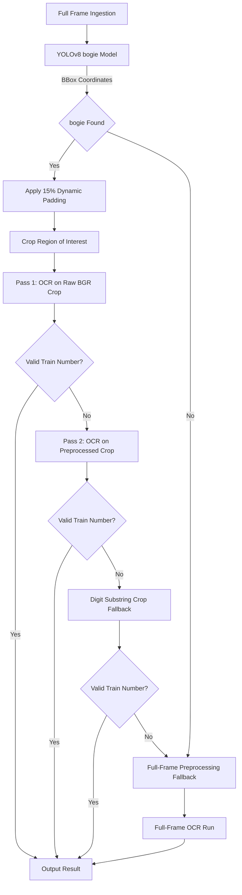
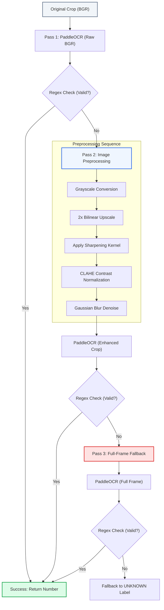

# Phase 4: AI Pipelines (YOLO ROI-First & PaddleOCR)

## 1. YOLO-First ROI Detection Pipeline

Direct OCR processing of high-resolution full-frame images is computationally expensive and introduces accuracy errors due to background noise (such as text on station boards, advertisement wraps, safety decals, or serial labels). To address this, VandeInspect AI implements a **YOLO-First ROI (Region of Interest) pipeline**.



### Why ROI is Faster and More Accurate
1. **Dimension Reduction**: Instead of running character recognition on a 5-Megapixel frame ($2592 \times 1944$), the system runs a fast YOLO detector to find the "bogie" box, reducing the search space to a cropped region of roughly $200 \times 100$ pixels.
2. **GPU Optimization**: YOLO inference takes $<20\text{ms}$ on a GPU. PaddleOCR execution on a small crop takes $\approx 50\text{ms}$, compared to $>800\text{ms}$ on a full frame.
3. **Noise Filtering**: Cropping excludes text outside the coach's serial number region, minimizing false positives.

---

## 2. Preprocessing & Dual-Pass OCR Engine

When the bogie region is cropped, the OCR service executes a **dual-pass recognition pipeline** to handle varying lighting conditions, dirt, and motion blur.



### The Preprocessing Sequence
To maximize legibility, the OCR worker applies the following OpenCV operations during Pass 2:
1. **Grayscale Conversion**: Eliminates chromatic noise.
2. **2x Upscale (Bilinear Interpolation)**: Increases sub-pixel spacing for character segmentation.
3. **Sharpening**: Emphasizes edge transitions using a custom kernel:
   $$\mathbf{K} = \begin{bmatrix} 0 & -1 & 0 \\ -1 & 5 & -1 \\ 0 & -1 & 0 \end{bmatrix}$$
4. **CLAHE (Contrast Limited Adaptive Histogram Equalization)**: Normalizes lighting gradients without over-amplifying noise.
5. **Gaussian Blur ($3\times3$)**: Smoothes out pixelation caused by upscaling.

```python
import cv2
import numpy as np

def preprocess_frame(frame):
    # Convert BGR to Grayscale
    gray = cv2.cvtColor(frame, cv2.COLOR_BGR2GRAY)
    
    # 2x Bilinear upscale
    gray = cv2.resize(gray, None, fx=2, fy=2, interpolation=cv2.INTER_LINEAR)
    
    # Apply 2D sharpening filter
    kernel = np.array([[0, -1, 0], [-1, 5, -1], [0, -1, 0]])
    sharp = cv2.filter2D(gray, -1, kernel)
    
    # Contrast normalization via CLAHE
    clahe = cv2.createCLAHE(clipLimit=2.0, tileGridSize=(8, 8))
    enhanced = clahe.apply(sharp)
    
    # Denoise with Gaussian blur
    return cv2.GaussianBlur(enhanced, (3, 3), 0)
```

---

## 3. Train Number Filtering & VoteManager

Text detected by PaddleOCR is filtered using custom regex validation and a voting buffer to ensure reliability.

### Validation Constraints
* **Regular Expression**: `^\d{5,6}$` (matches standard Indian Railways 5- or 6-digit coach numbers).
* **Confidence Threshold**: $\ge 0.4$.
* **Digit Substring Fallback**: If the raw text contains extra characters (e.g., `"COACH 22345B"`), the parser extracts digit-only substrings as a fallback.

### VoteManager Buffer
OCR predictions on single frames are prone to noise from paint scratches, shadows, or background elements. To prevent false writes, the system uses a cross-frame voting buffer (`VoteManager`):
1. Candidate numbers are stored in an active database pool.
2. An identifier is only written to the `coaches` table once it is detected **at least 5 times** across different frames.

---

## 4. CUDA Process Isolation

In early prototypes, running YOLO (PyTorch) and PaddleOCR (PaddlePaddle) within a single Python process on Windows caused instant crashes with exit code `0xC0000005` (Access Violation). 

### Root Cause
Both libraries load conflicting C-level DLL wrappers for CUDA initialization. PyTorch ships cuDNN 9.x, while PaddlePaddle requires cuDNN 8.x DLLs (e.g., `cudnn_ops_infer64_8.dll`). Attempting to initialize both within the same process thread space corrupts the C++ runtime memory.

### Solution
The system uses **process isolation**:
* The YOLO service runs as an isolated FastAPI app on port `5002`.
* The OCR service runs on port `5000`, communicating with YOLO via localhost loopback HTTP requests.
* On Windows hosts, the OCR service dynamically injects cuDNN 8.x DLL paths into Python's DLL directory list at runtime to ensure compatibility:

```python
if sys.platform == "win32":
    _extra_dll_paths = []
    for pkg in ("nvidia.cudnn", "nvidia.cublas", "nvidia.cuda_runtime", "nvidia.cusparse"):
        try:
            mod = __import__(pkg, fromlist=["__file__"])
            pkg_bin = os.path.abspath(os.path.join(os.path.dirname(mod.__file__), "bin"))
            if os.path.exists(pkg_bin):
                os.add_dll_directory(pkg_bin)
                _extra_dll_paths.append(pkg_bin)
        except Exception:
            pass
    if _extra_dll_paths:
        os.environ["PATH"] = ";".join(_extra_dll_paths) + ";" + os.environ.get("PATH", "")
```
This isolates the model runtime memory, enabling stable, GPU-accelerated parallel execution.
