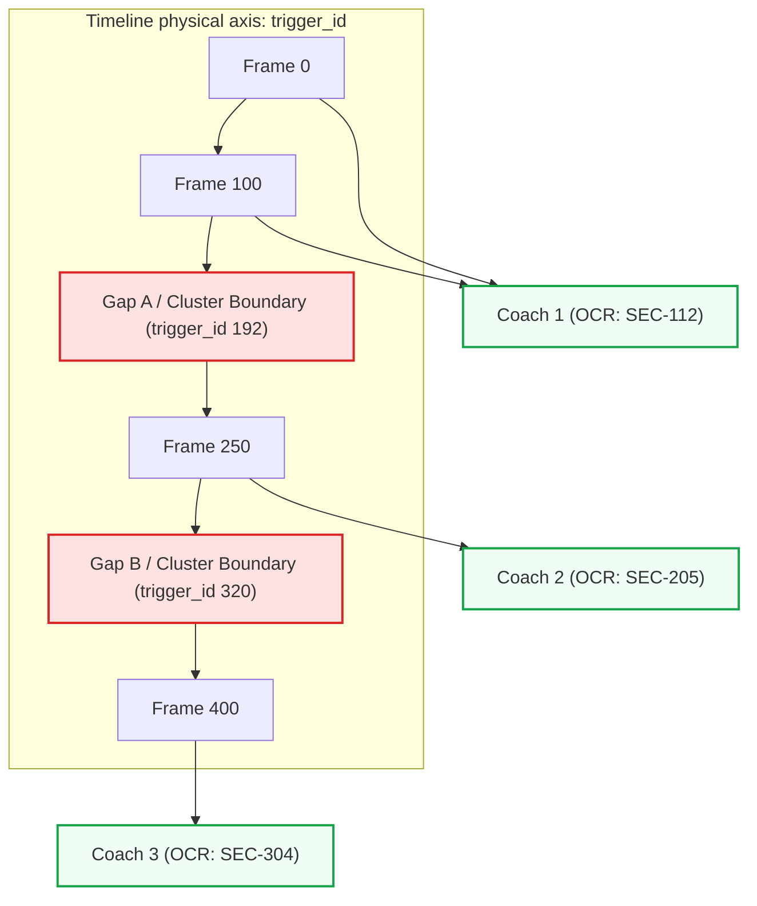
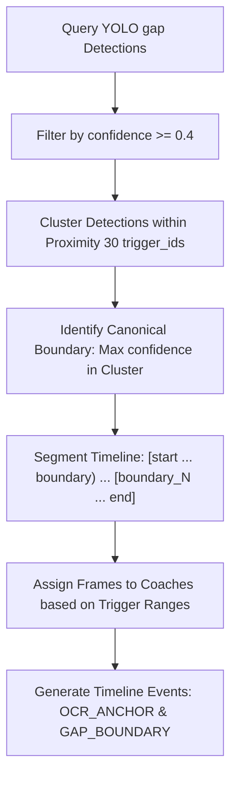
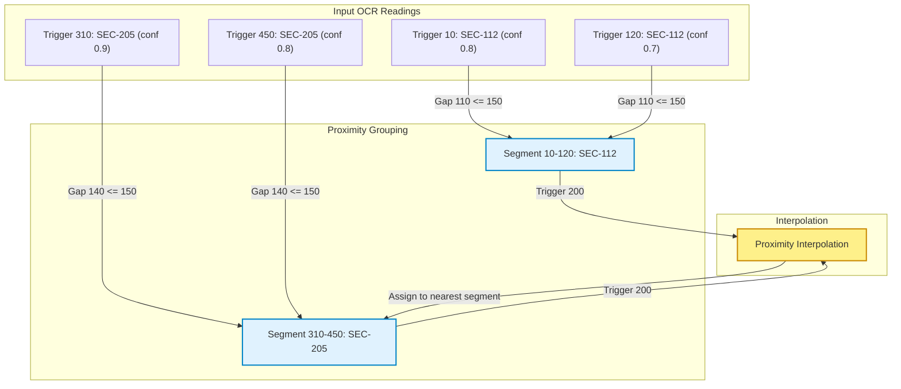

# Phase 5: Synchronization Engine

## 1. Why Timestamps Fail for Industrial Railway Inspection

In multi-camera wayside systems, traditional approaches attempt to align video feeds using CPU system clocks (timestamps). However, in high-speed industrial environments, timestamp-based alignment fails due to several factors:

1. **Clock Drift**: CPU system clocks on separate recording hosts drift relative to each other, introducing temporal errors of several milliseconds over short periods.
2. **Network Jitter**: IP-based GigE cameras experience packet delivery delays, causing frames to arrive at the capture cards at slightly variable intervals.
3. **Variable Exposure and Frame Drops**: Underbody cameras run at high frame rates (up to 120 FPS). Environmental factors (e.g., changes in lighting, dust) can trigger automatic exposure adjustments, leading to dropped frames that distort linear time offsets.
4. **Speed Variations**: Trains do not travel at a constant velocity past the inspection pit. A 200ms alignment error at 60 km/h shifts defect positions by **3.33 meters**, assigning defects to the wrong bogies.

---

## 2. Deterministic trigger_id Synchronization Concept

To establish a reliable sync key across all cameras, VandeInspect AI uses a **deterministic `trigger_id` sequence** instead of time-based offsets.

### 2.1 Production Mode (Hardware Sync Pulse)
In production deployment, the wayside inspection pit integrates a hardware sensor array (such as wheel-detecting induction sensors or laser barriers) connected to a centralized micro-controller. 

As each axle passes the sensor, a hardware trigger pulse is generated. This electrical pulse is distributed to all camera units via General Purpose Input/Output (GPIO) lines. All cameras fire their global shutters simultaneously, ensuring that Frame $N$ across all views captures the train at the exact same physical position. The hardware counter ID becomes the immutable `trigger_id`.

### 2.2 Test Mode (Video Upload Sync)
In test upload mode, the system aligns frames based on their position in the raw video file. The frame extractor sets:
$$\text{trigger\_id} = \text{frame\_number}$$
Because the test videos are recorded simultaneously and aligned at the first frame, frame 500 in Camera 1 corresponds to frame 500 in Camera 2, providing a reliable reference for testing.

---

## 3. Gap Detection and Clustering Algorithm

The system maps frames to coaches by locating the physical gaps between coach structures (inter-coach gangways).

### 3.1 Proximity-Based Clustering
As a train passes the camera, the space between coaches remains in view for multiple frames, resulting in consecutive gap detections. The sync engine clusters these detections using a proximity threshold (`GAP_CLUSTER_RADIUS = 30` trigger IDs):
1. Detections within 30 frames of each other are grouped as the same physical gap.
2. For each cluster, the frame with the highest detection confidence is selected as the canonical gap boundary.

### 3.2 Timeline Segmentation
The clustered boundary trigger IDs partition the inspection session timeline into distinct coach segments:
$$\mathbf{S}_0 = [T_{\min}, B_0), \quad \mathbf{S}_1 = [B_0, B_1), \quad \dots \quad \mathbf{S}_n = [B_{n-1}, T_{\max}]$$

---

## 4. Coach Range Mapping and OCR Anchoring

Once the timeline is divided into coach segments, the engine associates each segment with its physical coach identifier:

1. **OCR Anchor Lookup**: For each segment $\mathbf{S}_k$, the database is queried for OCR results within that segment's trigger ID range.
2. **Confidence-Weighted Selection**: The engine selects the OCR candidate with the highest confidence score, preferring records marked as valid by the regex filter.
3. **Fallback Labels**: If a segment contains no valid OCR readings, the engine assigns a temporary label (e.g., `UNKNOWN-1`, `UNKNOWN-2`) based on its position in the train.
4. **Frame Assignment**: Every frame from all cameras (underbody, side, suspension, wheel) is mapped to its parent coach based on whether its `trigger_id` falls within the coach's trigger range.

---

## 5. OCR Voting Fallback Algorithm

If YOLO misses the inter-coach gaps, the sync engine falls back to an **OCR-voting algorithm** to reconstruct the train structure.

### Step-by-Step Fallback Execution
1. **Deduplication**: Valid OCR detections are sorted by `trigger_id`. If a frame has multiple OCR outputs, only the highest confidence result is kept.
2. **Proximity Grouping**: Consecutive frames that read the same coach number are grouped into a segment if the gap between them is within `MAX_TRIGGER_GAP = 150` trigger IDs.
3. **Voting Threshold**: Segments are discarded if they accumulate fewer than 5 votes (`MIN_VOTES = 5`), preventing transient read errors from creating duplicate coach records.
4. **Proximity Interpolation**: Frames in the gaps between identified coach segments are assigned to the nearest coach. If the distance to the nearest segment exceeds $3 \times \text{MAX\_TRIGGER\_GAP}$, the frame remains unassigned.
5. **Timeline Verification**: The engine writes the results to the `coach_frame_map` table, tagging each row as either `OCR_DIRECT` (range match) or `GAP_INTERPOLATION` to maintain traceability.
