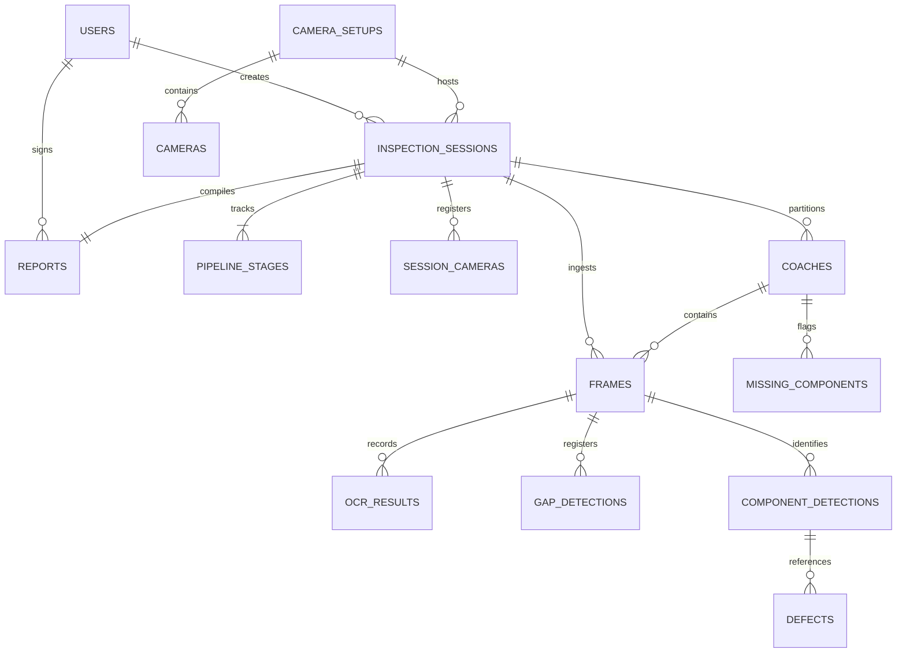

# Phase 6: Database Design & Prisma Schema

## 1. Schema Overview

VandeInspect AI uses a relational schema designed in **Prisma ORM** and hosted on a **Neon PostgreSQL** server. The schema contains 19 models that organize the physical rail inspection process into logical, audit-safe structures.

The core relationship pattern is hierarchically aligned with physical objects:
$$\text{InspectionSession} \longrightarrow \text{Coach} \longrightarrow \text{Camera} \longrightarrow \text{Frame} \longrightarrow \text{Component} \longrightarrow \text{Defect} \longrightarrow \text{Report}$$



---

## 2. Table Design and Key Relationships

### 2.1 Inspection Sessions (`inspection_sessions`)
Main table managing the lifecycle of each train pass.
* **Fields**: `id` (UUID), `train_number` (string), `status` (queued/extracting/ocr_running/analysing/completed/failed), `health_score` (decimal), and summary counters.
* **Indexes**: Clustered index on `train_number` and status fields to speed up dashboard queries.

### 2.2 Pipeline Stages (`pipeline_stages`)
Tracks granular progress.
* **Fields**: `stage` (e.g. `frame_extraction`, `ocr_detection`, `synchronization`, `component_detection`, `defect_analysis`, `report_generation`), `status` (pending/running/completed/failed), `detail_message`, and `stats` (JSON payload containing processed frame counters).
* **Constraints**: Unique compound index on `[session_id, stage]` ensures stage records are not duplicated.

### 2.3 Frames (`frames`)
Individual physical images extracted from video feeds.
* **Fields**: `id`, `trigger_id` (BigInt), `cloudinary_url` (string), `is_ocr_candidate` (boolean), and parent keys.
* **Indexes**: Indexed on `[session_id, trigger_id]` to speed up database reads during the synchronization phase.

### 2.4 Coaches (`coaches`)
Logical coach boundaries identified by the synchronization engine.
* **Fields**: `id`, `coach_number`, `coach_index` (integer sequence), `start_trigger_id` (BigInt), `end_trigger_id` (BigInt), and aggregates like `health_score` and `critical_defects`.
* **Relations**: One-to-many relationship with `frames` (a coach contains many frames), and one-to-many with `defects`.

### 2.5 Coach Frame Map (`coach_frame_map`)
Resolves many-to-many linkages between frames and coaches.
* **Fields**: `assignment_method` (`GAP_BOUNDARY`, `OCR_DIRECT`, or `GAP_INTERPOLATION`), and `confidence`.
* **Constraints**: Unique key on `frame_id` ensures a frame is only assigned to one coach.

### 2.6 Defects (`defects`)
AI-identified anomalies on components.
* **Fields**: `id`, `defect_type` (e.g. crack, rust, leakage, loose), `severity` (critical, high, medium, low), `bbox_x/y/w/h` (integers), and `review_status` (pending/approved/dismissed).
* **Relations**: Linked to `User` for operator sign-offs, and `ComponentDetection` for component context.

---

## 3. Prisma Schema Reference

The core models are declared in Prisma syntax as follows:

```prisma
model InspectionSession {
  id              String    @id @default(uuid()) @db.Uuid
  session_code    String?   @unique @db.VarChar(30)
  train_number    String    @db.VarChar(50)
  station_code    String?   @db.VarChar(20)
  camera_setup_id String?   @db.Uuid

  status                   String   @default("queued") @db.VarChar(30)
  progress_pct             Int      @default(0)
  total_coaches            Int?
  total_frames             Int?
  critical_defects         Int      @default(0)
  missing_components_count Int      @default(0)
  health_score             Decimal? @db.Decimal(5, 2)

  started_at    DateTime  @default(now()) @db.Timestamptz(6)
  completed_at  DateTime? @db.Timestamptz(6)
  error_message String?

  pipeline_stages      PipelineStage[]
  frames               Frame[]
  coaches              Coach[]
  defects              Defect[]
  report               Report?

  @@map("inspection_sessions")
}

model Frame {
  id                   String   @id @default(uuid()) @db.Uuid
  session_id           String   @db.Uuid
  session_camera_id    String   @db.Uuid
  coach_id             String?  @db.Uuid
  sequence_number      Int
  trigger_id           BigInt   // Unified physical synchronisation axis
  captured_at_ms       BigInt
  cloudinary_url       String
  cloudinary_public_id String

  session        InspectionSession @relation(fields: [session_id], references: [id], onDelete: Cascade)
  coach          Coach?            @relation("FrameToCoach", fields: [coach_id], references: [id])
  ocr_results    OcrResult[]
  defects        Defect[]

  @@map("frames")
}

model Coach {
  id                    String   @id @default(uuid()) @db.Uuid
  session_id            String   @db.Uuid
  coach_number          String   @db.VarChar(30)
  coach_index           Int?
  start_trigger_id      BigInt?
  end_trigger_id        BigInt?
  health_score          Decimal? @db.Decimal(5, 2)

  session   InspectionSession @relation(fields: [session_id], references: [id], onDelete: Cascade)
  frames    Frame[]           @relation("FrameToCoach")
  defects   Defect[]

  @@map("coaches")
}
```

---

## 4. Session State Lifecycles

```
+------------+      upload      +------------------+      complete      +-----------------+
|   QUEUED   | ---------------> | FRAME_EXTRACTION | -----------------> |   OCR_RUNNING   |
+------------+                  +------------------+                    +-----------------+
                                                                                 |
                                                                                 | complete
                                                                                 v
+------------+      complete    +------------------+      complete      +-----------------+
| COMPLETED  | <--------------- |    REPORTING     | <----------------- |    ANALYSING    |
+------------+                  +------------------+                    +-----------------+
      |                                                                          |
      +--------------------------> [FAILED] <------------------------------------+
                                (Any stage throws error)
```

The database tracks the pipeline state through a status machine:
1. **`queued`**: Session is created; videos are uploaded to the local disk.
2. **`extracting`**: Edge machine processes videos, uploading frames to Cloudinary and inserting records into the database.
3. **`ocr_running`**: Parallel OCR worker processes active candidate frames.
4. **`analysing`**: Gaps are clustered, frames mapped to coaches, and YOLO defect detection runs per coach.
5. **`completed`**: Defect severities are calculated, PDF reports generated, and final statistics aggregated.
6. **`failed`**: If any microservice throws an unhandled error, the state drops to `failed` and records the error message to help operators debug.
