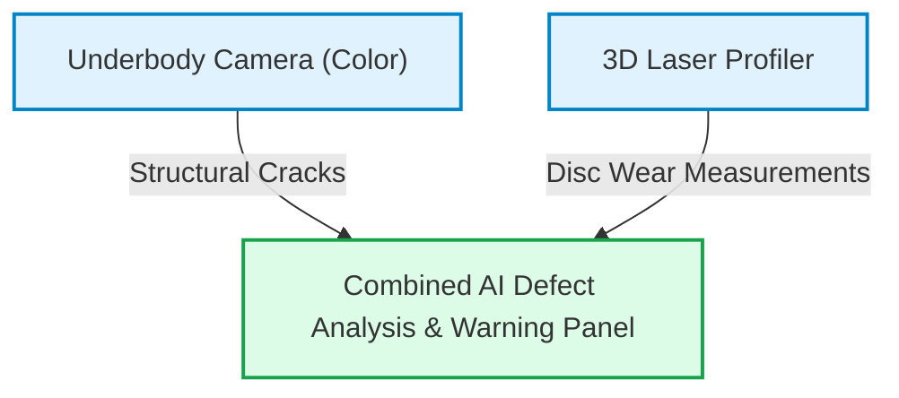

# Phase 12: Future Roadmap & Scaling Strategy

This document outlines the strategic engineering roadmap for scaling the VandeInspect AI platform from local edge prototypes to a distributed, nationwide rail inspection network.

---

## 1. Short-Term Scaling (v1.1 - v1.2)

### 1.1 Transition to a Distributed Message Broker (RabbitMQ / Kafka)
While the current direct HTTP loopback approach simplifies initial setup, scaling to handle multiple inspection bays requires a decoupled architecture.
* **Implementation Plan**: Replace direct Fastify HTTP calls with a **RabbitMQ AMQP exchange** or **Apache Kafka event stream**.
* **Benefit**: The Gateway will publish `FRAME_READY` events, allowing a cluster of local worker machines to pull and process frames in parallel. This prevents bottlenecks and ensures the system can continue processing during high-volume periods.

### 1.2 Local Offline S3 Storage (MinIO)
To operate reliably in remote rail workshops with limited internet connectivity, edge nodes must remain fully functional offline.
* **Implementation Plan**: Replace external Cloudinary API uploads with a local **MinIO server** hosted on the edge machine.
* **Benefit**: High-resolution frames and video assets are saved locally. When internet connectivity is detected, the edge node synchronizes the PDF reports and metadata to the central database, keeping raw videos offline to conserve bandwidth.

---

## 2. Medium-Term Infrastructure Optimization (v1.5)

### 2.1 Model Optimization via NVIDIA TensorRT
To support higher train speeds (above 80 km/h) at wayside stations, frame processing times must be reduced to under 10ms.
* **Implementation Plan**: Export YOLOv8 and PaddleOCR models to **NVIDIA TensorRT** engine formats (`.engine`).
* **Benefit**: Compiling the models directly to GPU instructions accelerates inference speed. YOLOv8 execution times drop from 20ms to **$<5\text{ms}$**, while PaddleOCR crop reads run in **$<15\text{ms}$**.

### 2.2 Kubernetes Deployment Orchestration (K3s)
For large-scale yards with multiple wayside pits and terminal dashboards, managing local service instances becomes complex.
* **Implementation Plan**: Pack the gateway, python services, and local databases into Docker containers managed by a lightweight **K3s (Kubernetes)** cluster on-site.
* **Benefit**: Provides automated self-healing (restarting failed workers), simple service updates, and dynamic scaling of GPU resources based on queue sizes.

---

## 3. Long-Term Research & Development (v2.0)

### 3.1 Sensor Fusion with 3D Laser Profilers
Camera feeds are excellent for detecting surface anomalies, but cannot measure physical wear in sub-millimeter detail.
* **Implementation Plan**: Integrate **3D Laser Profilers** alongside underbody cameras.
* **Benefit**: This enables the system to measure brake disc thickness, wheel tread wear, and gear case alignment with sub-millimeter accuracy, combining visual defect flags with precise physical measurements.

### 3.2 Workshop-Wide Federated Learning
Training a single global model is difficult due to regional variations in track dust, lighting conditions, and camera equipment. However, moving raw inspection videos to a central cloud server is bottlenecked by bandwidth constraints.
* **Implementation Plan**: Implement **Federated Learning** across inspection yards.
* **Benefit**: Models are trained locally at each workshop using on-site GPU resources. Only the resulting model weight adjustments (updates) are sent to a central server to improve the global model. This allows the system to continuously improve accuracy while keeping large video files stored locally.
