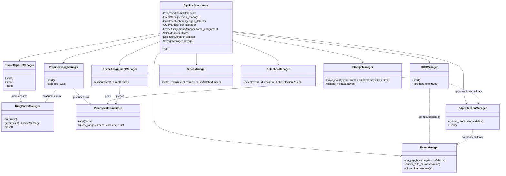
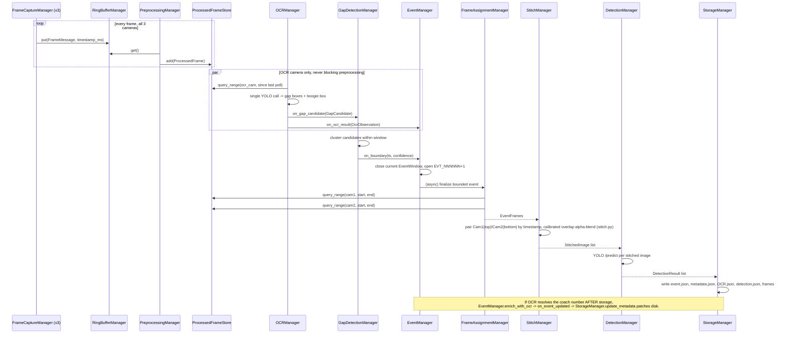
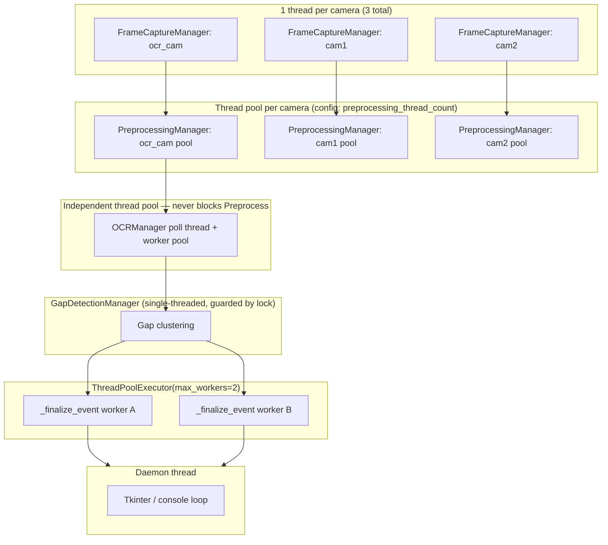
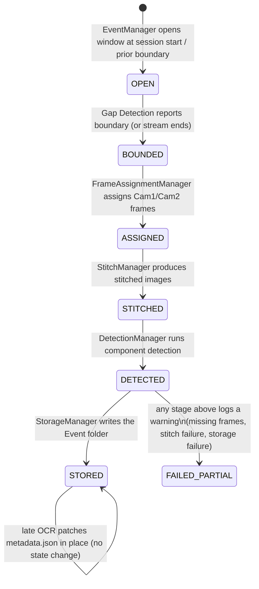

# Phase-1 Orchestrator — Architecture Diagrams

Companion to the top-level `README.md`. Diagrams in Mermaid, consistent with
the convention already used in `Railway_AI_Inspection_System_ADS.md`.

## 1. Manager class diagram (UML)

## 2. End-to-end sequence (one coach / Event)

## 3. Thread architecture

## 4. Queue / buffer topology

```mermaid
flowchart LR
    CAM(("3 Camera Sources")) --> RB1{{"RingBufferManager\n(bounded, drop-oldest + counter)"}}
    RB1 --> PRE["PreprocessingManager pool"]
    PRE --> PFS[("ProcessedFrameStore\n(timestamp-sorted, per camera)")]

    PFS -->|poll: ocr_cam only| OCR["OCRManager"]
    OCR -->|gap candidates| GAPQ["GapDetectionManager\n(in-memory cluster buffer)"]
    OCR -->|ocr observations| EVTQ["EventManager"]
    GAPQ -->|boundary| EVTQ

    EVTQ -->|bounded event| FINQ{{"Finalize ThreadPoolExecutor\n(bounded: max_workers=2)"}}
    PFS -->|query_range cam1/cam2| FINQ
    FINQ --> ST["StitchManager"]
    ST --> DET["DetectionManager"]
    DET --> STORE["StorageManager"]
    STORE --> DISK[("Event folder tree on disk")]
```

## 5. Event lifecycle (state machine)

